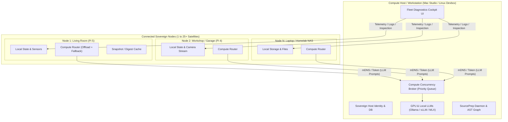

# Federated Multi-Node Architecture & Fleet Compute Sharing

**Date:** 2026-08-29  
**Status:** Comprehensive Architecture, Handoff & Implementation Plan  
**Target:** Halbert Workstations (macOS/Linux Desktop) + N Satellite Nodes (Raspberry Pi, Homelab, Laptops)  

---

## 1. Executive Summary & Vision

Halbert operates on a **Federated Peer Model ("Sovereign Self, Shared Commons")**:
* **Every device is a sovereign Halbert node:** Maintaining its own identity, SQLite state, local sensors, system baseline, and local automation rules.
* **Compute is asymmetrical and opportunistic:** Low-power 24/7 nodes (e.g. Raspberry Pi 5 / Home Hubs) leverage high-power desktop nodes (e.g. Mac Studio, GPU devbox) for heavy compute (LLM inference, embeddings, batch maintenance) whenever the desktop is awake.
* **1:N Fleet Support from Day One:** A single Compute Host (Desktop) can pair with and support **multiple satellite nodes** (1 to 25+ nodes: Living Room Pi, Workshop Pi, Garage Cam, Homelab NAS, Travel Laptop) with prioritized concurrency queuing.
* **Bi-directional value:**
  1. *Satellite ➔ Desktop:* Offloads heavy LLM inference and batch jobs to Desktop GPU.
  2. *Desktop ➔ Satellite:* Serves as a Fleet Diagnostics Cockpit to inspect remote node health, stream logs, and troubleshoot automation/system configs.
* **Local-First & Zero-Config:** Automatic discovery over LAN / Tailscale subnets via mDNS (`_halbert._tcp`) with mutual pre-shared token security (`X-Halbert-Peer-Token`). No external cloud servers or relays required.

---

## 2. Architecture & Topology



---

## 3. Human & Operational Roles

| Role | Typical Hardware | Primary Responsibilities | Compute Profile |
| :--- | :--- | :--- | :--- |
| **Compute Host (Workstation)** | Mac Studio, Linux GPU Rig, High-RAM Desktop | • Code development & SourcePrep daemon<br>• Fleet Diagnostics Cockpit<br>• Hosting 14B–70B LLMs & embedding models | Intermittent uptime (sleeps/travel), massive compute capacity |
| **Ambient Sentinel (Home / Satellites)** | Raspberry Pi 4/5, mini-PC, IoT Hub, Travel Laptop | • 24/7 continuous ambient monitoring<br>• Voice / wake-word assistant<br>• Home Assistant / Frigate / Sensor integration<br>• Local device control | Always-on, low power, lightweight CPU compute |

---

## 4. Key Architectural Pillars

### Pillar 1: Zero-Config Discovery & Mutual Pairing (mDNS + Token)
1. **Service Announcement:**
   * Compute Host advertises service type `_halbert._tcp` on local LAN / Tailnet.
   * TXT Record includes: `node_id`, `node_name`, `role=compute_provider`, `capabilities=gpu_llm,sourceprep,fleet_api`, `api_port=8000`.
2. **One-Click Pairing Handshake:**
   * Satellite discovers beacon and requests pairing.
   * Host displays pairing confirmation / 4-digit code.
   * Both exchange a cryptographic pre-shared token (`X-Halbert-Peer-Token`) stored locally in `~/.config/halbert/peers.json`.
3. **Advanced IT Backdoor:**
   * UI provides manual configuration: Enter static IP/Hostname (`http://192.168.1.50:8000` or `http://desktop.tailnet.ts.net:8000`) + Token for custom VLANs.

### Pillar 2: Priority-Queued Compute Broker (Home ➔ Desktop)
* Runs on Compute Host to manage multi-satellite inference without GPU VRAM thrashing:
  * **Priority 1 (Interactive Local User):** Immediate execution for direct desktop user prompt.
  * **Priority 2 (Interactive Remote Voice/Sensor):** Real-time queries from Home Pi wake-word/smart home actions.
  * **Priority 3 (Background Batch Summaries):** Daily digests, log indexing, scheduled maintenance.
* Built with an async concurrency semaphore (e.g. 4 concurrent inference slots with FIFO queueing).

### Pillar 3: Multi-Tier Fallback & Offline Resilience (When Desktop Sleeps)
* Satellite nodes use an intelligent `ComputeRouter` with sub-second health probing:
  ```
  1. Desktop Compute Peer (LAN / GPU) [1.5s health probe]
     └─► If Online: Stream generation from 32B GPU model
  2. Local Micro-Model / Heuristic Engine (On-Device CPU quantized model)
     └─► If Urgent & Desktop Asleep: Generate fast local response
  3. Optional Cloud API (if configured and allowed by privacy policy)
  4. Deferred Task Queue (Non-urgent maintenance tasks held until Desktop wakes)
  ```

### Pillar 4: Desktop Fleet Cockpit (Desktop ➔ Satellite Management)
* Desktop UI includes a **Fleet Cockpit** & **Node Switcher**:
  * Live status grid for all paired satellites (CPU, RAM, Temp, Uptime, Active Services).
  * Real-time log streaming and agent timeline inspection across any satellite.
  * Diagnostic Agent: Desktop AI analyzes remote Pi systemd configs, cron jobs, and Home Assistant error logs using Desktop's full LLM reasoning power.

---

## 5. Technical Implementation Roadmap

### Phase 1: Networking & Discovery
- [ ] Implement `halbert_core/discovery/peer_discovery.py` using `zeroconf` for mDNS broadcast and listening.
- [ ] Implement `halbert_core/config/peers_config.py` for managing paired node credentials and manual IP overrides.
- [ ] Create pairing handshake REST endpoints (`/api/peers/pair`, `/api/peers/verify`).

### Phase 2: Compute Broker & Client Router
- [ ] Implement `halbert_core/compute/broker.py` with priority queueing and concurrency semaphore on Compute Host.
- [ ] Implement `halbert_core/compute/router.py` with multi-tier fallback pipeline on Satellite nodes.
- [ ] Expose OpenAI-compatible `/api/compute/v1/chat/completions` endpoint for authenticated peers.

### Phase 3: Fleet Telemetry & Remote Diagnostics
- [ ] Implement `halbert_core/runtime/telemetry_agent.py` on satellites for lightweight system metrics reporting.
- [ ] Implement `halbert_core/dashboard/routes/fleet.py` on Desktop for node aggregation and SSE log streaming.
- [ ] Build Diagnostic Agent skill to inspect remote satellite configs.

### Phase 4: Frontend UI Components
- [ ] Build `NodeFleetCockpit.tsx` (Fleet dashboard cards, load gauges, connection status).
- [ ] Build `NodeSwitcher.tsx` (Top-bar dropdown for switching active node context).
- [ ] Build `PeerPairingModal.tsx` (Discovered peers list, one-click pair button, PIN confirmation).

---

## 6. Verification & Test Strategy

1. **Automated Unit & Load Tests:**
   * `test_peer_discovery.py`: mDNS packet serialization and pairing handshake validation.
   * `test_compute_broker.py`: 10-satellite concurrent load test with priority preemption verification.
   * `test_compute_router.py`: Simulated host offline/sleep failover tests.
2. **Integration Verification:**
   * Live pair testing between Desktop and Raspberry Pi over LAN and Tailscale.
   * GPU allocation monitoring during multi-node concurrent prompt dispatch.
