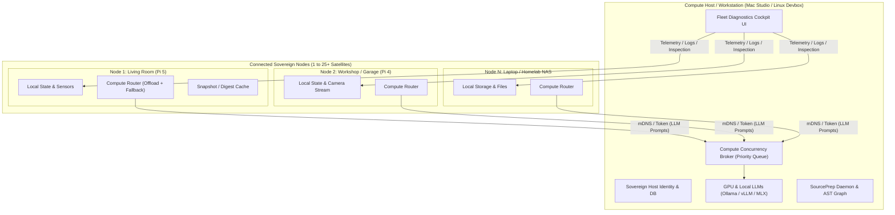

# Federated Multi-Node Architecture & Fleet Compute Sharing

**Date:** 2026-08-29  
**Status:** Comprehensive Architecture, Handoff & Implementation Plan  
**Target:** Halbert Workstations (macOS/Linux Desktop) + N Satellite Nodes (Raspberry Pi, Homelab, Laptops)  

---

## 1. Executive Summary & Vision

Halbert operates on a **Federated Peer Model ("Sovereign Self, Shared Commons")**:
* **Every device is a sovereign Halbert node:** Maintaining its own identity, SQLite state, local sensors, system baseline, and local automation rules.
* **Compute is asymmetrical and opportunistic:** Low-power 24/7 nodes (e.g. Raspberry Pi 5 / Home Hubs) leverage high-power desktop nodes (e.g. Mac Studio, GPU devbox) for heavy compute (LLM inference, embeddings, batch maintenance) whenever the desktop is awake.
* **1:N Fleet Support from Day One:** A single Compute Host (Desktop) can pair with and support **multiple satellite nodes** (1 to 25+ nodes: Living Room Pi, Workshop Pi, Garage Cam, Homelab NAS, Travel Laptop) with prioritized concurrency queuing.
* **Bi-directional value:**
  1. *Satellite ➔ Desktop:* Offloads heavy LLM inference and batch jobs to Desktop GPU.
  2. *Desktop ➔ Satellite:* Serves as a Fleet Diagnostics Cockpit to inspect remote node health, stream logs, and troubleshoot automation/system configs.
* **Local-First & Zero-Config:** Automatic discovery over LAN / Tailscale subnets via mDNS (`_halbert._tcp`) with mutual pre-shared token security (`X-Halbert-Peer-Token`). No external cloud servers or relays required.

---

## 2. Architecture & Topology



---

## 3. Human & Operational Roles

| Role | Typical Hardware | Primary Responsibilities | Compute Profile |
| :--- | :--- | :--- | :--- |
| **Compute Host (Workstation)** | Mac Studio, Linux GPU Rig, High-RAM Desktop | • Code development & SourcePrep daemon<br>• Fleet Diagnostics Cockpit<br>• Hosting 14B–70B LLMs & embedding models | Intermittent uptime (sleeps/travel), massive compute capacity |
| **Ambient Sentinel (Home / Satellites)** | Raspberry Pi 4/5, mini-PC, IoT Hub, Travel Laptop | • 24/7 continuous ambient monitoring<br>• Voice / wake-word assistant<br>• Home Assistant / Frigate / Sensor integration<br>• Local device control | Always-on, low power, lightweight CPU compute |

---

## 4. Key Architectural Pillars

### Pillar 1: Zero-Config Discovery & Mutual Pairing (mDNS + Token)
1. **Service Announcement:**
   * Compute Host advertises service type `_halbert._tcp` on local LAN / Tailnet.
   * TXT Record includes: `node_id`, `node_name`, `role=compute_provider`, `capabilities=gpu_llm,sourceprep,fleet_api`, `api_port=8000`.
2. **One-Click Pairing Handshake:**
   * Satellite discovers beacon and requests pairing.
   * Host displays pairing confirmation / 4-digit code.
   * Both exchange a cryptographic pre-shared token (`X-Halbert-Peer-Token`) stored locally in `~/.config/halbert/peers.json`.
3. **Advanced IT Backdoor:**
   * UI provides manual configuration: Enter static IP/Hostname (`http://192.168.1.50:8000` or `http://desktop.tailnet.ts.net:8000`) + Token for custom VLANs.

### Pillar 2: Priority-Queued Compute Broker (Home ➔ Desktop)
* Runs on Compute Host to manage multi-satellite inference without GPU VRAM thrashing:
  * **Priority 1 (Interactive Local User):** Immediate execution for direct desktop user prompt.
  * **Priority 2 (Interactive Remote Voice/Sensor):** Real-time queries from Home Pi wake-word/smart home actions.
  * **Priority 3 (Background Batch Summaries):** Daily digests, log indexing, scheduled maintenance.
* Built with an async concurrency semaphore (e.g. 4 concurrent inference slots with FIFO queueing).

### Pillar 3: Multi-Tier Fallback & Offline Resilience (When Desktop Sleeps)
* Satellite nodes use an intelligent `ComputeRouter` with sub-second health probing:
  ```
  1. Desktop Compute Peer (LAN / GPU) [1.5s health probe]
     └─► If Online: Stream generation from 32B GPU model
  2. Local Micro-Model / Heuristic Engine (On-Device CPU quantized model)
     └─► If Urgent & Desktop Asleep: Generate fast local response
  3. Optional Cloud API (if configured and allowed by privacy policy)
  4. Deferred Task Queue (Non-urgent maintenance tasks held until Desktop wakes)
  ```

### Pillar 4: Desktop Fleet Cockpit (Desktop ➔ Satellite Management)
* Desktop UI includes a **Fleet Cockpit** & **Node Switcher**:
  * Live status grid for all paired satellites (CPU, RAM, Temp, Uptime, Active Services).
  * Real-time log streaming and agent timeline inspection across any satellite.
  * Diagnostic Agent: Desktop AI analyzes remote Pi systemd configs, cron jobs, and Home Assistant error logs using Desktop's full LLM reasoning power.

---

## 5. Technical Implementation Roadmap

### Phase 1: Networking & Discovery
- [ ] Implement `halbert_core/discovery/peer_discovery.py` using `zeroconf` for mDNS broadcast and listening.
- [ ] Implement `halbert_core/config/peers_config.py` for managing paired node credentials and manual IP overrides.
- [ ] Create pairing handshake REST endpoints (`/api/peers/pair`, `/api/peers/verify`).

### Phase 2: Compute Broker & Client Router
- [ ] Implement `halbert_core/compute/broker.py` with priority queueing and concurrency semaphore on Compute Host.
- [ ] Implement `halbert_core/compute/router.py` with multi-tier fallback pipeline on Satellite nodes.
- [ ] Expose OpenAI-compatible `/api/compute/v1/chat/completions` endpoint for authenticated peers.

### Phase 3: Fleet Telemetry & Remote Diagnostics
- [ ] Implement `halbert_core/runtime/telemetry_agent.py` on satellites for lightweight system metrics reporting.
- [ ] Implement `halbert_core/dashboard/routes/fleet.py` on Desktop for node aggregation and SSE log streaming.
- [ ] Build Diagnostic Agent skill to inspect remote satellite configs.

### Phase 4: Frontend UI Components
- [ ] Build `NodeFleetCockpit.tsx` (Fleet dashboard cards, load gauges, connection status).
- [ ] Build `NodeSwitcher.tsx` (Top-bar dropdown for switching active node context).
- [ ] Build `PeerPairingModal.tsx` (Discovered peers list, one-click pair button, PIN confirmation).

---

## 6. Verification & Test Strategy

1. **Automated Unit & Load Tests:**
   * `test_peer_discovery.py`: mDNS packet serialization and pairing handshake validation.
   * `test_compute_broker.py`: 10-satellite concurrent load test with priority preemption verification.
   * `test_compute_router.py`: Simulated host offline/sleep failover tests.
2. **Integration Verification:**
   * Live pair testing between Desktop and Raspberry Pi over LAN and Tailscale.
   * GPU allocation monitoring during multi-node concurrent prompt dispatch.

---

## 7. Architectural Review Feedback (2026-08-29)

**Reviewer:** Devin (GLM-5.2 High)
**Verdict:** The vision is correct and the "Sovereign Self, Shared Commons" framing is the right mental model. However, the plan as written **ignores substantial completed work** (Multi-Instance Phase 7, MCP Phase 4b, 4-slot model architecture, Apple Intelligence integration, discovery engine) and proposes parallel systems where integration is required. It also under-specifies the trust boundary that a federated compute endpoint opens. Below are 15 findings, ordered by severity.

### Critical — must resolve before implementation

**C1. Duplicates MCP Phase 4b (HTTP/SSE + bearer auth) without referencing it.**
The MCP plan (`HALBERT-MCP-PLAN-2026-08-28.md`, Phase 4b) already specifies HTTP/SSE transport with bearer token auth for multi-instance access, reusing the `prep_token` pattern. This handoff proposes a separate `X-Halbert-Peer-Token` scheme over mDNS. These are two auth surfaces for the same problem. **Resolution:** The federated peer token MUST be the same credential mechanism as MCP Phase 4b. One token, one auth middleware, used by both MCP clients (Warp/Claude) and peer Halbert nodes. Do not build a second token system.

**C2. Duplicates Multi-Instance Phase 7 (already implemented) without building on it.**
Phase 7 (`HALBERT-MULTI-INSTANCE-DESIGN.md` + `HALBERT-MULTI-INSTANCE-REVIEW-FEEDBACK.md`) shipped the two-process env-var-isolated model, `HALBERT_PORT`, `HALBERT_DATA_DIR`, persona-aware sidebar, and the **Top-Bar Instance Switcher**. This handoff's "Node Switcher" (Phase 4) is the same component. **Resolution:** The federated work is effectively **Phase 9+** of the home-automation strategy. The `NodeSwitcher.tsx` already exists in the review feedback spec — extend it to list remote peers, do not create `NodeSwitcher.tsx` as a new component. The plan must explicitly state "builds on Phase 7 Instance Switcher."

**C3. ComputeRouter duplicates `tier_router.py` / `cascade_router.py`.**
The codebase already has `model/tier_router.py` with intelligent fallback chains, `cascade_router.py` (MetaHarnessRouter), and `error_recovery` manager. The proposed `compute/router.py` multi-tier fallback (Desktop → Local micro-model → Cloud → Deferred) is a *peer-aware extension* of the existing fallback machinery, not a new router. **Resolution:** Add a "peer endpoint" as a first-class provider in `tier_router.py` (alongside `OLLAMA`/`ANTHROPIC`/`OPENAI`/`OPENROUTER`), with health probing. The satellite's `chat_model` slot points at `peer://desktop.lan:8000`. Reuse `ModelSelection.fallback_used` / `fallback_from` rather than reinventing fallback tracking.

**C4. The compute endpoint opens a prompt-injection exfiltration path with no redaction boundary.**
`/api/compute/v1/chat/completions` lets a paired satellite send arbitrary prompts to the Desktop's GPU. A compromised satellite (Pi in the garage, travel laptop on hostile WiFi) can craft a prompt that instructs the Desktop model to read and return `~/.ssh/id_rsa`, `/etc/shadow`, or SourcePrep-indexed secrets. The MCP plan spent Tasks 0+3 building `redact_text()` and a Tier 0/1/2 sensitivity model precisely for this. **Resolution:** The compute endpoint MUST apply the same `redact_text()` boundary on responses, and the Desktop-side tool surface available to peer prompts MUST be a restricted subset (no `run_scanner`, no `approve_proposal`, no file-read tools). Define an explicit "peer-capable tool allowlist" mirroring the MCP `cloud_safe` tool table.

**C5. Fleet Cockpit remote-config inspection is a new attack surface on every satellite.**
Pillar 4 / Phase 3 proposes the Desktop AI inspecting "remote Pi systemd configs, cron jobs, HA error logs." This is a Tier 1 (Operational) data flow per the MCP sensitivity model — and it requires every satellite to expose a read API for its own configs. **Resolution:** Do NOT build a bespoke `/api/fleet/inspect` endpoint. The satellite should run the **MCP server** (already planned) and the Desktop should connect as an MCP *client* with the same Tier 0/1/2 redaction applied at the satellite's response boundary. This reuses the entire MCP security architecture instead of duplicating it insecurely.

### High — design gaps that will cause rework

**H6. "1:N from Day One (1 to 25+)" is over-scoped for a first phase.**
Phase 7 proved 1:1 (two processes, one machine). Jumping to 1:25+ with a priority concurrency broker in a single phase is a 10x complexity jump with no intermediate validation. **Resolution:** Split Phase 2. Phase 2a: 1:1 cross-machine (Desktop ↔ one Pi), prove the link, failover, and redaction. Phase 2b: introduce the concurrency broker and scale to N. Validate 2a end-to-end before building 2b.

**H7. Fallback tier 2 ("Local Micro-Model") is not viable on the lowest hardware tiers.**
The low-power hardware handoff (`HANDOFF-LOW-POWER-HARDWARE-TIERS-AND-EDGE-CASES-2026-08-29.md` §7.1) established that on Pi 4 (4GB) a 4B model is 3-5 tok/s with OOM risk, and on `SBC_LOW_POWER` (≤4GB) the architectural rule is template thoughts (`HALBERT_LLM_THOUGHTS=0`). The fallback chain as written assumes a usable local model always exists. **Resolution:** The `ComputeRouter` fallback must be **hardware-profile-aware** using the existing `SBC_LOW_POWER` / `ENTRY_8GB` profiles. On ≤4GB, realistic fallback is template thoughts + deferred queue, not a micro-model. On ≥8GB, the 3B fallback is valid.

**H8. Cognitive monologue (`advance_turn`) offload is not addressed.**
The satellite's `advance_turn` is a continuous cognitive tick. If it offloads to the Desktop and the Desktop sleeps, the satellite's cognition stalls. "Deferred Task Queue" handles batch jobs but not the monologue. **Resolution:** Define explicit behavior: when the Desktop peer is unreachable, the satellite's `advance_turn` falls back to template thoughts (per the low-power rule), and queued monologue turns are NOT replayed on wake (they'd flood). Only user-initiated and automation-triggered turns are deferred. State this in Pillar 3.

**H9. mDNS does not cross Tailscale without a reflector.**
§1 and Pillar 1 claim "automatic discovery over LAN / Tailscale subnets via mDNS." mDNS is link-local multicast and does not traverse Tailscale's WireGuard tunnel unless an mDNS reflector/bridge is configured. **Resolution:** Either (a) state that Tailscale peers use the "Advanced IT Backdoor" manual IP entry (Pillar 1.3) — mDNS is LAN-only, or (b) document the mDNS reflector requirement. Do not imply zero-config discovery over Tailscale.

**H10. `zeroconf` violates the Haloysius subtractive contract.**
The project rules (`CLAUDE.md`) mandate only 2 hard dependencies (`pyyaml`, `requests`); all heavy stacks must be function-level lazy optional extras. `zeroconf` would be a new hard dependency. **Resolution:** `peer_discovery.py` must import `zeroconf` lazily inside the discovery function with a graceful "mDNS unavailable, use manual pairing" fallback, exactly like the vision/ML stacks. Add `zeroconf` to optional extras, not `requirements.txt`.

### Medium — integration / consistency

**M11. No mapping to the 4-slot model architecture.**
The 4-slot model (`chat_model`, `specialist_model`, `vision_model`, `secure_model`) is the established config surface. The plan talks about "offloading LLM inference" generically. **Resolution:** Specify which slots offload to the peer. Recommendation: `chat_model` and `specialist_model` can peer-offload; `secure_model` MUST NOT (it is local-only by architectural rule — sending secure content to another node defeats its purpose). `vision_model` can peer-offload only if the peer advertises `vision` capability. State this explicitly.

**M12. Telemetry agent duplicates the discovery engine.**
Phase 3 proposes `runtime/telemetry_agent.py` for "lightweight system metrics." The `discovery/` package already has scanners (storage, service, network, thermal, process) producing structured discoveries on both macOS and Linux, with platform-aware registration. **Resolution:** The satellite's telemetry stream should be a **lightweight periodic snapshot of the discovery engine's existing results** plus live deltas (CPU/RAM/temp), not a parallel metrics collection system. Reuse `DiscoveryEngine` + a small vitals poller.

**M13. Apple Intelligence / Metal is absent from the Compute Host pillar.**
The recent Apple Intelligence integration (`HANDOFF-APPLE-INTELLIGENCE-IMPLEMENTATION-2026-08-29.md`) added `apple-foundation` as a local provider with Metal GPU detection and auto-provisioning. The Compute Host pillar (§2 diagram, §3 roles) lists only "Ollama / vLLM / MLX." **Resolution:** Add Apple Intelligence / Metal as a first-class compute source. A Mac Studio compute host's primary inference path may be Apple Intelligence on the ANE, not Ollama. The `capabilities=gpu_llm` TXT record should distinguish `apple_foundation` vs `ollama` vs `vllm` so satellites route to the right backend.

**M14. Token rotation and compromise recovery are undefined.**
`peers.json` stores a pre-shared token on disk. If a satellite (e.g., garage Pi) is physically compromised, the PSK leaks and grants GPU access to the Desktop. **Resolution:** Define (a) token rotation flow (Desktop revokes a peer, re-pairs), (b) per-peer tokens (not one shared PSK — the plan implies one token; each satellite should get its own so revocation is surgical), (c) what Desktop-side capabilities a revoked token loses immediately. Tie this to the MCP Phase 4b token scoping.

### Low — test strategy

**L15. Test strategy misses the trust boundary and split-brain cases.**
The proposed tests cover load and failover but not the security-critical paths. **Add:**
- `test_peer_redaction.py`: peer prompt requesting `~/.ssh/id_rsa` returns redacted/empty, never the value.
- `test_peer_tool_allowlist.py`: peer prompts cannot invoke `run_scanner` / `approve_proposal` / file-read tools on the Desktop.
- `test_token_revocation.py`: revoked peer token is rejected within one health-probe cycle.
- `test_split_brain.py`: Desktop wakes, a deferred satellite task completed locally conflicts with a Desktop-side completion — define resolution (last-write-wins? Desktop-authoritative?).
- `test_secure_model_no_offload.py`: `secure_model` slot never routes to a peer endpoint even when peer is online.

---

## 8. Recommended Re-sequencing

Given the completed foundations, the federated work should be framed as **Phase 9+** and re-sequenced to build on them:

| Step | Builds On | Deliverable |
|------|-----------|-------------|
| 9.1 | MCP Phase 4b (HTTP/SSE + bearer) | Peer auth = MCP token, one middleware. Per-peer tokens. |
| 9.2 | Multi-Instance Phase 7 (Instance Switcher) | Extend switcher with remote peer entries (manual IP first). |
| 9.3 | `tier_router.py` | Add `peer://` provider type with health probe. 1:1 cross-machine link. |
| 9.4 | MCP Tier 0/1/2 redaction | Apply `redact_text()` + peer tool allowlist on compute endpoint. |
| 9.5 | Discovery engine | Satellite telemetry = discovery snapshot + vitals deltas. |
| 9.6 | Low-power hardware profiles | Hardware-profile-aware fallback (template thoughts on ≤4GB). |
| 9.7 | — | mDNS auto-discovery (lazy `zeroconf`, LAN-only). Tailscale = manual. |
| 9.8 | 9.1-9.4 validated | Concurrency broker, scale to N (Phase 2b). |
| 9.9 | MCP server on satellite | Fleet Cockpit = Desktop as MCP client of satellite (no bespoke inspect API). |
| 9.10 | Apple Intelligence | `apple-foundation` as advertised peer capability. |

**Bottom line:** The vision is sound. The plan needs to be rewritten as an *extension* of MCP Phase 4b + Multi-Instance Phase 7 + the 4-slot model, not a greenfield architecture. The single most important fix is C4/C5 — the federated compute and inspection paths inherit the MCP redaction boundary and tool allowlist, or they are an unmonitored exfiltration channel.
