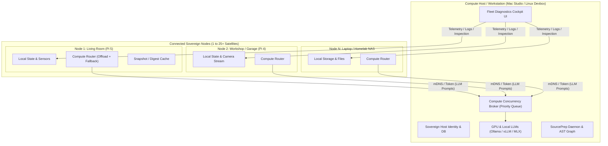

# Federated Multi-Node Architecture & Fleet Compute Sharing

**Date:** 2026-08-29  
**Status:** Comprehensive Architecture, Handoff & Implementation Plan  
**Target:** Halbert Workstations (macOS/Linux Desktop) + N Satellite Nodes (Raspberry Pi, Homelab, Laptops)  

---

## 1. Executive Summary & Vision

Halbert operates on a **Federated Peer Model ("Sovereign Self, Shared Commons")**:
* **Every device is a sovereign Halbert node:** Maintaining its own identity, SQLite state, local sensors, system baseline, and local automation rules.
* **Compute is asymmetrical and opportunistic:** Low-power 24/7 nodes (e.g. Raspberry Pi 5 / Home Hubs) leverage high-power desktop nodes (e.g. Mac Studio, GPU devbox) for heavy compute (LLM inference, embeddings, batch maintenance) whenever the desktop is awake.
* **1:N Fleet Support from Day One:** A single Compute Host (Desktop) can pair with and support **multiple satellite nodes** (1 to 25+ nodes: Living Room Pi, Workshop Pi, Garage Cam, Homelab NAS, Travel Laptop) with prioritized concurrency queuing.
* **Bi-directional value:**
  1. *Satellite ➔ Desktop:* Offloads heavy LLM inference and batch jobs to Desktop GPU.
  2. *Desktop ➔ Satellite:* Serves as a Fleet Diagnostics Cockpit to inspect remote node health, stream logs, and troubleshoot automation/system configs.
* **Local-First & Zero-Config:** Automatic discovery over LAN / Tailscale subnets via mDNS (`_halbert._tcp`) with mutual pre-shared token security (`X-Halbert-Peer-Token`). No external cloud servers or relays required.

---

## 2. Architecture & Topology



---

## 3. Human & Operational Roles

| Role | Typical Hardware | Primary Responsibilities | Compute Profile |
| :--- | :--- | :--- | :--- |
| **Compute Host (Workstation)** | Mac Studio, Linux GPU Rig, High-RAM Desktop | • Code development & SourcePrep daemon<br>• Fleet Diagnostics Cockpit<br>• Hosting 14B–70B LLMs & embedding models | Intermittent uptime (sleeps/travel), massive compute capacity |
| **Ambient Sentinel (Home / Satellites)** | Raspberry Pi 4/5, mini-PC, IoT Hub, Travel Laptop | • 24/7 continuous ambient monitoring<br>• Voice / wake-word assistant<br>• Home Assistant / Frigate / Sensor integration<br>• Local device control | Always-on, low power, lightweight CPU compute |

---

## 4. Key Architectural Pillars

### Pillar 1: Zero-Config Discovery & Mutual Pairing (mDNS + Token)
1. **Service Announcement:**
   * Compute Host advertises service type `_halbert._tcp` on local LAN / Tailnet.
   * TXT Record includes: `node_id`, `node_name`, `role=compute_provider`, `capabilities=gpu_llm,sourceprep,fleet_api`, `api_port=8000`.
2. **One-Click Pairing Handshake:**
   * Satellite discovers beacon and requests pairing.
   * Host displays pairing confirmation / 4-digit code.
   * Both exchange a cryptographic pre-shared token (`X-Halbert-Peer-Token`) stored locally in `~/.config/halbert/peers.json`.
3. **Advanced IT Backdoor:**
   * UI provides manual configuration: Enter static IP/Hostname (`http://192.168.1.50:8000` or `http://desktop.tailnet.ts.net:8000`) + Token for custom VLANs.

### Pillar 2: Priority-Queued Compute Broker (Home ➔ Desktop)
* Runs on Compute Host to manage multi-satellite inference without GPU VRAM thrashing:
  * **Priority 1 (Interactive Local User):** Immediate execution for direct desktop user prompt.
  * **Priority 2 (Interactive Remote Voice/Sensor):** Real-time queries from Home Pi wake-word/smart home actions.
  * **Priority 3 (Background Batch Summaries):** Daily digests, log indexing, scheduled maintenance.
* Built with an async concurrency semaphore (e.g. 4 concurrent inference slots with FIFO queueing).

### Pillar 3: Multi-Tier Fallback & Offline Resilience (When Desktop Sleeps)
* Satellite nodes use an intelligent `ComputeRouter` with sub-second health probing:
  ```
  1. Desktop Compute Peer (LAN / GPU) [1.5s health probe]
     └─► If Online: Stream generation from 32B GPU model
  2. Local Micro-Model / Heuristic Engine (On-Device CPU quantized model)
     └─► If Urgent & Desktop Asleep: Generate fast local response
  3. Optional Cloud API (if configured and allowed by privacy policy)
  4. Deferred Task Queue (Non-urgent maintenance tasks held until Desktop wakes)
  ```

### Pillar 4: Desktop Fleet Cockpit (Desktop ➔ Satellite Management)
* Desktop UI includes a **Fleet Cockpit** & **Node Switcher**:
  * Live status grid for all paired satellites (CPU, RAM, Temp, Uptime, Active Services).
  * Real-time log streaming and agent timeline inspection across any satellite.
  * Diagnostic Agent: Desktop AI analyzes remote Pi systemd configs, cron jobs, and Home Assistant error logs using Desktop's full LLM reasoning power.

---

## 5. Technical Implementation Roadmap

### Phase 1: Networking & Discovery
- [ ] Implement `halbert_core/discovery/peer_discovery.py` using `zeroconf` for mDNS broadcast and listening.
- [ ] Implement `halbert_core/config/peers_config.py` for managing paired node credentials and manual IP overrides.
- [ ] Create pairing handshake REST endpoints (`/api/peers/pair`, `/api/peers/verify`).

### Phase 2: Compute Broker & Client Router
- [ ] Implement `halbert_core/compute/broker.py` with priority queueing and concurrency semaphore on Compute Host.
- [ ] Implement `halbert_core/compute/router.py` with multi-tier fallback pipeline on Satellite nodes.
- [ ] Expose OpenAI-compatible `/api/compute/v1/chat/completions` endpoint for authenticated peers.

### Phase 3: Fleet Telemetry & Remote Diagnostics
- [ ] Implement `halbert_core/runtime/telemetry_agent.py` on satellites for lightweight system metrics reporting.
- [ ] Implement `halbert_core/dashboard/routes/fleet.py` on Desktop for node aggregation and SSE log streaming.
- [ ] Build Diagnostic Agent skill to inspect remote satellite configs.

### Phase 4: Frontend UI Components
- [ ] Build `NodeFleetCockpit.tsx` (Fleet dashboard cards, load gauges, connection status).
- [ ] Build `NodeSwitcher.tsx` (Top-bar dropdown for switching active node context).
- [ ] Build `PeerPairingModal.tsx` (Discovered peers list, one-click pair button, PIN confirmation).

---

## 6. Verification & Test Strategy

1. **Automated Unit & Load Tests:**
   * `test_peer_discovery.py`: mDNS packet serialization and pairing handshake validation.
   * `test_compute_broker.py`: 10-satellite concurrent load test with priority preemption verification.
   * `test_compute_router.py`: Simulated host offline/sleep failover tests.
2. **Integration Verification:**
   * Live pair testing between Desktop and Raspberry Pi over LAN and Tailscale.
   * GPU allocation monitoring during multi-node concurrent prompt dispatch.

---

## 7. Architectural Review Feedback (2026-08-29)

**Reviewer:** Devin (GLM-5.2 High)
**Verdict:** The vision is correct and the "Sovereign Self, Shared Commons" framing is the right mental model. However, the plan as written **ignores substantial completed work** (Multi-Instance Phase 7, MCP Phase 4b, 4-slot model architecture, Apple Intelligence integration, discovery engine) and proposes parallel systems where integration is required. It also under-specifies the trust boundary that a federated compute endpoint opens. Below are 15 findings, ordered by severity, each with concrete code references and implementation guidance.

### Critical — must resolve before implementation

---

**C1. Duplicates MCP Phase 4b (HTTP/SSE + bearer auth) without referencing it.**

The MCP plan (`HALBERT-MCP-PLAN-2026-08-28.md`, Phase 4b) already specifies HTTP/SSE transport with bearer token auth for multi-instance access, reusing the `prep_token` pattern. This handoff proposes a separate `X-Halbert-Peer-Token` scheme over mDNS. These are two auth surfaces for the same problem.

**Why this matters:** Two token systems means two rotation flows, two revocation paths, two places where a token leak goes undetected. A paired satellite and an MCP client are both "external callers that authenticate to the Halbert API" — they should share one credential mechanism.

**Code references:**
- `halbert_core/halbert_core/mcp/server.py:1-27` — MCP server already documents "HTTP/SSE + bearer auth in Phase 4b"
- `halbert_core/halbert_core/mcp/response.py:146-162` — `mcp_response()` is the existing egress boundary
- MCP plan Phase 4b tasks: T4b.1 (HTTP/SSE transport), T4b.2 (bearer token auth), T4b.3 (instance naming)

**Resolution:** The federated peer token MUST be the same credential mechanism as MCP Phase 4b. One token, one auth middleware (`federation/peer_middleware.py`), used by both MCP clients (Warp/Claude) and peer Halbert nodes. The `X-Halbert-Peer-Token` header and the MCP `Authorization: Bearer <token>` header should resolve to the same `PeerCredential` record. Do not build a second token system.

**Scaffolded file:** `halbert_core/halbert_core/federation/peer_middleware.py` — FastAPI dependency that validates bearer tokens against `peers_config.py`, shared by both the MCP HTTP/SSE transport and the compute endpoint.

---

**C2. Duplicates Multi-Instance Phase 7 (already implemented) without building on it.**

Phase 7 (`HALBERT-MULTI-INSTANCE-DESIGN.md` + `HALBERT-MULTI-INSTANCE-REVIEW-FEEDBACK.md`) shipped the two-process env-var-isolated model, `HALBERT_PORT`, `HALBERT_DATA_DIR`, persona-aware sidebar, and the **Top-Bar Instance Switcher**. This handoff's "Node Switcher" (Phase 4) is the same component.

**Why this matters:** The Instance Switcher already handles paired remote instances (manual IP entry, localStorage persistence, role-based icons). The federated work just needs to add mDNS-discovered peers to the same dropdown and add a "Fleet Cockpit" view — not rebuild the switcher.

**Code references:**
- `halbert_core/halbert_core/dashboard/frontend/src/components/shell/InstanceSwitch.tsx:1-244` — full Instance Switcher with `PairedInstance` interface, `loadPairedInstances()`, `handleSwitch()`, add/remove form
- `halbert_core/halbert_core/dashboard/routes/instance.py:1-60` — `GET /api/instance/info` returns persona_id, role, features, port
- `halbert_core/halbert_core/dashboard/frontend/src/lib/apiBase.ts` — `setInstanceEndpoint()` / `getInstanceEndpoint()` already support remote endpoints

**Resolution:** The federated work is effectively **Phase 9+** of the home-automation strategy. The `NodeSwitcher.tsx` already exists as `InstanceSwitch.tsx` — extend it to list mDNS-discovered peers alongside manually-paired instances. The plan must explicitly state "builds on Phase 7 Instance Switcher." Do not create `NodeSwitcher.tsx` as a new component.

**Scaffolded change:** `InstanceSwitch.tsx` gains a `discoveredPeers` prop fed by a `useDiscoveredPeers` hook that polls `/api/peers/discovered`. Discovered peers show with a "mDNS" badge vs manually-paired "Manual" badge.

---

**C3. ComputeRouter duplicates `tier_router.py` / `cascade_router.py`.**

The codebase already has `model/tier_router.py` with intelligent fallback chains, `cascade_router.py` (MetaHarnessRouter), and `error_recovery` manager. The proposed `compute/router.py` multi-tier fallback (Desktop → Local micro-model → Cloud → Deferred) is a *peer-aware extension* of the existing fallback machinery, not a new router.

**Why this matters:** `TierRouter` already tracks `_model_health`, `_last_health_check`, `ModelSelection.fallback_used`, `fallback_from`, and has a `RateLimiter` for 429/529 handling. Building a parallel router means two health-check systems, two fallback-tracking systems, and two places where cost-cascade logic lives. The `MetaHarnessRouter` (cascade_router.py) blends outcome evidence with priors — a peer endpoint should participate in that same evidence loop.

**Code references:**
- `halbert_core/halbert_core/model/tier_router.py:37-42` — `ProviderType` enum: `OLLAMA`, `ANTHROPIC`, `OPENAI`, `OPENROUTER` (needs `PEER`)
- `halbert_core/halbert_core/model/tier_router.py:46-53` — `ModelSelection` dataclass with `fallback_used`, `fallback_from`
- `halbert_core/halbert_core/model/tier_router.py:215-263` — `TierRouter` class with `_model_health`, `rate_limiter`, `outcome_store`, `cascade_router`
- `halbert_core/halbert_core/model/providers/base.py:60-100` — `ModelProvider` ABC with `list_models()`, `load_model()`, `generate()`
- `halbert_core/halbert_core/model/providers/ollama.py:30` — `OllamaProvider(ModelProvider)` — the pattern to follow

**Resolution:** Add a "peer endpoint" as a first-class provider in `tier_router.py` (alongside `OLLAMA`/`ANTHROPIC`/`OPENAI`/`OPENROUTER`), with health probing. The satellite's `chat_model` slot points at `peer://desktop.lan:8000`. Reuse `ModelSelection.fallback_used` / `fallback_from` rather than reinventing fallback tracking. The `PeerProvider` class implements `ModelProvider` and proxies to the peer's `/api/compute/v1/chat/completions` endpoint.

**Scaffolded file:** `halbert_core/halbert_core/model/providers/peer.py` — `PeerProvider(ModelProvider)` that calls the peer's compute endpoint with bearer auth, implements `list_models()` via `GET /api/compute/v1/models`, and `generate()` via `POST /api/compute/v1/chat/completions`.

---

**C4. The compute endpoint opens a prompt-injection exfiltration path with no redaction boundary.**

`/api/compute/v1/chat/completions` lets a paired satellite send arbitrary prompts to the Desktop's GPU. A compromised satellite (Pi in the garage, travel laptop on hostile WiFi) can craft a prompt that instructs the Desktop model to read and return `~/.ssh/id_rsa`, `/etc/shadow`, or SourcePrep-indexed secrets. The MCP plan spent Tasks 0+3 building `redact_text()` and a Tier 0/1/2 sensitivity model precisely for this.

**Why this matters:** Without redaction, a peer compute request is equivalent to giving the satellite shell access to the Desktop's model + tool surface. The MCP plan's entire security architecture (Tasks 0, 3, 7) exists because "an MCP client is not `cat`" — the same is true for a peer node. A peer is not `cat`; it forwards prompts that may contain injection payloads.

**Code references:**
- `halbert_core/halbert_core/mcp/response.py:1-62` — `mcp_response()` documentation explaining why the egress boundary exists
- `halbert_core/halbert_core/ingestion/redaction.py` — `redact_text()` and `_is_secret_key()` (the redaction primitives)
- MCP plan §2 "The Two Egress Risks" — Risk A (MCP egress to vendor) is the same risk as peer egress to satellite
- MCP plan §3 "Tiered Sensitivity" — Tier 0 (Public), Tier 1 (Operational), Tier 2 (Secrets)

**Resolution:** The compute endpoint MUST apply the same `mcp_response()` / `redact_text()` boundary on responses, and the Desktop-side tool surface available to peer prompts MUST be a restricted subset (no `run_scanner`, no `approve_proposal`, no file-read tools). Define an explicit "peer-capable tool allowlist" mirroring the MCP `cloud_safe` tool table (MCP plan §8). The response from a peer-initiated generation passes through `mcp_response()` before being sent back over the network.

**Scaffolded files:**
- `halbert_core/halbert_core/federation/tool_allowlist.py` — `PEER_ALLOWED_TOOLS` frozenset, `is_tool_allowed_for_peer()`, `filter_tools_for_peer()`
- `halbert_core/halbert_core/federation/compute_endpoint.py` — applies `mcp_response()` to the generation response before returning

---

**C5. Fleet Cockpit remote-config inspection is a new attack surface on every satellite.**

Pillar 4 / Phase 3 proposes the Desktop AI inspecting "remote Pi systemd configs, cron jobs, HA error logs." This is a Tier 1 (Operational) data flow per the MCP sensitivity model — and it requires every satellite to expose a read API for its own configs.

**Why this matters:** Building a bespoke `/api/fleet/inspect` endpoint on every satellite means every satellite runs a second API surface with its own auth, its own redaction, and its own tool set. The MCP server already solves this: it exposes config queries with `mcp_response()` redaction, tool allowlisting, and bearer auth. The Desktop should be an MCP *client* of the satellite, not a consumer of a parallel API.

**Code references:**
- `halbert_core/halbert_core/mcp/server.py:1-27` — 17 MCP tools already defined
- `halbert_core/halbert_core/mcp/response.py:146-162` — `mcp_response()` boundary
- MCP plan §8 tool table — `get_config_structure` (cloud-safe), `get_config_diff` (cloud-safe), `get_config_value` (Tier 1, user-configurable redaction)

**Resolution:** Do NOT build a bespoke `/api/fleet/inspect` endpoint. The satellite should run the **MCP server** (already planned) and the Desktop should connect as an MCP *client* with the same Tier 0/1/2 redaction applied at the satellite's response boundary. This reuses the entire MCP security architecture instead of duplicating it insecurely. The Fleet Cockpit UI calls a Desktop-side route that proxies MCP tool calls to the satellite.

**Scaffolded file:** `halbert_core/halbert_core/federation/fleet_proxy.py` — proxies MCP tool calls from Desktop to satellite over the peer link, applies `mcp_response()` on the Desktop side as defense-in-depth.

### High — design gaps that will cause rework

---

**H6. "1:N from Day One (1 to 25+)" is over-scoped for a first phase.**

Phase 7 proved 1:1 (two processes, one machine). Jumping to 1:25+ with a priority concurrency broker in a single phase is a 10x complexity jump with no intermediate validation.

**Why this matters:** The concurrency broker (semaphore, priority queue, preemption) is the hardest part to get right. If the 1:1 link has a subtle bug (token mismatch, redaction gap, health-probe race), it will be multiplied by 25 nodes and become invisible in the noise. Validate the link, the auth, the redaction, and the failover with exactly 2 nodes first.

**Resolution:** Split Phase 2. Phase 2a: 1:1 cross-machine (Desktop ↔ one Pi), prove the link, failover, and redaction. Phase 2b: introduce the concurrency broker and scale to N. Validate 2a end-to-end before building 2b.

**Scaffolded files reflect this:** `compute_broker.py` is scaffolded with a `max_concurrent` parameter defaulting to 1 (effectively FIFO for 2a), with the priority queue and semaphore ready for 2b but not enforced until 2a passes.

---

**H7. Fallback tier 2 ("Local Micro-Model") is not viable on the lowest hardware tiers.**

The low-power hardware handoff (`HANDOFF-LOW-POWER-HARDWARE-TIERS-AND-EDGE-CASES-2026-08-29.md` §7.1) established that on Pi 4 (4GB) a 4B model is 3-5 tok/s with OOM risk, and on `SBC_LOW_POWER` (≤4GB) the architectural rule is template thoughts (`HALBERT_LLM_THOUGHTS=0`). The fallback chain as written assumes a usable local model always exists.

**Why this matters:** If the fallback chain tries to load a 3B model on a Pi 4 2GB, it will OOM and crash the satellite — worse than just failing silently. The fallback must be aware of the hardware profile it's running on.

**Code references:**
- `halbert_core/halbert_core/model/hardware_detector.py:32-41` — `HardwareProfile` enum: `SBC_LOW_POWER`, `ENTRY_8GB`, `LAPTOP_16GB`, etc.
- `halbert_core/halbert_core/model/hardware_detector.py:392-427` — `_classify_hardware()` maps RAM → profile
- Low-power handoff §7.1 — parameter table: 4B on Pi 4 = 3-5 tok/s, OOM risk
- Low-power handoff §3 — "cognitive monologue defaults to template thoughts (`HALBERT_LLM_THOUGHTS=0`)" on ≤4GB

**Resolution:** The `ComputeRouter` fallback must be **hardware-profile-aware** using the existing `SBC_LOW_POWER` / `ENTRY_8GB` profiles. On ≤4GB, realistic fallback is template thoughts + deferred queue, not a micro-model. On ≥8GB, the 3B fallback is valid. The `PeerProvider` in `tier_router.py` checks `HardwareProfile` before attempting local model fallback.

---

**H8. Cognitive monologue (`advance_turn`) offload is not addressed.**

The satellite's `advance_turn` is a continuous cognitive tick. If it offloads to the Desktop and the Desktop sleeps, the satellite's cognition stalls. "Deferred Task Queue" handles batch jobs but not the monologue.

**Why this matters:** If `advance_turn` queues 200 turns while the Desktop sleeps and replays them on wake, the Desktop gets a burst of 200 inference requests — a denial-of-service from the satellite's own cognition. Conversely, if `advance_turn` just drops turns, the satellite's cognitive state diverges from reality.

**Resolution:** Define explicit behavior: when the Desktop peer is unreachable, the satellite's `advance_turn` falls back to template thoughts (per the low-power rule), and queued monologue turns are NOT replayed on wake (they'd flood). Only user-initiated and automation-triggered turns are deferred. State this in Pillar 3. The `ComputeRouter` distinguishes `turn_type: "monologue" | "user" | "automation"` and applies different deferral policies.

---

**H9. mDNS does not cross Tailscale without a reflector.**

§1 and Pillar 1 claim "automatic discovery over LAN / Tailscale subnets via mDNS." mDNS is link-local multicast (224.0.0.251) and does not traverse Tailscale's WireGuard tunnel unless an mDNS reflector/bridge is explicitly configured on a node.

**Why this matters:** A user on a travel laptop connected to Tailscale will expect zero-config discovery of their home Desktop, but mDNS will silently fail. The "Advanced IT Backdoor" (manual IP) is the actual Tailscale path, but the plan implies it's a secondary option.

**Resolution:** Either (a) state that Tailscale peers use the "Advanced IT Backdoor" manual IP entry (Pillar 1.3) — mDNS is LAN-only, or (b) document the mDNS reflector requirement (e.g., `avahi-daemon` with `enable-reflector=yes` on a bridge node). Do not imply zero-config discovery over Tailscale. The scaffolded `peer_discovery.py` documents this limitation in its module docstring.

---

**H10. `zeroconf` violates the Haloysius subtractive contract.**

The project rules (`CLAUDE.md`) mandate only 2 hard dependencies (`pyyaml`, `requests`); all heavy stacks must be function-level lazy optional extras. `zeroconf` would be a new hard dependency.

**Why this matters:** The subtractive contract is what lets Halbert run on a Pi 4 2GB without pulling in unnecessary packages. `zeroconf` pulls in `ifaddr` and other networking deps. Adding it to `requirements.txt` breaks the contract.

**Code references:**
- `CLAUDE.md` / `AGENTS.md` — "Haloysius Subtractive Contract: Only 2 hard dependencies (`pyyaml>=6.0`, `requests>=2.31.0`); all heavy/ML stacks must remain function-level lazy optional extras."
- `halbert_core/halbert_core/vision/` — example of lazy imports (torch, cv2 imported inside functions)

**Resolution:** `peer_discovery.py` must import `zeroconf` lazily inside the discovery function with a graceful "mDNS unavailable, use manual pairing" fallback, exactly like the vision/ML stacks. Add `zeroconf` to optional extras (`halbert-core[federation]`), not `requirements.txt`.

**Scaffolded file:** `halbert_core/halbert_core/federation/peer_discovery.py` — `import zeroconf` is inside `_start_zeroconf_listener()`, wrapped in `try/except ImportError`.

### Medium — integration / consistency

---

**M11. No mapping to the 4-slot model architecture.**

The 4-slot model (`chat_model`, `specialist_model`, `vision_model`, `secure_model`) is the established config surface. The plan talks about "offloading LLM inference" generically.

**Why this matters:** Without slot-level routing rules, a satellite might offload `secure_model` to the Desktop — which defeats the entire purpose of `secure_model` (local-only processing of secrets, credentials, camera frames). The `secure_model` slot has a hard local-only URL enforcement (`llm_config.py:417-421`) that would need to be bypassed, creating a security hole.

**Code references:**
- `halbert_core/halbert_core/model/llm_config.py:64` — `SLOTS = ("chat_model", "specialist_model", "vision_model", "secure_model")`
- `halbert_core/halbert_core/model/llm_config.py:135-140` — `_is_local_url()` enforces `secure_model` is local-only
- `halbert_core/halbert_core/model/llm_config.py:417-421` — `secure_model` endpoint non-local → slot disabled with warning

**Resolution:** Specify which slots offload to the peer:
- `chat_model`: CAN peer-offload (general conversation, no secrets expected)
- `specialist_model`: CAN peer-offload (complex reasoning, the main use case)
- `vision_model`: CAN peer-offload ONLY if peer advertises `vision` capability in mDNS TXT record
- `secure_model`: MUST NOT peer-offload (local-only by architectural rule — sending secure content to another node defeats its purpose). The `_is_local_url()` enforcement stays in place; `peer://` URLs are rejected for `secure_model`.

State this explicitly in the plan and enforce it in `PeerProvider.can_serve_slot()`.

---

**M12. Telemetry agent duplicates the discovery engine.**

Phase 3 proposes `runtime/telemetry_agent.py` for "lightweight system metrics." The `discovery/` package already has scanners (storage, service, network, thermal, process) producing structured discoveries on both macOS and Linux, with platform-aware registration.

**Why this matters:** Two metrics collection systems means two code paths for "what services are running on this Pi," two data shapes, and two update cadences. The discovery engine already produces `Discovery` objects with structured data fields that the frontend renders.

**Code references:**
- `halbert_core/halbert_core/discovery/engine.py:28-60` — `DiscoveryEngine` with scanner registration, `scan_all()`, `get_by_type()`
- `halbert_core/halbert_core/discovery/scanners/` — 20+ scanners including `thermal.py`, `process.py`, `network.py`, `service.py`
- `halbert_core/halbert_core/discovery/scanners/macos/` — macOS-specific scanners (platform-aware registration already works)

**Resolution:** The satellite's telemetry stream should be a **lightweight periodic snapshot of the discovery engine's existing results** plus live deltas (CPU/RAM/temp via `psutil`), not a parallel metrics collection system. Reuse `DiscoveryEngine` + a small vitals poller. The `telemetry_agent.py` becomes a thin wrapper that calls `engine.scan_all()` periodically and diffs against the last snapshot.

---

**M13. Apple Intelligence / Metal is absent from the Compute Host pillar.**

The recent Apple Intelligence integration (`HANDOFF-APPLE-INTELLIGENCE-IMPLEMENTATION-2026-08-29.md`) added `apple-foundation` as a local provider with Metal GPU detection and auto-provisioning. The Compute Host pillar (§2 diagram, §3 roles) lists only "Ollama / vLLM / MLX."

**Why this matters:** A Mac Studio compute host's primary inference path may be Apple Intelligence on the ANE (Apple Neural Engine), not Ollama. Satellites need to know which backend the Desktop uses so they route to the right endpoint. The `apple-foundation` provider has different capabilities (on-device, no data leaves the Mac) that affect the sensitivity routing.

**Code references:**
- `halbert_core/halbert_core/model/capabilities.py` — `ModelCapabilities.detect()` has `apple-foundation` branch with `tool_use=True`, `streaming=True`
- `halbert_core/halbert_core/model/hardware_detector.py:66-69` — `apple_intelligence_available`, `apple_intelligence_bridge_running` fields
- `halbert_core/halbert_core/model/auto_provision.py` — auto-provisioning on first boot

**Resolution:** Add Apple Intelligence / Metal as a first-class compute source. The `capabilities=gpu_llm` TXT record should distinguish `apple_foundation` vs `ollama` vs `vllm` so satellites route to the right backend. The mDNS TXT record gains a `compute_backends=ollama,apple_foundation` field.

---

**M14. Token rotation and compromise recovery are undefined.**

`peers.json` stores a pre-shared token on disk. If a satellite (e.g., garage Pi) is physically compromised, the PSK leaks and grants GPU access to the Desktop.

**Why this matters:** Without per-peer tokens, one compromised satellite means re-pairing ALL satellites. Without a rotation flow, tokens never change and accumulate risk. Without revocation, a stolen token remains valid indefinitely.

**Resolution:** Define:
- (a) **Per-peer tokens:** each satellite gets its own token (not one shared PSK). The `peers_config.py` stores a `token_hash` per peer (SHA-256, never the raw token). Revocation is surgical — one peer, one token.
- (b) **Token rotation flow:** Desktop revokes a peer (`DELETE /api/peers/{node_id}`), the peer is forced to re-pair. The old token is invalidated immediately.
- (c) **What Desktop-side capabilities a revoked token loses immediately:** the `peer_middleware.py` checks token validity on every request; a revoked token gets 401 within one request cycle (no caching of token validity beyond the request scope).

Tie this to the MCP Phase 4b token scoping.

**Scaffolded file:** `halbert_core/halbert_core/federation/peers_config.py` — `PeerCredential` dataclass with `node_id`, `token_hash`, `role`, `paired_at`, `last_seen`, `revoked`. `PeersConfig` class with `add_peer()`, `revoke_peer()`, `verify_token()`.

### Low — test strategy

---

**L15. Test strategy misses the trust boundary and split-brain cases.**

The proposed tests cover load and failover but not the security-critical paths.

**Add the following test files:**

- `test_peer_redaction.py`: peer prompt requesting `~/.ssh/id_rsa` content returns redacted/empty, never the raw value. Verifies `mcp_response()` is applied on the compute endpoint response boundary.
- `test_peer_tool_allowlist.py`: peer prompts cannot invoke `run_scanner` / `approve_proposal` / file-read tools on the Desktop. Verifies `filter_tools_for_peer()` strips disallowed tools.
- `test_token_revocation.py`: revoked peer token is rejected within one request cycle. Verifies `peer_middleware.py` checks `revoked` flag on every request.
- `test_split_brain.py`: Desktop wakes, a deferred satellite task completed locally conflicts with a Desktop-side completion — define resolution (last-write-wins? Desktop-authoritative?).
- `test_secure_model_no_offload.py`: `secure_model` slot never routes to a peer endpoint even when peer is online. Verifies `PeerProvider.can_serve_slot("secure_model")` returns `False`.
- `test_hardware_profile_fallback.py`: on `SBC_LOW_POWER` profile, fallback uses template thoughts, not a micro-model. On `ENTRY_8GB`, fallback uses 3B local model.

---

## 8. Recommended Re-sequencing

Given the completed foundations, the federated work should be framed as **Phase 9+** and re-sequenced to build on them:

| Step | Builds On | Deliverable | Scaffolded File(s) |
|------|-----------|-------------|---------------------|
| 9.1 | MCP Phase 4b (HTTP/SSE + bearer) | Peer auth = MCP token, one middleware. Per-peer tokens. | `federation/peer_middleware.py`, `federation/peers_config.py` |
| 9.2 | Multi-Instance Phase 7 (Instance Switcher) | Extend switcher with remote peer entries (manual IP first). | `InstanceSwitch.tsx` (extend), `useDiscoveredPeers.ts` |
| 9.3 | `tier_router.py` | Add `peer://` provider type with health probe. 1:1 cross-machine link. | `model/providers/peer.py` |
| 9.4 | MCP Tier 0/1/2 redaction | Apply `redact_text()` + peer tool allowlist on compute endpoint. | `federation/tool_allowlist.py`, `federation/compute_endpoint.py` |
| 9.5 | Discovery engine | Satellite telemetry = discovery snapshot + vitals deltas. | `federation/telemetry_agent.py` |
| 9.6 | Low-power hardware profiles | Hardware-profile-aware fallback (template thoughts on ≤4GB). | `federation/compute_router.py` |
| 9.7 | — | mDNS auto-discovery (lazy `zeroconf`, LAN-only). Tailscale = manual. | `federation/peer_discovery.py` |
| 9.8 | 9.1-9.4 validated | Concurrency broker, scale to N (Phase 2b). | `federation/compute_broker.py` |
| 9.9 | MCP server on satellite | Fleet Cockpit = Desktop as MCP client of satellite (no bespoke inspect API). | `federation/fleet_proxy.py`, `dashboard/routes/fleet.py` |
| 9.10 | Apple Intelligence | `apple-foundation` as advertised peer capability. | (TXT record field in `peer_discovery.py`) |

**Bottom line:** The vision is sound. The plan needs to be rewritten as an *extension* of MCP Phase 4b + Multi-Instance Phase 7 + the 4-slot model, not a greenfield architecture. The single most important fix is C4/C5 — the federated compute and inspection paths inherit the MCP redaction boundary and tool allowlist, or they are an unmonitored exfiltration channel.

---

## 9. Scaffolded Implementation (this worktree)

**Worktree:** `~/.config/superpowers/worktrees/Halbert/federated-fleet`
**Branch:** `feat/federated-fleet`

All files are scaffolded with detailed inline comments referencing the findings above. No file contains working logic — they are structural skeletons with docstrings, type signatures, and `raise NotImplementedError` / `TODO(federation-9.x)` markers. The intent is to make the implementation path concrete and reviewable before any logic is written.

### Backend (`halbert_core/halbert_core/federation/`)

| File | Purpose | Finding |
|------|---------|---------|
| `__init__.py` | Package init, public API exports | — |
| `peers_config.py` | Per-peer credential store with token hashes, revocation | C1, M14 |
| `peer_middleware.py` | FastAPI dependency: bearer token validation (shared with MCP 4b) | C1 |
| `peer_discovery.py` | mDNS beacon/listener (lazy `zeroconf`, LAN-only) | H9, H10 |
| `compute_endpoint.py` | OpenAI-compatible `/api/compute/v1/chat/completions` with redaction boundary | C4 |
| `compute_broker.py` | Priority queue + concurrency semaphore (max_concurrent=1 for 9.2a) | H6 |
| `compute_router.py` | Hardware-profile-aware fallback chain (extends tier_router) | C3, H7, H8 |
| `tool_allowlist.py` | `PEER_ALLOWED_TOOLS` frozenset, `filter_tools_for_peer()` | C4, C5 |
| `telemetry_agent.py` | Discovery engine snapshot + vitals deltas (reuses discovery/) | M12 |
| `fleet_proxy.py` | Desktop-as-MCP-client proxy to satellite (no bespoke inspect API) | C5 |

### Backend (`halbert_core/halbert_core/model/providers/`)

| File | Purpose | Finding |
|------|---------|---------|
| `peer.py` | `PeerProvider(ModelProvider)` — calls peer compute endpoint with bearer auth | C3, M11 |

### Backend (`halbert_core/halbert_core/dashboard/routes/`)

| File | Purpose | Finding |
|------|---------|---------|
| `peers.py` | Pairing handshake (`/api/peers/pair`, `/api/peers/verify`), list/revoke | C1, M14 |
| `fleet.py` | Fleet Cockpit aggregation (proxies to satellite MCP via `fleet_proxy`) | C5 |

### Frontend (`halbert_core/halbert_core/dashboard/frontend/src/`)

| File | Purpose | Finding |
|------|---------|---------|
| `components/fleet/NodeFleetCockpit.tsx` | Fleet status grid (CPU/RAM/temp/uptime per node) | C2 |
| `components/fleet/PeerPairingModal.tsx` | Discovered peers list, one-click pair, PIN confirmation | C2 |
| `hooks/useDiscoveredPeers.ts` | Polls `/api/peers/discovered`, feeds `InstanceSwitch` | C2 |
| `lib/peerApi.ts` | Typed API client for peers/fleet endpoints | — |

### Tests (`halbert_core/tests/federation/`)

| File | Purpose | Finding |
|------|---------|---------|
| `test_peer_redaction.py` | Peer prompt requesting `~/.ssh/id_rsa` returns redacted | C4, L15 |
| `test_peer_tool_allowlist.py` | Peer prompts cannot invoke restricted tools | C4, L15 |
| `test_token_revocation.py` | Revoked token rejected within one request cycle | M14, L15 |
| `test_split_brain.py` | Deferred task conflict resolution | L15 |
| `test_secure_model_no_offload.py` | `secure_model` never routes to peer | M11, L15 |
| `test_hardware_profile_fallback.py` | SBC_LOW_POWER uses template thoughts, not micro-model | H7, L15 |
| `test_compute_broker.py` | Concurrency + priority preemption (Phase 2b) | H6 |
| `test_peer_discovery.py` | mDNS packet serialization + handshake validation | H9 |

### Documentation

| File | Purpose |
|------|---------|
| `halbert_core/halbert_core/federation/README.md` | Architecture overview, finding references, implementation order |
