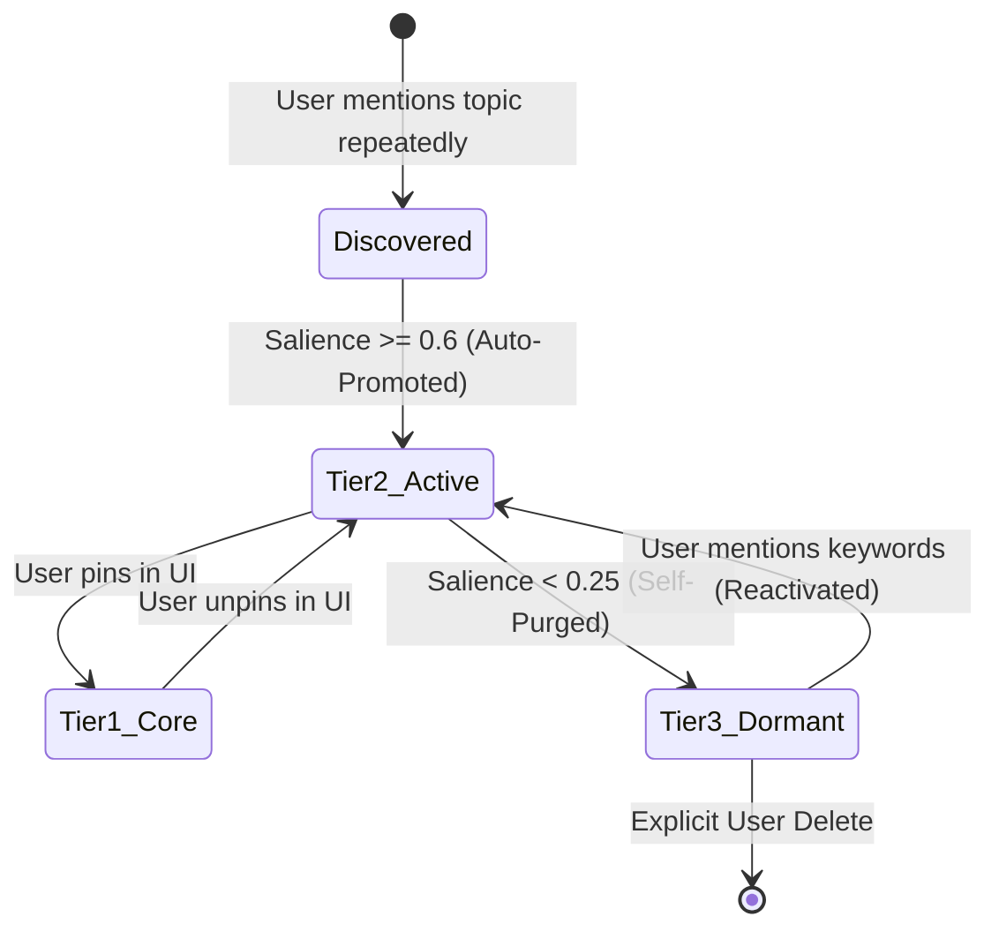

# HANDOFF: "Nerd-Scopes" & Dynamic Personality Steering Architecture

**Date**: 2026-09-04  
**Author**: Antigravity / Pair Programming with Founder  
**Status**: SUPERSEDED-BY `.handoff/HANDOFF-OBSERVATION-LENSES-2026-09-04.md` (rev 2, 2026-09-05). Kept as history; the founder requirements quoted in §1.2 and §6 are carried forward there (§1.1, D9, §13 CD-5).  
**Target Subsystems**:
- **Haloysius (Universal Engine)**: `src/haloysius/scopes/` (new module), `src/haloysius/context/prompt_pipeline.py`, `src/haloysius/persona/cognition_tick.py`, `src/haloysius/memory_v2/`
- **Halbert Core (Host/Platform)**: `halbert_core/persona/`, `halbert_core/prompts/builder.py`, `halbert_core/continuity/state_store.py`, `halbert_core/rag/`
- **Halbert Dashboard (Frontend)**: `halbert_core/dashboard/frontend/src/pages/Settings.tsx`, `halbert_core/dashboard/frontend/src/components/settings/NerdScopesCard.tsx`
- **Storage Surface**: User filesystem at `~/.config/halbert/nerd_scopes/` and Haloysius `config/nerd_scopes/`

---

## 1. Executive Context & Problem Statement

### 1.1 The Missing Dimension in Companion Intelligence
Halbert and Haloysius currently possess sophisticated mechanisms for:
1. **Demeanor & Tone**: 5-way communication styles (`concise`, `balanced`, `detailed`, `analytical`, `casual`), Big Five personality profiles, and voice presentation (`male`, `female`, `not_defined`).
2. **Task Refinement & Safety Guardrails**: Tiered XML prompt assembly (`guide`, `specialist`, `vision`), tool schemas with strict JSON output contracts, and explicit confirmation levels.
3. **Continuity & Memory**: Immutable machine-state ledgers (`StateStore`), temporal triples, markdown vault projections, semantic memory (`PersonaMemoryStore`), and conversation SQLite threads.

**The Glaring Void:**  
We have abilities to control *how fast or polite* the AI speaks (demeanor), and *what tools* it can touch (task execution), but **nothing to drive its conversational substance, intellectual flavor, wit, or thematic curiosity**.

Without thematic direction, an AI companion defaults to either generic bland corporate assistant banter ("*I'd be happy to help with that!*") or vacuous sycophancy.

### 1.2 The "Trained-Model Trap": Why Specialized Models Fail for an OS Companion
A common naive proposal is: *"Why not swap in a comedy-trained or creative fine-tuned model for personality?"*

As the founder rightly noted:  
> *"lol you don't want the OS playing tricks on you..."*

Swapping or fine-tuning weights for humor or creative behavior is fatal for an operating system companion:
1. **Tool Dispatch & Syntax Corruption**: Creative models frequently hallucinate flags, alter shell commands, invent non-existent parameters, and fail strict JSON schema validation.
2. **Safety & Destructive Operations**: An OS steward manages root privileges, disks, systemd services, and file permissions. A model fine-tuned for mischievous or theatrical banter cannot be reliably gated when issuing `rm -rf`, `mkfs`, or `fdisk`.
3. **Hardware Budget & The Subtractive Contract**: Halbert targets low-power hardware tiers (e.g. Intel N150 with 8 GB RAM) and local inference (ONNX/Ollama). Running dual models (one for sysadmin work, one for creative humor) blows past VRAM and CPU limits. Swapping model weights during chat introduces catastrophic latency.
4. **Zero User Agency**: Model weights are opaque black boxes. The user cannot edit, inspect, tune, or turn off specific jokes or reference styles without retraining.

### 1.3 The Core Solution: The "Nerd-Scopes" Abstraction
Personality and intellectual flavor must be an **orthogonal steering layer**:
- Decoupled from model weights and valid across all model tiers (from local small models up to frontier cloud LLMs).
- Driven by human-readable, composable **Markdown (`.md`) files** containing prompt fragments, metaphor mappings, and recommendation banks.
- Governed by a **two-way definition**: user-curated (top-down) and AI-discovered/learned (bottom-up).
- Transparently managed in the UI with **hierarchical tiers** (Core, Active, Dormant).
- **Self-organizing and self-purging**: active topics stay fresh during short-term discussions; inactive topics decay from hot prompts and compress into long-term memory so they can be recalled later without wasting token budget.
- **Deeply grounded in hybrid memory and RAG**: linked to past conversation turns, user favorites, and downloaded topical research.

---

## 2. Reverse Engineering & Second-Guessing Existing Codebases

To build this cleanly without redundant machinery or broken invariants, we scrutinize what both codebases provide today.

```
┌──────────────────────────────────────────────────────────────────────────────────┐
│ HALBERTIAN / HALOYSIUS COGNITIVE STACK                                           │
├──────────────────────────┬───────────────────────────────────────────────────────┤
│ Surface                  │ Current Reality & Architectural Scrutiny              │
├──────────────────────────┼───────────────────────────────────────────────────────┤
│ Haloysius Prompt Pipeline│ `UnifiedPromptPipeline` (prompt_pipeline.py) assembles │
│                          │ system prompts under a single token budget using      │
│                          │ `ContextBuilder`. Uses explicit priority blocks:      │
│                          │ CRITICAL (identity, format_rules, current_state)      │
│                          │ HIGH (personality, memories, scenario)               │
│                          │ MEDIUM (context_hints, narrative_hint, session)      │
│                          │ LOW (extended_memory, hidden_knowledge).             │
│                          │ Drop-down behavior: low-priority blocks are dropped   │
│                          │ cleanly when budget is tight.                         │
├──────────────────────────┼───────────────────────────────────────────────────────┤
│ Halbert Prompt Builder   │ `PromptBuilder` (builder.py) assembles XML templates. │
│                          │ Accepts `personality_section` param (generated from   │
│                          │ `BeingConfig` via `generate_personality_section()`).  │
│                          │ Concatenates dynamic sections (system_context, prefs, │
│                          │ rag_results, conversation_history).                   │
├──────────────────────────┼───────────────────────────────────────────────────────┤
│ Cognitive Tick & Decay   │ `advance_turn()` in Haloysius `cognition_tick.py`     │
│                          │ executes a 6-phase lifecycle per turn: decay, trigger │
│                          │ detection, reinforcement, thought promotion to memory,│
│                          │ conflict detection, and persistence. Built-in decay:  │
│                          │ drives (0.03), worries (0.02), emotions (0.1).        │
├──────────────────────────┼───────────────────────────────────────────────────────┤
│ Keyword / Lorebook Hooks │ `KeywordInjector` in `keyword_injection.py` provides  │
│                          │ activation keys, secondary keys, priorities, and regex│
│                          │ scanning over recent messages.                        │
├──────────────────────────┼───────────────────────────────────────────────────────┤
│ Self-Editing & User Facts│ `UserKnowledge` in `self_editing.py` tracks user      │
│                          │ `likes`, `dislikes`, `interests`, and key facts.      │
│                          │ Emits a prompt section: "WHAT I KNOW ABOUT YOU".      │
├──────────────────────────┼───────────────────────────────────────────────────────┤
│ Memory & Invariants      │ Fable / Ledger (`StateStore`): records digests and   │
│                          │ triples. INVARIANT 1: `reason` is never fabricated    │
│                          │ post-hoc by a model. INVARIANT 4: The Markdown vault  │
│                          │ has no authority; rebuildable from store. INVARIANT 8:│
│                          │ Deterministic before model.                           │
└──────────────────────────┴───────────────────────────────────────────────────────┘
```

### 2.1 Second-Guessing Every Finding

#### Finding A: Can we just dump `.md` files into the existing `personality_section`?
- **Second-Guess**: In Halbert, `personality_section` is a single string injected inside `<personality>...</personality>`. If we simply concatenate 5 or 10 full markdown files, we will blow out the token budget (costing 2,000–5,000 tokens) on every single turn!
- **Resolution**: We must adopt **hierarchical budgeting**. Only compressed prompt directives from **Tier 1 (Core)** and dynamically activated **Tier 2 (Active)** scopes get injected into the hot prompt. Inactive scopes (Tier 3) are evicted from the prompt and stay dormant in long-term memory.

#### Finding B: Can Haloysius run a background LLM daemon to organize scopes?
- **Second-Guess**: Invariant 6 (`HANDOFF-FABLE-MEMORY-ECOSYSTEM-2026-09-02.md`) strictly dictates: *Background work registers on Halbert's APScheduler, gated by the 60s turn-lock heartbeat — never on haloysius.background. Do not build an idle probe.* Furthermore, Invariant 8 mandates *deterministic before model*.
- **Resolution**: Scope lifecycle management (salience decay, promotion, demotion, purging) must be **purely deterministic arithmetic** evaluated on the cognitive tick (`advance_turn`) or Halbert's turn handler. No background LLM calls or idle daemons. An LLM is only used optionally when the user explicitly requests generating or summarizing a scope.

#### Finding C: Haloysius Subtractive Contract
- **Second-Guess**: Haloysius enforces a strict contract: *Only 2 hard dependencies (`pyyaml>=6.0`, `requests>=2.31.0`); all heavy/ML stacks must remain function-level lazy optional extras.*
- **Resolution**: The universal Nerd-Scope engine in Haloysius must rely exclusively on Python standard libraries (`dataclasses`, `re`, `pathlib`, `json`, `math`) and `pyyaml`. It must not import heavy embedding frameworks or vector DBs at the top level.

---

### 2.2 Deep Reverse Engineering of Claude Code (`open-claude-code`) Skills Architecture

We reverse engineered the skills and agent loading implementation in [`open-claude-code`](file:///Volumes/Thunderbolt/AI/OSS/open-claude-code):
- **Skills Loader** ([`v2/src/skills/loader.mjs`](file:///Volumes/Thunderbolt/AI/OSS/open-claude-code/v2/src/skills/loader.mjs)): Discovers `.claude/skills/{name}/SKILL.md` files, parses frontmatter and body, and manages an in-memory lookup map.
- **Skill Tool** ([`v2/src/tools/skill.mjs`](file:///Volumes/Thunderbolt/AI/OSS/open-claude-code/v2/src/tools/skill.mjs)): A first-class tool in the agent's tool registry allowing the model to voluntarily execute a skill.
- **Skill Runner** ([`v2/src/skills/runner.mjs`](file:///Volumes/Thunderbolt/AI/OSS/open-claude-code/v2/src/skills/runner.mjs)): Handles user-initiated slash commands (`/skill-name [args]`), injecting the skill prompt as a user message into the agent loop.
- **Agent Parser** ([`v2/src/agents/parser.mjs`](file:///Volumes/Thunderbolt/AI/OSS/open-claude-code/v2/src/agents/parser.mjs)): Parses both `.json` and `.md` agent definitions with YAML frontmatter.
- **Prompt Isolation** ([`v2/src/core/system-prompt.mjs`](file:///Volumes/Thunderbolt/AI/OSS/open-claude-code/v2/src/core/system-prompt.mjs)): Skills are explicitly kept OUT of the static system prompt to maintain prompt cache hit rates; they are only introduced upon invocation.

#### Critical Comparison: Claude Code vs. Halbert/Haloysius Nerd-Scopes

| Architectural Dimension | Claude Code (`open-claude-code`) | Halbert / Haloysius Nerd-Scopes |
|:--|:--|:--|
| **Core Nature** | **One-Shot Procedural Task**: Steps to accomplish a specific action (e.g., `/commit`, `/review-pr`). | **Continuous Cognitive Steering**: Persistent demeanor modulation, intellectual lenses, metaphor domains, and topical humor. |
| **Directory Layout** | `.claude/skills/{name}/SKILL.md` (isolated folder per skill with optional assets). | `nerd_scopes/{id}/SCOPE.md` or `{id}.md` (supports single files and folders with companion RAG/research docs). |
| **Search Path Chain** | 2-tier: Project `{cwd}/.claude/skills` overrides Global `~/.claude/skills`. | 4-tier: Persona `personas/{id}/scopes/` ➔ Workspace `{cwd}/.halbert/scopes/` ➔ User Global `~/.config/halbert/nerd_scopes/` ➔ System Built-in `config/nerd_scopes/`. |
| **Injection Point** | Injected dynamically as a **`user` turn** (slash command) or **`tool_result`** (`SkillTool`). Never in static system prompt. | **Tiered System Prompt Injection**: Tier 1 (Core) & Tier 2 (Active) live in `UnifiedPromptPipeline` system prompt blocks. Tier 3 is evicted from prompt entirely. |
| **Lifecycle & Persistence** | **Static & Permanent**: Files stay loaded; no decay, no automatic promotion, no purging. | **Self-Organizing & Self-Purging**: Arithmetic salience decay per turn/day. Eviction from hot prompt to compressed long-term memory (`PersonaMemoryStore`). |
| **Learning & Discovery** | **Manual Only**: User or developer manually writes `SKILL.md`. No bottom-up extraction. | **Two-Way**: User-authored top-down + AI-discovered bottom-up via `UserKnowledge` and `advance_turn()`. |
| **Context & Token Budget** | Unbudgeted: Invoked skill prompt is injected in full into conversation history. | Strictly budgeted: Max 250 tokens across all active scopes; Tier 2 evicted automatically under budget pressure. |
| **Deep Grounding & RAG** | In-prompt text only (`$ARGUMENTS` template substitution). | Multi-Store: Hot prompt directives + Short-term working context + Long-term episodic memory + Offline Hybrid RAG corpus. |

#### Architectural Synthesis: What We Adopt from Claude Code
1. **Directory Structure Convention**: Support both `{name}/SCOPE.md` (directory style, allowing companion research files and assets) and `{name}.md` (single-file style for quick user drops).
2. **Dual-Trigger Execution**:
   - Ambient continuous steering via `UnifiedPromptPipeline` (Tiers 1 & 2).
   - Slash command `/scope <name>` in the REPL/Timeline for immediate manual activation or inspection.
   - Model-side autonomous tool `invoke_nerd_scope(name, query)` allowing the agent to query deep procedural or reference material from a scope on-demand without bloating the system prompt.
3. **Template Token Substitutions**: Adopt Claude Code's `$ARGUMENTS` pattern, extended with system awareness: `$USER_NAME`, `$ENTITY_NAME`, and `$PLATFORM` (Linux vs macOS).
4. **Resilient Frontmatter Parsing**: A zero-external-dependency fallback parser in Haloysius that extracts metadata cleanly even if a user writes imperfect YAML.

---

## 3. The Nerd-Scope Abstraction & `.md` File Specification

A **Nerd-Scope** is a modular, declarative package of conversational intelligence, cultural flavor, and domain competence. It provides the AI with a specific worldview, analogy bank, and conversational depth without affecting tool safety.

> **Note on Nomenclature (2026-09-05)**:  
> Because Claude Code standardizes on "Skills" for procedural tool actions (`.claude/skills/{name}/SKILL.md`), and "Nerd-Scopes" was a working title, the team is evaluating cleaner taxonomy (see `HANDOFF-OBSERVATION-LENSES-2026-09-04.md` D10 & CD-11):
> 1. **Affinities** (`affinities/`) — *Recommended for relational flavor & learned user favorites*. Natural growth/decay without jargon.
> 2. **Lenses** (`lenses/`) — *Recommended for observational framing of the timeline/events*.
> 3. **Facets** (`facets/`) — Stresses multi-sided singular entity architecture.
> 4. **Enthusiasms** (`enthusiasms/`) — Plainspoken, dignified British sysadmin tone.

### 3.1 Two-Way Definition Model

```
               ┌──────────────────────────────────────────────┐
               │              TWO-WAY DEFINITION              │
               └──────────────────────┬───────────────────────┘
                                      │
              ┌───────────────────────┴───────────────────────┐
              ▼                                               ▼
   TOP-DOWN (User-Curated)                         BOTTOM-UP (AI-Discovered)
┌─────────────────────────────────┐             ┌─────────────────────────────────┐
│ • User drops `.md` in directory │             │ • Extracted during chat turns   │
│ • User edits in Dashboard UI    │             │ • AI detects recurring topics   │
│ • Pinned as permanent/core      │             │ • Draft scope created in memory │
│ • Custom intensity & triggers   │             │ • Promoted via engagement score │
└─────────────────────────────────┘             └─────────────────────────────────┘
```

1. **Top-Down (User-Authored / User-Curated)**:
   - Users drop `.md` files into `~/.config/halbert/nerd_scopes/`.
   - Users inspect and edit raw Markdown files directly in the dashboard UI.
   - Users can pin scopes to prevent automatic purging.
2. **Bottom-Up (AI-Discovered / Emergent)**:
   - As the user chats (e.g. discussing vintage ThinkPads, Dune lore, homelab ZFS setups, or Japanese whisky), the cognitive tick detects topic clusters and emotional resonance.
   - The engine creates an **emergent scope candidate**.
   - If the topic recurs over multiple turns/sessions, it is promoted to **Tier 2 (Active Scope)**.
   - The UI surfaces this transparently: *"Learned Topic: Vintage ThinkPads (3 conversations). Pin as Core Scope?"*

### 3.2 Canonical Markdown Scope Schema (`.md`)

Each scope file is a valid Markdown document with structured YAML frontmatter:

```markdown
---
id: retro_computing
title: "Retro Computing & Vintage Unix"
tier: active                  # core | active | dormant
intensity: 0.6                # 0.0 (off) to 1.0 (prominent)
origin: user_authored         # user_authored | ai_discovered | downloaded_research
pinned: false                 # if true, exempt from self-purging decay
activation_keys:              # primary trigger keys (case-insensitive)
  - amiga
  - commodore
  - vax
  - vt100
  - irq
  - floppy
  - scsi
  - dec
  - openbsd
secondary_keys:               # optional contextual keys
  - terminal
  - hardware
  - vintage
token_budget: 120             # max prompt tokens when hot
salience_score: 0.85          # dynamically updated by decay engine
last_engaged_at: "2026-09-04T18:30:00Z"
lod_summary: "Deep knowledge of late 20th-century computing architectures, IRQ conflicts, DEC terminals, and vintage Unix culture. Uses dry, nostalgic analogies."
---

## Demeanor & Voice Modulation
- Adopt a calm, slightly nostalgic perspective when discussing systems architectures.
- Appreciate simplicity and rugged engineering over bloated modern abstractions.
- Employ dry, understated humor regarding hardware constraints (e.g., memory limits, baud rates).
- NEVER sound dismissive of modern tooling; frame modern conveniences through historical appreciation.

## Analogy & Metaphor Domain
- Compare modern async runtimes or goroutines to cooperative multitasking on the Amiga 1000.
- Compare cloud bill shock or container bloat to running out of 640K base memory under DOS.
- Compare clean config formats to DEC VMS command-line syntax.
- Compare network latency or buffering to acoustic couplers and 1200-baud modems.

## Reference Universe & Canon
- **Hardware**: Commodore Amiga 500/1200, DEC PDP-11, VAX-11/780, IBM Model M, SGI Indigo2, Sun SPARCstation.
- **Software**: BSD 4.3, Plan 9 from Bell Labs, AmigaOS Workbench, System V Unix.
- **Cultural Anchors**: Jargon File, BOFH (the engineering realism, not the cruelty), Usenet culture, comp.risks.
- **Recommendations**: *The Soul of a New Machine* by Tracy Kidder; *Where Wizards Stay Up Late*; *Hackers* by Steven Levy.

## Operational Boundary & Anti-Derailment Invariant
- **ABSOLUTE RULE**: NEVER inject retro analogies or humorous comparisons during critical system recovery, disk formatting, security incident triage, or error diagnostics.
- Only introduce analogies during explanation, conversational chit-chat, or post-verification summaries.
- Keep analogies to a single subtle sentence; do not monologue.
```

---

## 4. Hierarchical Tiers & Dynamic Prompt Assembly

To satisfy token budget constraints across low-end and high-end models, scopes are organized into three tiers:

```
┌─────────────────────────────────────────────────────────────────────────────────┐
│ NERD-SCOPE HIERARCHY & TOKEN LIFECYCLE                                          │
├─────────────────────────────────────────────────────────────────────────────────┤
│                                                                                 │
│  [TIER 1: CORE SUPERPOWERS] ──────────────────► INJECTED INTO SYSTEM PROMPT     │
│   • Pinned by user or foundational              • ContextPriority.HIGH          │
│   • Max 1-2 active                              • Compact directives (~80 tok)  │
│   • Always available                            • e.g. "Dry British Sysadmin"   │
│                                                                                 │
│  [TIER 2: ACTIVE WORKING SCOPES] ─────────────► DYNAMICALLY INJECTED            │
│   • Hot topics / recent interactions            • ContextPriority.MEDIUM        │
│   • Triggered by keywords or recency            • Active budget (~150 tok)      │
│   • Max 2 active at once                        • e.g. "Retro Computing"        │
│                                                                                 │
│  ═════════════════════════ SELF-PURGING / DECAY BOUNDARY ═════════════════════  │
│                                                                                 │
│  [TIER 3: DORMANT / COMPRESSED] ──────────────► ZERO SYSTEM PROMPT TOKENS       │
│   • Self-purged from hot prompt                 • Preserved in Memory V2 / RAG  │
│   • Compressed LOD gist in SQLite               • Reactivates on keyword match  │
│   • Historical research indexed in RAG          • e.g. "Dune Lore", "ZFS Tuning"│
│                                                                                 │
└─────────────────────────────────────────────────────────────────────────────────┘
```

### 4.1 Tier Characteristics

| Tier | Name | Injection Point | Token Budget | Retention / Decay | Grounding Backends |
|:--|:--|:--|:--|:--|:--|
| **Tier 1** | **Core Superpower** | Hot System Prompt (`HIGH`) | 60–100 tokens per scope (max 2) | Pinned. Never purges automatically. | Markdown file (`~/.config/halbert/nerd_scopes/core/`) |
| **Tier 2** | **Active Scope** | Hot System Prompt (`MEDIUM`) | 120–200 tokens total (max 2) | Decays if not triggered for 5 conversation turns or 7 days. | Markdown file + Working memory turns |
| **Tier 3** | **Dormant Scope** | Cold Storage / On-Demand RAG | **0 tokens** in system prompt | Persists indefinitely in compressed form. | `PersonaMemoryStore` + Hybrid RAG vector store + SQLite |

### 4.2 Integration into Haloysius `UnifiedPromptPipeline`
In `src/haloysius/context/prompt_pipeline.py`, a new named section `nerd_scopes` is registered into `ContextBuilder`:

```python
# In UnifiedPromptPipeline.build():
# Render active nerd scopes under budget
scopes_block = ""
if nerd_scopes_context:
    scopes_block = self.scopes_renderer.render(
        nerd_scopes_context,
        tier=self.config.tier,
        budget_pressure=budget_pressure
    )

# CRITICAL sections: identity, format_rules, current_state
# ...
# HIGH sections:
builder.add_section("personality", personality_prompt, ContextPriority.HIGH, source="personality_builder")
builder.add_section("core_superpowers", scopes_block.tier1_text, ContextPriority.HIGH, source="nerd_scopes_core")
builder.add_section("memories", memory_block, ContextPriority.HIGH, source="memory_store")

# MEDIUM sections:
builder.add_section("active_scopes", scopes_block.tier2_text, ContextPriority.MEDIUM, source="nerd_scopes_active")
builder.add_section("context_hints", context_hints, ContextPriority.MEDIUM, source="context_hints")
```

When budget pressure is high (e.g. during large tool outputs or long context turns), `ContextBuilder` automatically drops `active_scopes` while keeping `core_superpowers` and safety rules intact.

---

## 5. Self-Organizing & Self-Purging Lifecycle

### 5.1 The Mathematical Salience Engine
Every scope carries a **Salience Score** $S \in [0.0, 1.0]$. The score is calculated deterministically during each cognitive tick:

$$S_{t} = (S_{t-1} \cdot e^{-\lambda \Delta t}) + \alpha \cdot M_{\text{turn}} + \beta \cdot A_{\text{user}}$$

Where:
- $\lambda$: Decay rate per turn ($\lambda = 0.05$ per turn; idle time decay = $0.1$ per day).
- $\Delta t$: Elapsed turns or days since last engagement.
- $M_{\text{turn}}$: Keyword / entity match indicator ($1.0$ if user message matches `activation_keys`, $0.5$ if AI referenced topic, $0.0$ if unmentioned).
- $\alpha$: Mention reinforcement weight ($\alpha = 0.35$).
- $A_{\text{user}}$: Direct user affirmation or interest score ($1.0$ if pinned or liked).
- Clamped to $[0.0, 1.0]$.

### 5.2 State Transitions



### 5.3 The Self-Purging Pass: Graceful Eviction to Long-Term Memory
When an active scope's salience drops below the eviction threshold ($S < 0.25$):
1. **Eviction from Hot Context**: The scope is removed from `active_scopes` in `UnifiedPromptPipeline`.
2. **Digest & Compaction**: The engine computes a 1-paragraph Level-of-Detail (LOD) summary capturing:
   - What the topic was.
   - Any specific user preferences recorded during its active phase (e.g. *"User prefers Amiga 1200 over 500; dislikes Windows 95 nostalgia"*).
3. **Write to `PersonaMemoryStore`**:
   - Written as a semantic memory with `memory_type = MemoryType.SEMANTIC`, tagged with `[nerd_scope, dormant, <scope_id>]`.
   - Adheres to **Invariant 1**: `reason="purged_from_active_prompt"`, `actor="system"`.
4. **Markdown File Update**: The scope's frontmatter is updated: `tier: dormant`, `purged_at: <ISO-DATE>`. The file remains safely on disk in `~/.config/halbert/nerd_scopes/` ready for immediate revival.

### 5.4 The Reactivation / Wakeup Trigger
If the user mentions a keyword belonging to a dormant scope (e.g. *"Remember that SCSI bug we had?"*):
- `KeywordInjector` scans the turn and detects a match on `dormant` scopes.
- The engine temporarily boosts the salience score above $0.6$.
- The scope is instantly restored from Tier 3 to Tier 2 for the duration of the conversation session.
- **Zero user manual re-configuration required.**

---

## 6. Multi-Store Memory Grounding & Downloaded Research RAG

The user explicitly required:
> *"this can learn from the user keep long term memories of favorites and topics use them as content discussions in the short term and stored compressed memories of this that can still be recalled later. This can include anything from conversations with the user to downloaded research a topic, stored in rag and memories etc."*

To achieve this without confusing memory types, we establish a clean **4-Layer Knowledge Topology**:

```
┌─────────────────────────────────────────────────────────────────────────────────┐
│ FOUR-LAYER KNOWLEDGE TOPOLOGY FOR NERD SCOPES                                   │
├─────────────────────────────────────────────────────────────────────────────────┤
│                                                                                 │
│  [LAYER 1: HOT PROMPT STEERING] ───────────────► UnifiedPromptPipeline          │
│   • Behavioral directives & tone modulation     • Markdown Frontmatter & Rules  │
│   • Active metaphor domains & canon             • Under strict token budget     │
│                                                                                 │
│  [LAYER 2: SHORT-TERM CONTEXT & BANTER] ──────► Working Memory (SQLite)         │
│   • Recent conversation turns                   • Current thread context        │
│   • In-flight jokes, active banter              • Thread receipts               │
│                                                                                 │
│  [LAYER 3: COMPRESSED EPISODIC/SEMANTIC] ─────► PersonaMemoryStore & Vault      │
│   • User's specific favorites & opinions        • Structured LOD summaries      │
│   • Past shared moments & inside jokes          • `StateStore` provenance       │
│                                                                                 │
│  [LAYER 4: DEEP TOPICAL RAG CORPUS] ──────────► Halbert Hybrid RAG              │
│   • Downloaded technical docs, RFCs             • BM25 + Dense Embeddings       │
│   • Wikipedia lore summaries, book digests      • Queried on-demand only        │
│                                                                                 │
└─────────────────────────────────────────────────────────────────────────────────┘
```

### 6.1 Topical Research Ingestion Workflow
When a user asks Halbert to research a topic or when the AI downloads technical documentation:
1. **Download & Ingest**:
   - Content is downloaded (e.g. via `curl` / `requests` or SourcePrep scrapers) into `~/.local/share/halbert/research/<topic_id>/`.
   - Chunked and indexed into Halbert's local Hybrid RAG index (BM25 + Chroma/ONNX embeddings).
2. **Nerd-Scope Synthesis**:
   - A companion `.md` scope file is generated in `~/.config/halbert/nerd_scopes/research_<topic_id>.md`.
   - The scope contains high-level conversational directives, key terminology, and references.
   - Frontmatter includes `rag_collection_id: "<topic_id>"`.
3. **Conversational Utilization**:
   - During chat, the AI speaks with natural familiarity using Layer 1 directives.
   - When detailed facts, specs, or quotes are needed, the existing RAG pipeline queries `rag_collection_id` and injects exact context snippets into `<rag_results>`.
   - **Result**: The agent can discuss dense topics with intellectual fluency without drowning the system prompt in raw reference text.

---

## 7. Frontend Specification: Transparent UI in Dashboard

In alignment with Halbert's core design ethos (*Apple-like restraint, zero theater, 100% transparency*), Nerd Scopes are presented as a clean, dignified management card inside the Dashboard.

### 7.1 Target Surface
- **File**: `halbert_core/halbert_core/dashboard/frontend/src/pages/Settings.tsx`
- **Tab**: `<TabsContent value="being">` (below the Character card, or as a sub-card).

### 7.2 UI Wireframe & Layout

```
┌─────────────────────────────────────────────────────────────────────────────────┐
│ Nerd Scopes & Superpowers                                                       │
│ Conversational flavor, intellectual lenses, and learned topic interests.        │
├─────────────────────────────────────────────────────────────────────────────────┤
│                                                                                 │
│ Global Flavor Intensity                                                         │
│ ┌───────────────┐ ┌───────────────┐ ┌───────────────┐                           │
│ │      Off      │ │ Subtle (Def)  │ │  Flavorful    │                           │
│ └───────────────┘ └───────────────┘ └───────────────┘                           │
│ Controls how frequently metaphors and subtle humor appear in conversation.      │
│                                                                                 │
├─────────────────────────────────────────────────────────────────────────────────┤
│ Active & Learned Scopes                                           [+ New Scope] │
│                                                                                 │
│ ┌─────────────────────────────────────────────────────────────────────────────┐ │
│ │ 📌 Retro Computing & Vintage Unix                   [Core: Tier 1] [Edit ▾] │ │
│ │    User-Authored • Amiga, VAX, DEC, IRQ • Salience: 100% (Pinned)           │ │
│ │    [Active Toggle: ON]                               [Inspect Markdown]     │ │
│ ├─────────────────────────────────────────────────────────────────────────────┤ │
│ │ ⚡ Classic Hard Sci-Fi                              [Active: Tier 2] [Edit ▾]│ │
│ │    Learned • Asimov, Gibson, Egan, Dune • Salience: 82% (Decays in 4 days)  │ │
│ │    [Active Toggle: ON]     [Pin as Core]             [Inspect Markdown]     │ │
│ ├─────────────────────────────────────────────────────────────────────────────┤ │
│ │ 💤 Mechanical Keyboards & Ergonomics                [Dormant: Tier 3]        │ │
│ │    Learned • Topre, QMK, Ortholinear • Compressed in Memory • Salience: 18% │ │
│ │    [Reactivate]            [Delete]                  [Inspect Markdown]     │ │
│ └─────────────────────────────────────────────────────────────────────────────┘ │
│                                                                                 │
│ Transparent Inspection: Click any scope to view or edit the exact Markdown.     │
└─────────────────────────────────────────────────────────────────────────────────┘
```

### 7.3 Key UI Features
1. **Full Text Transparency**: Clicking `[Inspect Markdown]` opens a Monaco/CodeMirror drawer showing the raw `.md` file. The user can see the exact directives driving the AI.
2. **Tiers as Clear Badges**:
   - `Core: Tier 1` (Violet badge, pinned icon).
   - `Active: Tier 2` (Blue badge, shows salience % and decay countdown).
   - `Dormant: Tier 3` (Muted gray badge, indicates compressed memory status).
3. **One-Click Promotion/Demotion**: Users can click `[Pin as Core]` to make an emergent topic permanent, or toggle `[Active]` off to immediately purge it into dormant memory.
4. **No Theater**: No goofy cartoon avatars or gimmicky titles. Just clear, legible technical scopes.

---

## 8. Implementation Roadmap & Universalization Strategy

### 8.1 Universalization Division of Labor

```
┌─────────────────────────────────────────────────────────────────────────────────┐
│ UNIVERSAL ARCHITECTURE DIVISION                                                 │
├──────────────────────────────────────┬──────────────────────────────────────────┤
│ HALOYSIUS (Universal Python Engine)  │ HALBERT (Host, Platform & UI)            │
├──────────────────────────────────────┼──────────────────────────────────────────┤
│ • `NerdScope` dataclass & .md parser │ • Storage path: `~/.config/halbert/...`  │
│ • `NerdScopeManager` (salience engine│ • Dashboard REST API routes              │
│   and decay arithmetic)              │ • React/Tauri Settings UI card           │
│ • `UnifiedPromptPipeline` block hook │ • Hybrid RAG research download & indexer │
│ • Cognitive tick hook in advance_turn│ • Sysadmin safety & confirmation gates   │
│ • Subtractive contract (pure Python) │ • `StateStore` provenance logging        │
└──────────────────────────────────────┴──────────────────────────────────────────┘
```

### 8.2 Build Order

#### Phase 1: Haloysius Core Engine (`src/haloysius/scopes/`)
1. Create `src/haloysius/scopes/types.py`:
   - `NerdScope` dataclass (frontmatter fields, body sections, compiled patterns).
   - `ScopeTier` enum (`CORE`, `ACTIVE`, `DORMANT`).
2. Create `src/haloysius/scopes/parser.py`:
   - Parse `.md` file frontmatter using `yaml.safe_load`.
   - Extract sections (`## Demeanor`, `## Analogy`, `## References`, `## Boundary`).
   - Format high-density prompt snippets for `ContextBuilder`.
3. Create `src/haloysius/scopes/manager.py`:
   - Directory loader: loads all `.md` files from a scopes directory.
   - Salience calculator: decay arithmetic and keyword matching.
   - Tier promoter / purger: moves scopes between Tier 1, 2, and 3.

#### Phase 2: Haloysius Prompt Pipeline Wiring
1. In `src/haloysius/context/prompt_pipeline.py`:
   - Add `nerd_scopes` parameter to `UnifiedPromptPipeline.build()`.
   - Register Tier 1 scopes under `ContextPriority.HIGH`.
   - Register Tier 2 scopes under `ContextPriority.MEDIUM`.
2. Add unit tests in `src/haloysius/context/tests/test_nerd_scopes.py`.

#### Phase 3: Cognitive Tick Integration
1. In `src/haloysius/persona/cognition_tick.py` (`advance_turn`):
   - Hook into the `detect` phase: check user turn text against scope activation keys.
   - Update salience scores.
   - Trigger memory write callback if a scope is purged to Tier 3.

#### Phase 4: Halbert Platform Integration & Dual-Trigger Wiring
1. In Halbert `halbert_core/persona/personality_prompt.py`:
   - Expose Nerd-Scope summary rendering in `PromptBuilder`.
2. Register Dual-Trigger Invocations (mirroring Claude Code `SkillTool` and `SkillRunner`):
   - **Slash Command**: Add `/scope [id]` to Halbert CLI/Timeline handler for immediate user activation/inspection.
   - **Autonomous Tool**: Build `invoke_nerd_scope` in `halbert_core/tools/` allowing the model to voluntarily pull in full scope reference canon or procedural guidelines without cluttering the system prompt.
3. In `halbert_core/dashboard/routes/settings.py`:
   - `GET /api/scopes`: returns list of all scopes with tier and salience.
   - `POST /api/scopes`: create new scope from `.md` or template.
   - `PUT /api/scopes/{id}`: update scope frontmatter or body.
   - `DELETE /api/scopes/{id}`: remove scope file.
   - `POST /api/scopes/{id}/pin`: pin as Core Tier 1.

#### Phase 5: Dashboard Frontend Surface
1. Build `NerdScopesCard.tsx` in `halbert_core/dashboard/frontend/src/components/settings/`.
2. Integrate into `Settings.tsx` `<TabsContent value="being">`.
3. Add raw Markdown editor modal with live syntax highlighting.

---

## 9. Invariants & Guardrails (Binding Rules)

1. **Safety Primacy (Anti-Derailment Invariant)**:  
   Nerd Scopes must **never** modify, annotate, or delay critical system operations, sudo prompts, package installations, service restarts, or error diagnostics. Flavor is strictly quarantined to informational explanations, intros, and conversational summaries.
2. **Deterministic Salience Before Model (Invariant 8)**:  
   Decay, promotion, and purging are calculated using strict arithmetic rules based on turn counts and timestamps. The LLM does not decide its own salience.
3. **No Model-Fabricated Provenance (Invariant 1)**:  
   When a scope is purged and written to `PersonaMemoryStore`, `reason` must be `"purged_from_active_prompt"`, not an imagined reason.
4. **Token Budget Strictness**:  
   Total token consumption across all active nerd scopes must never exceed 250 tokens in any system prompt. Under token pressure, Tier 2 scopes are evicted first.
5. **Universal Subtractive Contract**:  
   The Haloysius scope engine must remain strictly pure-Python + `pyyaml`. No vector databases, torch, or C-extensions in the core engine.
6. **Complete User Transparency**:  
   There are no secret or hardcoded behavioral prompts. Every directive running in a nerd-scope must exist as an editable `.md` file on the user's disk.

---

## 10. Summary Verification Checklist

- [x] Solves the missing flavor/wit dimension without requiring fine-tuned comedy models.
- [x] Protects the OS companion from mischievous or destructive behavior.
- [x] Fully universalized to Haloysius and consumed cleanly by Halbert.
- [x] Defined via standard Markdown (`.md`) files with YAML frontmatter.
- [x] Supports two-way definition (user-curated top-down + AI-learned bottom-up).
- [x] Implements 3-tier hierarchy (Core, Active, Dormant) with token budgeting.
- [x] Implements self-organizing salience tracking and self-purging decay.
- [x] Connects short-term discussion to long-term memory compression (`PersonaMemoryStore`).
- [x] Connects deep topical research to local Hybrid RAG.
- [x] Specifies a clean, transparent, Apple-restrained UI card for the Dashboard.
- [x] Complies with all existing memory invariants (`MEM-01`..`MEM-06`).
