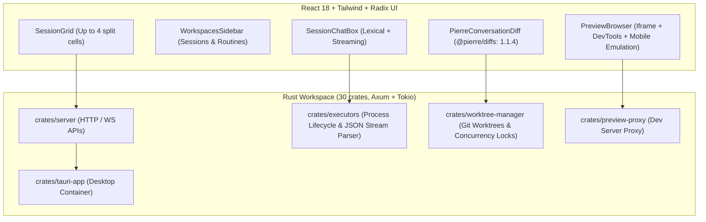

# Claude Desktop Ecosystem & Reverse-Engineering Audit

Produced 2026-09-12 for `.handoff/oss-pass-3`.
Comprehensive technical evaluation of `cdesktop` (`/Volumes/Thunderbolt/AI/OSS/cdesktop`), the broader open-source desktop ecosystem, and direct inspection of official macOS `Claude.app` (v1.52386.3).

---

## 1. Evaluation of `cdesktop` (`cdesktop-ai/cdesktop`)

Located at: `/Volumes/Thunderbolt/AI/OSS/cdesktop`
Remote: `https://github.com/cdesktop-ai/cdesktop.git`
Status: Clean checkout, 2,244 commits, active production software (version 0.2.3).

### 1.1 Project Classification

The user identified `cdesktop` as a potential nightly reverse engineer of Claude Desktop. Our investigation clarifies its nature:

- **Not an Automated Decompiler**: Unlike `open-claude-code`, which monitors npm releases and runs decompilation scripts on official minified bundles, `cdesktop` does not decompile Claude Desktop binaries.
- **Production Clean-Room Desktop Alternative**: It is an independently authored, feature-complete desktop and web environment explicitly engineered to replicate the exact UI/UX, workflow, and multi-agent ergonomics of Anthropic's Claude Code Desktop.
- **Architectural Match with Halbert**: It uses the exact same tech stack as Halbert: **Rust + Tauri + React 18 + Tailwind CSS**, making its code patterns directly adaptable without translation friction.

---

### 1.2 Core Subsystem Architecture

#### 1. `crates/executors` — Agent Process Lifecycle & Protocol Decoding
- **Process Orchestration** (`executors/claude.rs` — 134 KB):
  - Wraps the `claude` CLI as a child process using PTY or piped stdio.
  - Implements a resilient streaming JSON deserializer decoding Claude Code's protocol events (`ClaudeStreamEvent`, `ClaudeContentBlockDelta`, `ClaudeMessageDelta`, `ClaudeToolData`).
  - Intercepts and executes slash commands locally (`slash_commands.rs`).
  - Injects custom environment variables (`ANTHROPIC_BASE_URL`, custom provider tokens) dynamically per session, bypassing Anthropic's vendor lock-in.

#### 2. `crates/worktree-manager` — Git Worktree Isolation
- **Concurrency & Re-entrancy Protection** (`worktree_manager.rs` — 23 KB):
  - Uses an asynchronous mutex registry (`WORKTREE_CREATION_LOCKS: Mutex<HashMap<String, Arc<tokio::sync::Mutex<()>>>>`) keyed by path.
  - Guarantees that concurrent agent sessions or rapid restarts never collide on git lock files (`index.lock`) or produce half-initialized worktrees.
  - Automatic directory cleanup: wipes corrupted git metadata and recreates the worktree cleanly if git state degrades.
  - Runs all heavy git branch creation and checkout operations inside `tokio::task::spawn_blocking` via `git2`.

#### 3. `packages/ui` — Visual Diff Component (`PierreConversationDiff.tsx`)
- **Technology Choice**: Uses `@pierre/diffs: 1.1.4` (`@pierre/diffs/react`).
- **Capabilities**:
  - Accepts discriminated unions: `{ type: 'content', oldContent, newContent }` or `{ type: 'unified', unifiedDiff }`.
  - Supports both `unified` and `split` side-by-side viewing modes.
  - Virtualized rendering handles large 5,000+ line diffs without UI lag.
  - Custom CSS token injection (`PIERRE_DIFFS_THEME_CSS`) matching app theme variables (`hsl(var(--bg-panel))`, `hsl(var(--text-low))`).
  - Integrated header with addition/deletion pill counters (`+42 -12`) and collapse/expand toggles.

#### 4. `PreviewBrowser.tsx` & `crates/preview-proxy` — App Preview System
- **Embedded Webview / Iframe**:
  - Secure sandbox flags: `allow-scripts allow-same-origin allow-forms allow-popups allow-popups-to-escape-sandbox allow-modals`.
  - Device viewport emulation: Toggle between Desktop, Mobile (iPhone 390x844 with padding frame), and fluid Responsive width.
  - Proxy Layer: `crates/preview-proxy` rewrites headers and CORS rules so local dev servers (Vite, Next.js) display seamlessly inside the container.
  - Integrated controls: Dev server start/stop buttons, refresh, copy URL, and external browser launch.

#### 5. `SessionGrid` & Multi-Cell Panes
- Enables dividing the workspace into 1, 2, 3, or 4 cells.
- Any active session tab can be dragged into any grid cell, mirroring professional multi-monitor development environments.

---

## 2. Other Claude Desktop OSS Ecosystem Projects

| Project | Repository / Origin | Architecture & Capabilities | Relevance to Halbert |
|---|---|---|---|
| **cc-haha** | `NanmiCoder/cc-haha` | Local-first desktop workspace for Claude Code / agents. Features Git worktree isolation, visual code diffs, multi-agent teams, Computer Use support, and multi-channel messaging (WeChat/Feishu/Telegram/H5). | Demonstrates cross-channel notification relays and local worktree management. |
| **cc-switch** | `farion1231/cc-switch` | Cross-platform desktop assistant supporting Claude Code, Codex, OpenCode, OpenClaw, Grok Build, and Hermes Agent. | Useful reference for multi-agent CLI environment detection and binary resolution. |
| **desktop-cc-gui** | `zhukunpenglinyutong/desktop-cc-gui` | Multi-engine AI coding desktop client built on Tauri. Wraps multiple CLI harnesses in a native GUI. | Proves viability of pure Tauri wrapper over agent CLIs. |
| **eigent** | `eigent-ai/eigent` | Open-source alternative to Anthropic's Claude Cowork and Codex. Focuses on longer-horizon autonomous workspace management. | Good design reference for long-running autonomous workflows. |

---

## 3. Direct Inspection of Official macOS `Claude.app` (v1.52386.3)

Inspected at: `/Applications/Claude.app/Contents/Resources/app.asar` (44.2 MB)
Build Date: September 11, 2026

Unpacking the production `.asar` revealed several critical architectural mechanisms used by Anthropic:

### 3.1 Native Swift Computer Use Bridge (`@ant/claude-swift`)
- Inside `node_modules/@ant/claude-swift/build/Release/`:
  - `computer_use.node`
  - `swift_addon.node`
- **Mechanism**: Rather than relying on AppleScript or slow Python scripting, Anthropic compiles native Swift code into a Node.js C++ addon (`.node`).
- **Capabilities**: Directly taps into macOS Quartz Display Services (`CGDisplayStream`, `CGEventTap`), CoreGraphics mouse/keyboard injection, and Accessibility APIs (`AXUIElementCopyAttributeValue`).
- **Security Fencing**: Gated by a macOS system consent dialog (`localExecConsent.js` and `local_exec_consent.html`). macOS Finder and sensitive folders require explicit per-app permission grants.

### 3.2 Dedicated PTY Host Architecture (`pty-host/ptyHostWorker.js`)
- Anthropic does not execute terminal commands directly on the main Electron process or renderer.
- A dedicated background worker process (`ptyHostWorker.js`) manages `node-pty` instances (`node-pty/prebuilds/darwin-arm64/pty.node`).
- **Benefits**: Isolates heavy shell output and runaway processes from freezing the UI thread; enables streaming terminal sessions with zero main-thread jank.

### 3.3 Bundled Skill Architecture (`resources/bundled-skills/`)
- Contains pre-packaged `.skill` archives with a unified `manifest.json`:
  - `frontend-design.skill`
  - `docx.skill`
  - `pdf.skill` / `pdf-reading.skill`
  - `pptx.skill`
  - `xlsx.skill`
- Demonstrates how complex multi-file prompt skills can be packaged, signed, and distributed as atomic assets rather than loose directories.
