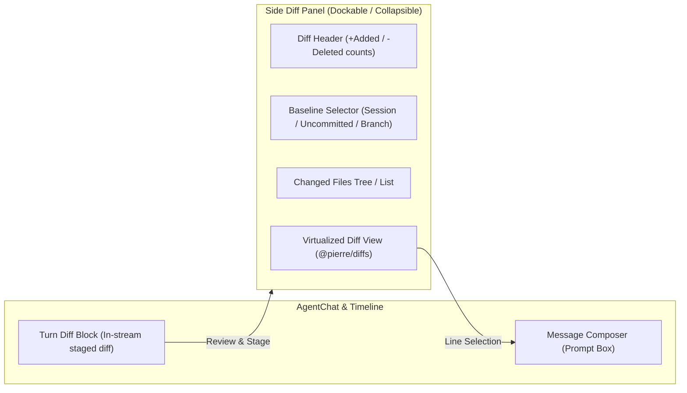

# Halbert Architectural Leverage & UI Roadmap (Pass 3)

Produced 2026-09-12 for `.handoff/oss-pass-3`.
Translates discoveries from Claude Code v2.1.269, `open-claude-code`, `cdesktop`, and macOS `Claude.app` into concrete architectural blueprints for Halbert.

---

## 1. Governance & Invariant Guardrails

Every pattern lifted below is filtered through Halbert's standing directives in [`DECISIONS.md`](file:///Volumes/4TB-BAD/Halbert/DECISIONS.md) and [`AGENTS.md`](file:///Volumes/4TB-BAD/Halbert/AGENTS.md):

- **Single Voice**: Halbert speaks as the computer itself in first person, grounded in measured telemetry — never as an assistant or third-party chatbot.
- **Model Locality**: `is_local_model()` in `llm_config.py:181` remains the sole choke point. No model menus or model recommendations on user-facing surfaces.
- **Conversation Topology**: "One seamless conversation, hidden topic threads, no conversation list." Out-of-band features must never create competing conversation list sidebars.
- **Strict Staging**: "Commands staged from the UI are staged, never executed."
- **Color & Tokens**: All UI implementations use tokens from `shared-tokens/tokens.css`. No hardcoded hex values, no emoji in UI, verified by `scripts/check_contrast.py`.

---

## 2. Blueprint 1: Professional Diff Review Modernization

### Current Halbert State
Halbert's existing `DiffBlock.tsx` (`dashboard/frontend/src/components/agent/DiffBlock.tsx:34`) carries an explicit placeholder comment:
> `// Simple diff visualization (in production, use a proper diff library)`
It performs basic string splitting and renders raw spans with rudimentary green/red styles. It lacks virtualization, split view, line selection, and working-tree change aggregation.

### The Upstream & `cdesktop` Pattern
- Upstream Claude Code 2.1.260 introduced the live `/diff` panel.
- `cdesktop` implements `PierreConversationDiff.tsx` leveraging `@pierre/diffs: 1.1.4`.

### Proposed Halbert Implementation



1. **Package Adoption**:
   - Add `@pierre/diffs: 1.1.4` and `@pierre/diffs/react` to `packages/design-system` or `dashboard/frontend`.
   - Apply Halbert's theme tokens via `tokens.css` overrides (`--diffs-light-addition-color`, `--diffs-bg-addition-override`, `--bg-panel`, etc.).
2. **Dual-Surface Diff Experience**:
   - **Inline Turn Diff (`DiffBlock.tsx`)**: Upgraded to render virtualized unified/split diffs for changes staged in that specific turn.
   - **Dockable Side Diff Panel**: A collapsible panel beside `AgentChat.tsx` that reflects full working-tree state across all modified files, with quick jump navigation.
3. **Interactive Line Attachment**:
   - Dragging across lines in the diff panel creates a structured selection tag attached to the composer input (`[Diff: path/to/file.py#L42-L58]`), enabling immediate conversational feedback.
4. **Three-Way Comparison Baseline**:
   - Mode 1: Current turn edits.
   - Mode 2: Uncommitted changes in working directory.
   - Mode 3: Divergence from base branch (`main`).

---

## 3. Blueprint 2: Ephemeral Side-Questions (`/btw`)

### The Friction in Halbert Today
Halbert adheres to "One seamless conversation, hidden topic threads, no conversation list." However, developers frequently need to ask clarifying questions about code previously loaded into memory without polluting the main trajectory or consuming context tokens on future turns.

### The Upstream Mechanism
Claude Code v2.1.260's `/btw` command queries the warm context cache, runs with zero tool permissions, and returns an answer that never enters the conversation transcript.

### Halbert Implementation Blueprint
1. **Frontend Trigger**:
   - Entering `/btw <question>` in the composer intercepts the standard `sendToChat` pipeline.
2. **Backend Execution (`routes/agent.py`)**:
   - Dispatches a lightweight query to the local model (or warm session prefix).
   - Tool execution is disabled (`tools=[]`).
   - The result is marked with `ephemeral: true`.
3. **Transient UI Rendering**:
   - The answer renders in a floating HUD / dismissible popover overlay directly above the composer.
   - The exchange is stored in an in-memory session ring (max 20 entries) for quick recall, but is **never** written to SQLite or JSONL session transcripts.
   - Keyboard controls: `Esc` or `Enter` closes the overlay. A "Stage as Turn" button allows promoting the insight to the main conversation if desired.

---

## 4. Blueprint 3: Workspace Isolation via Git Worktrees

### Current State
Concurrent subagents and background tasks currently risk operating in the same workspace directory, creating file contention and uncommitted overwrite hazards.

### The `cdesktop` Pattern
`crates/worktree-manager/src/worktree_manager.rs` provides an asynchronous, path-locked worktree manager:
- Thread-safe creation via path-keyed mutexes (`WORKTREE_CREATION_LOCKS`).
- Automatic fallback cleanup for corrupted git states.
- Dedicated worktree directories under a centralized `.worktrees/` folder.

### Halbert Implementation Blueprint
1. **Backend Worktree Service** (`halbert_core/workspace/worktree.py`):
   - Wrap `git worktree add -b halbert-task-<id> .worktrees/<id>` with an async mutex lock.
   - Route subagent execution and long-running analysis tasks into dedicated worktree paths.
2. **Task Cleanup Lifecycle**:
   - On task completion or user rejection, automatically purge the worktree via `git worktree remove --force`.
   - On approval, stage the worktree changes into the primary tree for user review.

---

## 5. Blueprint 4: Dev Server Preview & Verification Loop

### The Upstream & `cdesktop` Pattern
- Upstream uses `.claude/launch.json` and auto-verifies changes via headless DOM and screenshot inspections.
- `cdesktop` implements `PreviewBrowser.tsx` with mobile/responsive viewport toggling and an Axum reverse proxy.

### Halbert Implementation Blueprint
1. **Launch Configuration**:
   - Support `.halbert/launch.json` defining dev server launch commands and health endpoints.
2. **Dashboard Preview Pane**:
   - Embed an isolated webview/iframe inside the Halbert dashboard using `PreviewBrowser` patterns.
   - Provide Desktop and Mobile emulation frames (using Halbert token borders).
3. **Auto-Verification Hook**:
   - Before concluding a code generation turn, Halbert's verification agent tests the local endpoint, verifies zero console errors, and captures a verification screenshot for user confirmation.

---

## 6. Blueprint 5: Native macOS System Integration via Swift FFI

### The Production `Claude.app` Pattern
Anthropic's official macOS app bundles `@ant/claude-swift/build/Release/computer_use.node` and `swift_addon.node` to drive Quartz display streaming, Accessibility APIs, and CGEvent injection natively.

### Halbert Alignment
- Halbert already includes `crates/halbert-ffi` for native platform bridges.
- **Deprecate AppleScript**: Replace fragile `osascript` shell execution with Swift/Objective-C routines in `crates/halbert-ffi` for:
  1. Window state querying and focus detection (`CGWindowListCopyWindowInfo`).
  2. Screen capture for vision models (`CGDisplayStreamCreate`).
  3. Accessibility hierarchy inspection (`AXUIElementCopyAttributeValue`).
- **Security Fencing**: Maintain Halbert's deterministic security choke points — any native action requires explicit user confirmation in the UI.

---

## 7. Next Steps & Execution Sequence

```
Phase 1: Diff Modernization
  ├── 1. Install @pierre/diffs: 1.1.4 in dashboard
  ├── 2. Create tokens.css theme adapter for Pierre diffs
  └── 3. Implement Dockable Side Diff Panel beside AgentChat

Phase 2: Ephemeral Context Queries
  ├── 1. Add /btw command parsing in composer
  ├── 2. Implement ephemeral turn router in routes/agent.py
  └── 3. Create TransientOverlay UI component

Phase 3: Worktree & Terminal Isolation
  ├── 1. Implement Python worktree manager with path mutexes
  └── 2. Configure bashOutputMaxChars (128KB) buffer in executor
```
