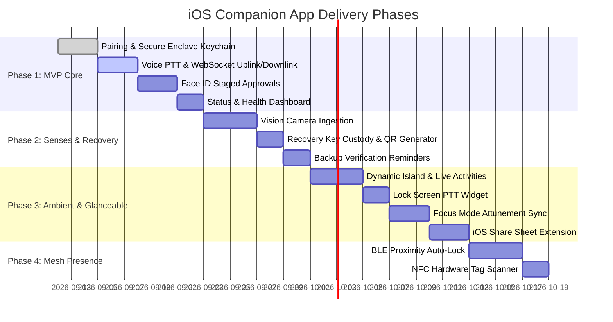

> **SUPERSEDED — 2026-09-12**
>
> This document proposed a standalone native SwiftUI app. That approach was
> rejected in favour of extending the existing Tauri v2 build to iOS, reusing
> the Voice Mode frontend as the one source of truth for tablet, kiosk, and
> mobile. The active plan is in
> [`companion-frontend-handoff.md`](companion-frontend-handoff.md).
>
> The backend sections below (sections 5-6: `trust_anchor` role,
> `require_trust_anchor`, `/api/entity/status`, wire contracts) remain valid
> and are carried forward. The frontend sections (7-10: SwiftUI screens,
> AVFoundation, Swift 6, zero dependencies) are replaced by the Tauri plan.

---

# iOS Companion App: Architecture & Planning Handoff (Superseded)

**Date**: 2026-09-12  
**Status**: **SUPERSEDED** — see [`companion-frontend-handoff.md`](companion-frontend-handoff.md).  
**Parent**: [`open-questions-resolved.md`](open-questions-resolved.md) (Q7, Q8), [`design-exploration.md`](design-exploration.md) (variation E), [`DECISIONS.md`](../../../DECISIONS.md)  
**Related Subsystems**: `halbert_core/dashboard/routes/websocket.py` (audio streams), `halbert_core/dashboard/voice_relay.py` (voice turn claims), `halbert_core/integrations/voice_auth_gate.py` (biometric voice auth).

---

## 1. Executive Summary & Revised Charter

The iOS companion app is Halbert's **roaming voice port and biometric trust anchor**.

Earlier planning drafts conceived the companion app strictly as a passive, read-mostly button box for disaster recovery and peer approval (explicitly asserting "not a chat interface"). That framing was wrong: it overlooked the single most natural and valuable capability of a pocket device: **near-field, high-SNR acoustic presence and biometric identity**.

The revised charter establishes the companion app around two primary pillars and four supporting senses:

1. **The Voice Port (Microphone & Ear)**: A low-latency conversational audio interface to the Halbert entity. You talk to your computer from your pocket, your couch, or your car. Halbert replies in first person with spoken audio.
2. **The Biometric Trust Anchor (Auth & Security Token)**: A hardware-backed physical 2FA device. Halbert stages privileged shell commands and config changes on the desktop; the phone prompts with Face ID to approve them. The phone also guards peer mesh onboarding and holds disaster recovery keys in the Secure Enclave.
3. **Roving Eyes (Visual Ingress)**: The host machine is blind; the phone provides an on-demand camera feeding Halbert's `vision_model` slot for physical hardware diagnostics, screen error triage, and document scanning.
4. **Contextual Telemetry (Zero-Cloud)**: Feeds iOS Focus Mode (DND/Sleep) and private on-device geofencing into Halbert's `Attunement` / `ProactiveGate` engine so the computer knows when to speak and when to remain silent.
5. **Glanceable Attention**: Dynamic Island and Live Activities tracking long-running server operations (backups, compilations, deep scans).
6. **Disaster Recovery Key Custody**: Holding the backup encryption passphrase in Secure Enclave Keychain for bare-metal restore via QR display.

The app is a **client of the existing Halbert API and WebSocket audio pipeline**, not an autonomous AI body or cloud service.

---

## 2. What the App Is and Is Not

### What the App Is:
- **A voice interface to the computer**: Push-to-Talk and conversational audio streaming directly into the server's speech-to-text pipeline, receiving synthesized Piper TTS audio responses.
- **A physical two-person rule for privileged execution**: The computer stages actions; the human approves them with Face ID / Touch ID on their personal device.
- **A roving sensory extension**: Camera intake for physical reality; ambient context for sleep and focus states.
- **A disaster recovery key custodian**: Holds backup passphrases in the Secure Enclave and verifies entity health.
- **A direct, local-first client**: Talks directly to the canonical host over LAN (via Bonjour/mDNS) or across a private overlay network (Tailscale / WireGuard).

### What the App Is Not:
- **Not a body**: It does not store the continuous memory graph (`memories.json`), conversation logs (`conversations.db`), or run local LLM inference. Mobile battery and storage constraints make running the entity locally counterproductive.
- **Not a backup storage target**: It does not store the `.halbert-backup` archive (200MB+). Backups live on NAS, USB drives, or personal storage volumes; the phone holds only the *custody key* that decrypts the backup.
- **Not a cloud SaaS product**: No third-party relay servers, no external auth databases, and no central push servers required for operation.
- **Not a heavy multi-tab management console**: The Tauri desktop dashboard remains the workspace for deep log inspection, code editing, terminal multiplexing, and configuration authoring. The mobile app is designed for immediate interaction: speak, approve, glance, capture.

---

## 3. Blue Sky Architecture: Mobile Superpowers

A desktop workstation or rackmounted server is durable and computationally dense, but physically stationary and sensor-blind. A modern smartphone inverts these trade-offs. Integrating mobile capabilities directly into Halbert's Singular Entity architecture creates massive leverage.

```
┌────────────────────────────────────────────────────────────────────────┐
│                      iPhone Companion Surface                          │
│                                                                        │
│   [ Microphones ]       [ Face ID / SEP ]       [ Multi-Lens Camera ]  │
│    Voice Isolation       Hardware 2FA / P-256    Physical Diagnostics  │
│          │                       │                       │             │
│          ▼                       ▼                       ▼             │
│   Audio Stream (PCM)     Signed Approval Token    Vision Snapshot      │
└──────────┬───────────────────────┬───────────────────────┬─────────────┘
           │                       │                       │
     Direct LAN / Tailscale        │                       │
           │                       │                       │
┌──────────▼───────────────────────▼───────────────────────▼─────────────┐
│                    Halbert Canonical Host Core                         │
│                                                                        │
│   /api/audio/stream      /api/peers/pending      /api/vision/ingest    │
│   Voice Relay & CAM++    RoleGate & Staged Cmd   vision_model slot     │
│   Piper TTS Downlink     Attunement Gate         TimelineStore         │
└────────────────────────────────────────────────────────────────────────┘
```

### 3.1 The Roaming Voice Port (Microphone & Ear)
- **Superior Acoustic Quality**: Desktop and rack microphones suffer from room reverberation, HVAC noise, and keyboard clatter. Modern iPhones possess studio-grade multi-mic arrays with hardware beamforming, Apple Voice Isolation, and acoustic echo cancellation (AEC).
- **Pristine Biometric Ingress**: Clean, near-field audio dramatically improves server-side speaker verification. Halbert's CAM++ pipeline (`voice_auth_gate.py`) extracts a 256-dimensional speaker embedding with minimal noise, reliably crossing the `0.82` cosine-similarity admin threshold.
- **Instant Activation**:
  - Primary in-app tactile Push-to-Talk button.
  - Action Button assignment (iPhone 15 Pro+) for instant single-click voice turn from anywhere in iOS.
  - Lock Screen and Control Center widgets.
  - Bluetooth / AirPods / CarPlay integration for hands-free queries while driving or moving around the home.
- **Speech Egress & Barge-In**: Synthesized Piper audio streams back over WebSocket in real time. Tapping the screen or speaking instantly transmits the `{"type": "cancel"}` barge-in token, immediately halting server-side synthesis and client audio playback within <120ms.

### 3.2 Hardware-Rooted Trust & Biometric Approvals
- **Physical 2FA for Staged Commands**:
  - In accordance with standing directives, Halbert never runs destructive commands automatically; commands from the UI are staged.
  - Privileged actions (`systemctl`, `apt/dnf`, firewall alterations, file deletions, config rewrites) generate an `ApprovalReceipt`.
  - The phone buzzes with a tailored haptic pattern. The user reviews the exact command diff, actor, and rationale on their phone screen.
  - Authenticating via Face ID / Touch ID issues a cryptographically signed approval token, unlocking server execution.
- **Peer Mesh Onboarding**: Approving a new workstation, laptop, or satellite joining the Halbert mesh by tapping "Approve" with Face ID on the phone.
- **Recovery Key Custody**: The master backup decryption passphrase is held in the Secure Enclave (`kSecAttrAccessibleWhenUnlockedThisDeviceOnly`). In a catastrophic disaster, scanning a QR code from the phone unlocks the backup archive on fresh hardware.
- **Proximity-Based Auto-Lock (BLE Presence)**: Low-power Bluetooth Low Energy beaconing between the phone and the workstation. When the user walks away from their desk, the desktop session automatically locks or dials Halbert's proactive voice volume down to quiet.

### 3.3 Roving Eyes (Visual Intake / Vision Slot)
- **Physical Hardware Triage**: Servers and desktop towers cannot point their webcams at their own backplanes. The phone provides roving vision:
  - Photographing blinking LED diagnostic codes on motherboards, switches, and NAS units.
  - Reading physical serial numbers, drive bay labels, and network patch panel ports.
  - Capturing dead-host terminal error screens (kernel panics, BIOS POST errors) when network access is down.
  - Scanning physical paper receipts, whiteboards, or equipment manuals directly into Halbert's observation store.
- **Vision Pipeline Connection**: Photos route straight into Halbert's configured `vision_model` slot, allowing the user to ask: *"What's wrong with this motherboard LED?"* or *"Read the serial and check if this drive is still under warranty."*

### 3.4 Zero-Cloud Contextual Telemetry
- **Focus & Attunement Sync**: iOS Focus states (Do Not Disturb, Work, Sleep) are communicated locally to Halbert's `Attunement` / `ProactiveGate` engine (`context.py`). Proactive spoken alerts are automatically held or redirected to the quiet pull queue.
- **Private On-Device Geofencing**: On-device geofencing detects Home vs Away transitions over LAN/Tailscale with zero third-party cloud location sharing, providing presence context for Home automation loops.
- **Circadian Rhythm Signaling**: Phone placed on a nightstand charger after 10:00 PM signals sleep state, prompting Halbert to trigger Deep Thinker nightly maintenance passes and backup consolidation.

### 3.5 Glanceable Attention & Dynamic Monitoring
- **Live Activities & Dynamic Island**: Real-time status for long-running server operations:
  - Nightly backup progress and verification hashing.
  - Large package builds or system updates.
  - Large local model downloads or RAG re-indexing.
- **Distinct Haptic Language**: Custom CoreHaptics patterns for different finding severities (e.g. subtle tap for voice listening, double-click for command staged, urgent pulse for security probe or water leak alert).

### 3.6 Universal Intake Funnel (iOS Share Sheet)
- System-wide iOS Share Extension ("Send to Halbert") allows one-tap sharing of Safari URLs, research papers, PDFs, images, or notes directly into Halbert's `TimelineStore` and observation store.

---

## 4. The Simplest Thing We Need to Build (Lean MVP)

While the Blue Sky architecture provides the strategic roadmap, the initial v1 release must be relentlessly simple, robust, and functional on Day 1.

The MVP is strictly: **Push-to-Talk Voice Port + Face ID Approval Device + Entity Status**.

```
┌─────────────────────────────────────────────────────────┐
│  Halbert                                        ● Online│
│  Home Server (canonical)                                │
├─────────────────────────────────────────────────────────┤
│                                                         │
│                [  HOLD TO SPEAK  ]                      │
│                                                         │
│  "What's the system health?"                            │
│  "All 4 cores nominal. Memory at 42%.                   │
│   Last backup created 2 hours ago."                     │
│                                                         │
├─────────────────────────────────────────────────────────┤
│  PENDING APPROVALS (1)                                  │
│  ┌───────────────────────────────────────────────────┐  │
│  │ Staged: systemctl restart docker                  │  │
│  │ Target: Home Server · Actor: Agent (Finding #42)  │  │
│  │ [Deny]                        [Approve (Face ID)] │  │
│  └───────────────────────────────────────────────────┘  │
├─────────────────────────────────────────────────────────┤
│  DEVICES                                                │
│  ● Home Server (canonical)     ● Workstation (body)     │
└─────────────────────────────────────────────────────────┘
```

### The 3 Core MVP Flows:

#### 1. Push-to-Talk Voice Port
- **Interaction**: Prominent, high-contrast button on the main screen: "Hold to Speak".
- **Audio Capture**: While held, `AVAudioEngine` records 16kHz 16-bit mono PCM. Frames are streamed over WebSocket to `/api/audio/stream`.
- **Audio Downlink**: Subscribes to `/api/audio/tts?session_id={id}`. Audio chunks from Piper TTS play through the device speaker.
- **Barge-in**: Releasing early or tapping anywhere sends `{"type": "cancel"}` over the TTS socket, aborting synthesis instantly.
- **Transcript Card**: Displays the spoken turn transcript and Halbert's response text.

#### 2. Biometric Auth & Approvals
- **Pending List**: Polls `/api/peers/pending` and staged command approval endpoints.
- **Face ID Verification**: Tapping "Approve" triggers `LAContext.evaluatePolicy(.deviceOwnerAuthenticationWithBiometrics)`.
- **Execution**: On biometric success, the app posts to the approval route using its Keychain-stored bearer token.
- **Pairing**: Built-in QR code scanner (`AVCaptureMetadataOutput`) reads the pairing QR code from the Halbert dashboard, verifies PIN, and exchanges credentials.

#### 3. Status & Health Card
- Polls `GET /api/entity/status` every 30s when the app is foregrounded.
- Shows: Entity name, canonical host reachability, last backup timestamp, memory/thread counts, and paired peer list.

### Non-Functional MVP Invariants:
- **Zero Third-Party Dependencies**: Native SwiftUI, AVFoundation, LocalAuthentication, and URLSession. Zero CocoaPods, zero Swift Packages.
- **Zero Cloud Infrastructure**: Direct LAN communication via Bonjour/mDNS, and remote access via Tailscale or WireGuard. No central relays.
- **Fail-Closed Biometrics**: Every approval requires a fresh Face ID challenge; tokens never leave the device Keychain.

---

## 5. Pairing Flow (How the Phone Joins)

The phone pairs with the canonical host using the standard Halbert peer pairing flow. The phone registers as a peer with the specialized role: `trust_anchor`.

```
1. User opens Halbert Companion on iOS.
2. The app discovers the canonical host via mDNS (or user inputs URL).
3. The app scans the Pairing QR code on the desktop dashboard (or sends POST /api/peers/pair).
4. Canonical host displays a 60-second PIN on its dashboard.
5. App verifies the PIN via POST /api/peers/verify.
6. Canonical host issues a long-lived bearer token for the phone.
7. Phone stores bearer token in iOS Keychain backed by Secure Enclave.
```

### The `trust_anchor` Role:
- Can approve peer pairing requests (`POST /api/peers/pending/{id}/approve`).
- Can approve staged commands and actions.
- Can approve satellite promotion to canonical (`POST /api/replica/promote`).
- Can read aggregated status (`GET /api/entity/status`).
- Can stream voice audio (`/api/audio/stream`, `/api/audio/tts`).
- **Cannot** act as a compute provider (does not execute model inferences).
- **Cannot** receive database replica pushes (does not store SQLite/JSON bodies).

---

## 6. Backend Integration & Wire Contracts

The backend changes remain lean, directly utilizing Halbert's existing audio and security subsystems.

### 6.1 Voice Pipeline Wire Contracts

#### Audio Uplink (`/api/audio/stream`):
- **Protocol**: WebSocket (`ws://` or `wss://`).
- **Auth**: Bearer token via `Authorization` header or query parameter.
- **Payload**: Binary frames containing raw 16kHz 16-bit little-endian mono PCM (s16le).
- **Framing**: Recommended 20ms–40ms chunk sizes (640 or 1280 bytes per frame).
- **Processing**: Forwarded to `AudioCoordinator.get_ingress("dashboard")` for VAD, ASR, and CAM++ speaker identification.

#### Audio Downlink (`/api/audio/tts`):
- **Protocol**: WebSocket (`ws://` or `wss://`).
- **Query Parameter**: `session_id={session_id}`.
- **Payload (Server -> Client)**:
  - Text frame: `{"type": "begin", "session_id": "...", "rate": 16000}`
  - Binary frames: raw 16kHz s16le PCM synthesized by PiperTTS.
  - Text frame: `{"type": "end"}`
- **Barge-In Control (Client -> Server)**:
  - Text frame: `{"type": "cancel"}` -> fires server `BargeInToken`, immediately aborting active synthesis and answering `{"type": "cancelled"}`.

### 6.2 Auth & Security Contracts

#### New Auth Dependency: `require_trust_anchor`
**Where**: `halbert_core/halbert_core/federation/peer_middleware.py`

Accepts either local admin (`require_local_admin`) or an authenticated peer with `role == "trust_anchor"`:

```python
async def require_trust_anchor(request: Request) -> None:
    """Accept either local admin or a paired trust_anchor peer."""
    try:
        await require_local_admin(request)
        return
    except HTTPException:
        pass

    peer = await require_peer_auth(request)
    if getattr(peer, "role", None) != "trust_anchor":
        raise HTTPException(403, "Only trust_anchor peers can approve sensitive operations")
```

#### Endpoints Guarded by `require_trust_anchor`:
- `POST /api/peers/pending/{request_id}/approve` — approve a new device pairing.
- `POST /api/replica/promote` — promote a satellite to canonical.
- `POST /api/backup/restore` — restore from a backup archive.
- `POST /api/approvals/{approval_id}/approve` — approve a staged command.

### 6.3 Aggregated Status Endpoint: `GET /api/entity/status`
**Where**: `halbert_core/halbert_core/dashboard/routes/entity.py`

Aggregates all necessary status details in a single call:

```python
@router.get("/api/entity/status")
async def entity_status(
    _auth: None = Depends(require_peer_auth),
) -> Dict[str, Any]:
    """Aggregated entity status for the companion app."""
    return {
        "entity_name": resolve_entity_name(),
        "node_id": get_local_node_id(),
        "role": "canonical",
        "canonical_url": None,
        "peers": list_peers_summary(),
        "last_backup": get_last_backup_timestamp(),
        "memory_count": get_memory_count(),
        "thread_count": get_thread_count(),
        "pending_approvals_count": get_pending_approvals_count(),
    }
```

---

## 7. App Screens & UI Flows

### 7.1 Unified Voice & Status Screen (Primary View)
```
┌─────────────────────────────────────────────────────────┐
│  Halbert                                        ● Online│
│  Mac Mini (canonical)                                   │
├─────────────────────────────────────────────────────────┤
│                                                         │
│                                                         │
│                   ┌─────────────────┐                   │
│                   │  HOLD TO SPEAK  │                   │
│                   └─────────────────┘                   │
│                                                         │
│  "What's the system health?"                            │
│  "All cores nominal. Memory at 38%. Last backup: 2h ago"│
│                                                         │
├─────────────────────────────────────────────────────────┤
│  Pending Approvals (1)                       [View All] │
│  ● apt upgrade -y (staging from terminal)               │
├─────────────────────────────────────────────────────────┤
│  Mesh Devices                                           │
│  ● Mac Mini        canonical                            │
│  ● Workstation     body                                 │
│  ○ Laptop          body (offline)                       │
│                                                         │
│  [Camera / Vision]                    [Settings]        │
└─────────────────────────────────────────────────────────┘
```

### 7.2 Staged Approval Detail Modal
```
┌─────────────────────────────────────────────────────────┐
│  Privileged Action Approval                             │
│                                                         │
│  Action: Staged Shell Command                           │
│  Target: Home Server (canonical)                        │
│  Actor:  Agent (Troubleshooting Task #14)               │
│                                                         │
│  Command:                                               │
│  $ systemctl restart caddy.service                      │
│                                                         │
│  Rationale:                                             │
│  Reloading reverse proxy after SSL renewal.             │
│                                                         │
│  [ Deny ]                       [ Approve with Face ID ]│
└─────────────────────────────────────────────────────────┘
```

### 7.3 Vision Ingestion Screen (Phase 2)
```
┌─────────────────────────────────────────────────────────┐
│  ┌───────────────────────────────────────────────────┐  │
│  │                                                   │  │
│  │               Camera Viewfinder                   │  │
│  │          [Targeting Router Error LED]             │  │
│  │                                                   │  │
│  └───────────────────────────────────────────────────┘  │
│                                                         │
│  "Halbert, what does this blinking red LED indicate?"   │
│                                                         │
│  [ Retake ]                             [ Send Photo ]  │
└─────────────────────────────────────────────────────────┘
```

### 7.4 Settings & Key Custody Screen
```
┌─────────────────────────────────────────────────────────┐
│  Settings                                               │
│                                                         │
│  Entity Connection                                      │
│  Halbert @ http://mac-mini.local:8000                   │
│  Role: Trust Anchor (Phone)                             │
│                                                         │
│  Disaster Recovery Key                                  │
│  Status: Stored in Secure Enclave                       │
│  [ Show Recovery QR Code ]                              │
│  [ Export Key Phrase ]                                  │
│                                                         │
│  Backup Reminders                                       │
│  Monthly Integrity Check: Enabled                       │
│                                                         │
│  [ Unpair Device ]                                      │
└─────────────────────────────────────────────────────────┘
```

---

## 8. Security & Data Protection Model

### 8.1 Keychain & Key Custody
- All tokens and passphrases are stored with `kSecAttrAccessibleWhenUnlockedThisDeviceOnly`.
- Credentials do not sync to iCloud Keychain, preventing remote exfiltration.
- Cryptographic operations and biometric gates leverage the iOS Secure Enclave.

### 8.2 Transport Security
- **LAN**: Direct HTTP/WS for local discovery.
- **Remote**: HTTPS/WSS routed over Tailscale or WireGuard VPN.
- **Future**: Mutual TLS (mTLS) with pinned peer certificates.

### 8.3 Loss of Device Threat Model
1. **Device Theft**: Token and recovery key are locked behind the iOS device passcode and Secure Enclave Face ID challenge.
2. **Immediate Revocation**: The operator can revoke the phone instantly from the desktop dashboard via `DELETE /api/peers/{phone_node_id}`.
3. **No Local Sensitive Data**: The phone stores zero conversation history, zero memories, and zero system logs. Losing the phone leaks no entity knowledge.

---

## 9. Phased Implementation Roadmap



### Phase 1: Lean MVP (The Immediate Goal)
- Native SwiftUI app shell.
- Pairing flow via QR scanner + Keychain storage.
- Push-to-Talk button streaming 16kHz PCM to `/api/audio/stream`.
- Audio playback from `/api/audio/tts` with barge-in support.
- Face ID approval for staged commands and peer pairing.
- Entity health status card.

### Phase 2: Sensory Ingress & Recovery
- Camera capture directly into `vision_model` slot.
- Recovery passphrase custody and QR display for bare-metal restore.
- Monthly local backup verification reminders.

### Phase 3: Ambient Awareness & Glanceable UI
- Live Activities and Dynamic Island for long-running jobs (backups, compilations).
- Lock Screen widget for instant voice access.
- iOS Focus Mode integration signaling Halbert's `Attunement` engine.
- iOS Share Sheet extension to capture links and documents into `TimelineStore`.

### Phase 4: Physical Presence & Hardware Proximity
- BLE beaconing for workstation proximity auto-lock.
- NFC tag scanning on physical hardware racks to launch diagnostic cards.
- Universal iPadOS layout scaling.

---

## 10. Technical Requirements & Tooling

- **Platform**: iOS 17.0+ (utilizing modern SwiftUI, Observation framework, and `AVAudioEngine`).
- **Language**: Swift 6 (strict concurrency enabled).
- **Core Frameworks**:
  - `SwiftUI`: Native declarative user interface.
  - `AVFoundation`: Audio session management, PCM streaming capture, audio player node, and camera metadata output.
  - `LocalAuthentication`: Face ID / Touch ID biometric policy enforcement.
  - `Security`: Keychain Services with Secure Enclave attributes.
  - `Network` & `Foundation`: `URLSessionWebSocketTask` for audio and events; Bonjour / `NWBrowser` for LAN discovery.
- **Dependencies**: Zero external Swift packages or pods.

---

## 11. Open Questions & Architectural Ratification

1. **APNs vs. Local Network Notifications**:
   - *Decision*: v1 relies entirely on direct local network connections and polling while active. APNs push notifications require Apple Developer Server infrastructure and will be introduced when a remote notification relay is formally architected.
2. **Push-to-Talk vs Continuous VAD**:
   - *Decision*: v1 uses Push-to-Talk ("Hold to Speak"). This guarantees intentionality, conserves mobile battery, and avoids the need for client-side silence-detection tuning. Continuous ambient VAD is deferred.
3. **Distribution Path**:
   - *Decision*: Source distributed in the Halbert repository. Conveyed under GPL-3.0 with the App Store Exception (`LICENSE-EXCEPTION-APPSTORE`) per `DECISIONS.md` (`FDR-02`).
