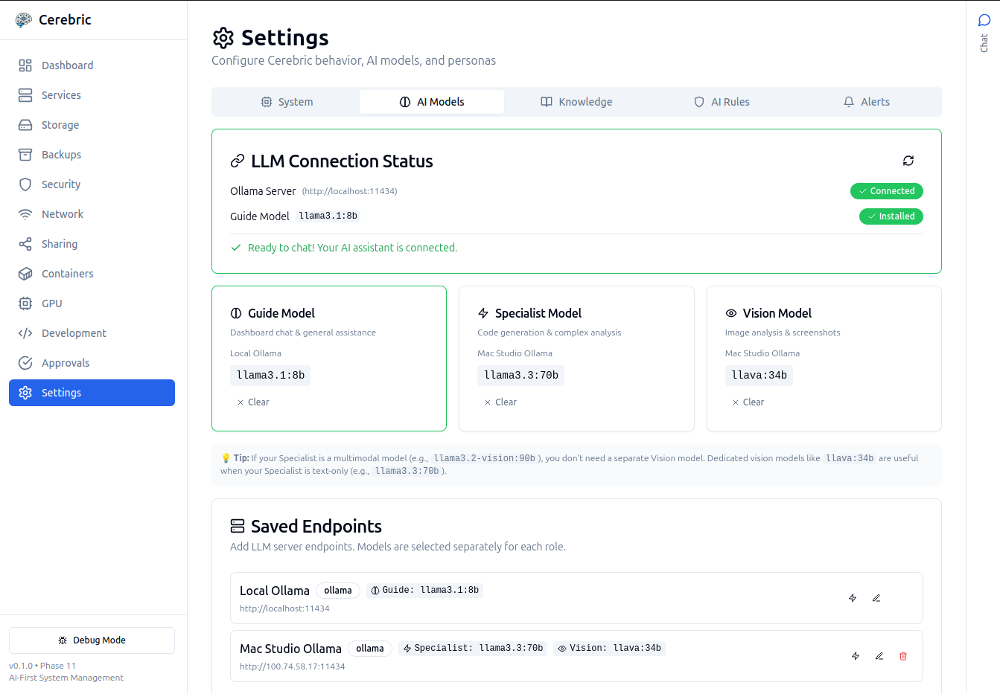
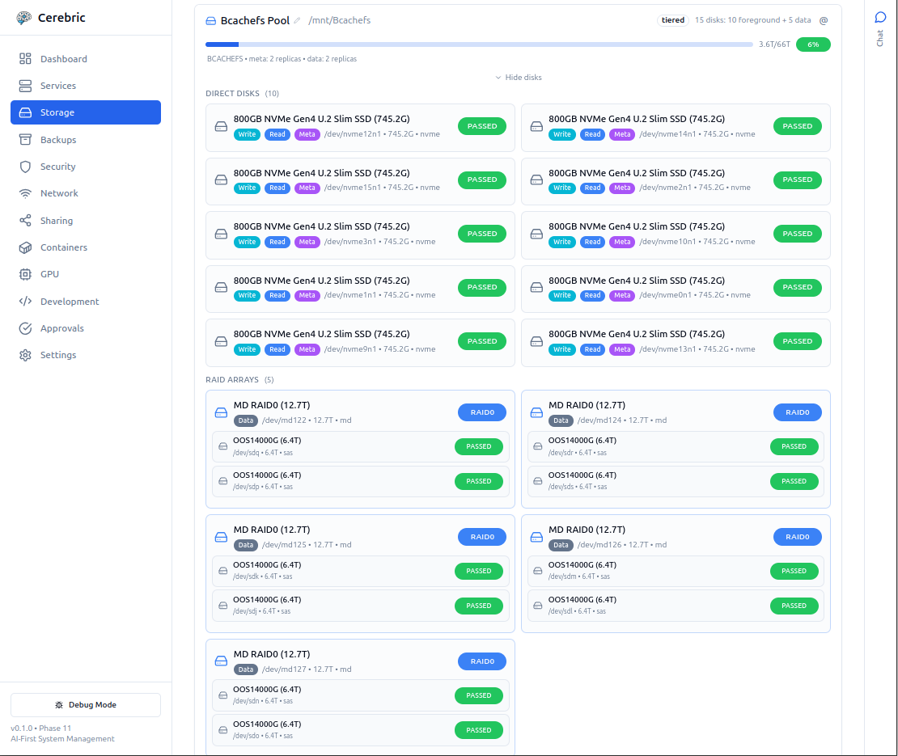
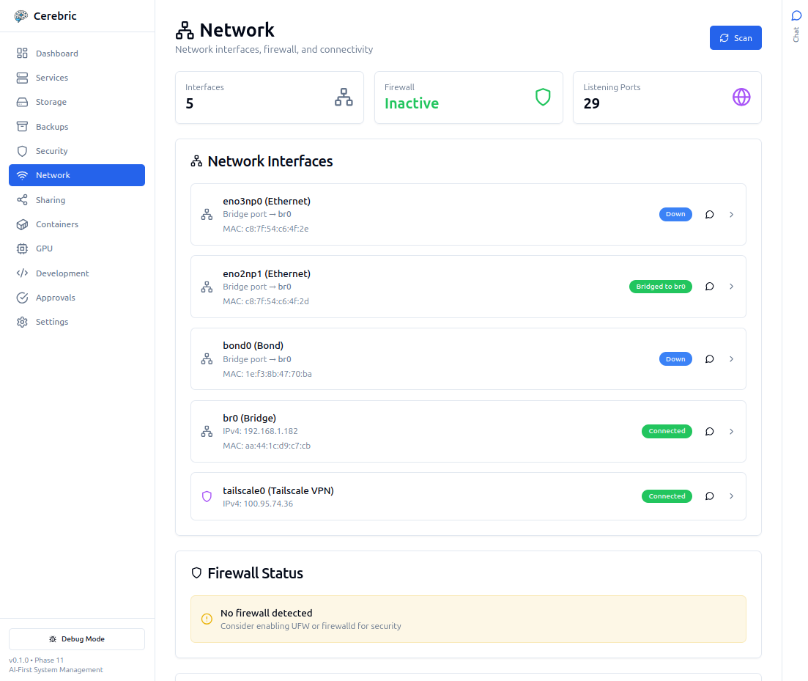

<p align="left">
  
</p>

# Halbert

**Local-first AI assistant for Linux system administration.**

Halbert runs on your machine using local LLMs by default—no cloud required. Optionally connect to cloud APIs (OpenAI, Claude, Gemini) if you prefer. It ingests system logs, tracks configuration changes, and answers questions grounded in real system data.

---

<p align="center">
  
</p>

## Features

- **Local LLM** — Runs on Ollama by default, no cloud required
- **Cloud optional** — Connect OpenAI, Claude, or Gemini if you prefer
- **System-aware** — Ingests journald logs and hardware sensors
- **RAG-powered** — Answers grounded in Linux documentation
- **Safe by default** — Dry-run mode, approval system, policy engine
- **Self-identifying** — The LLM identifies as your computer

---

## Quick Start

```bash
# 1. Install Ollama
curl -fsSL https://ollama.ai/install.sh | sh
ollama pull llama3.2:3b

# 2. Clone and install
git clone https://github.com/yourusername/halbert.git
cd halbert
python3 -m venv .venv
source .venv/bin/activate
pip install -e halbert_core/

# 3. Ask a question
python Halbert/main.py ask "Why did my docker service fail?"
```

---

## Requirements

- Linux (Ubuntu 22.04+, Fedora 38+, Arch)
- Python 3.11+
- 8 GB RAM minimum
- [Ollama](https://ollama.ai/)

---

## Documentation

| Document | Description |
|----------|-------------|
| [Installation](documentation/INSTALLATION.md) | Full setup guide |
| [CLI Reference](documentation/CLI-REFERENCE.md) | All commands |
| [Configuration](documentation/CONFIGURATION.md) | Config files |
| [Architecture](documentation/ARCHITECTURE.md) | System design |
| [API Reference](documentation/API-REFERENCE.md) | Dashboard API |

See [documentation/](documentation/) for full docs.

---

## Example Usage

```bash
# Ask questions
python Halbert/main.py ask "How do I free up disk space?"

# Start dashboard
python Halbert/main.py dashboard

# Ingest system logs
python Halbert/main.py ingest-journald

# Track config changes
python Halbert/main.py snapshot-configs
```

---

## Architecture

```
┌────────────────────────────────────────┐
│                Halbert                │
├────────────────────────────────────────┤
│ CLI / Dashboard                        │
├────────────────────────────────────────┤
│ Runtime Engine (LangGraph)             │
├────────────┬──────────────┬────────────┤
│   Memory   │      RAG     │   Tools    │
│ (ChromaDB) │  (Docs + KB) │  (System)  │
├────────────┴──────────────┴────────────┤
│ Ollama (Local) or Cloud API (Optional) │
└────────────────────────────────────────┘
```

<p align="center">
  
  &nbsp;&nbsp;
  
</p>

---

## Contributing

See [CONTRIBUTING.md](documentation/contributing/CONTRIBUTING.md).

---

## License

GPL-3.0. See [LICENSE](LICENSE).
