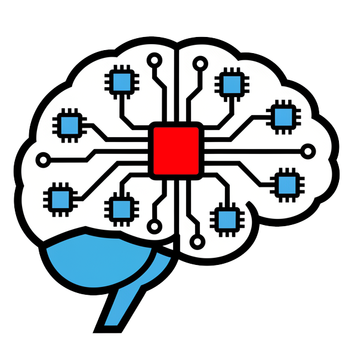

<p align="left">
  
</p>

# Halbert

**Local-first AI assistant for Linux system administration.**

Halbert runs on your machine using local LLMs by default—no cloud required. Optionally connect to cloud APIs (OpenAI, Claude, Gemini) if you prefer. It ingests system logs, tracks configuration changes, and answers questions grounded in real system data.

---

<p align="center">
  <picture>
    <source media="(prefers-color-scheme: dark)" srcset="./assets/screenshots/hero/dashboard-overview-dark.png">
    <source media="(prefers-color-scheme: light)" srcset="./assets/screenshots/hero/dashboard-overview-light.png">
    
  </picture>
</p>

## Features

- **Local LLM** — Runs on Ollama by default, no cloud required
- **Cloud optional** — Connect OpenAI, Claude, or Gemini if you prefer
- **System-aware** — Ingests journald logs and hardware sensors
- **RAG-powered** — Answers grounded in Linux documentation
- **Safe by default** — Dry-run mode, approval system, policy engine
- **Self-identifying** — The LLM identifies as your computer

---

## Quick Start

```bash
# 1. Install Ollama
curl -fsSL https://ollama.ai/install.sh | sh
ollama pull mistral-small  # Recommended: vision + 128K context
# Or for 24GB GPUs: ollama pull qwen2.5:14b

# 2. Clone and install
git clone https://github.com/EricBintner/Halbert.git
cd Halbert
python3 -m venv .venv
source .venv/bin/activate
pip install -e halbert_core/

# 3. Start the web dashboard
make dev-web
# Open http://localhost:8000
# or for Tauri build
make dev  
```

### Recommended Models by GPU

| GPU VRAM | Chat Model | Features | Notes |
|----------|------------|----------|-------|
| **48GB+** (RTX 5090) | `mistral-small:24b` | 👁️ Vision, 128K context | **Best choice** - one model does everything |
| **24GB** (RTX 4090) | `qwen2.5:14b` | 128K context | Add `pixtral:12b` for vision |
| **Apple 64GB+** | `mistral-small:24b` | 👁️ Vision, 128K context | Works via unified memory |

**★★ Top Pick:** `mistral-small:24b` (v3.1+) includes built-in vision, 128K context, and function calling. No need for separate Specialist or Vision models!

See [Quick Start Guide](docs/guides/QUICK-START-MISTRAL.md) for full setup.

---

## Requirements

- Linux (Ubuntu 22.04+, Fedora 38+, Arch)
- Python 3.11+
- 8 GB RAM minimum
- [Ollama](https://ollama.ai/)

---

## Documentation

| Document | Description |
|----------|-------------|
| [**Visual Walkthrough**](documentation/WALKTHROUGH.md) | **Screenshot tour of every feature** |
| [Installation](documentation/INSTALLATION.md) | Full setup guide |
| [CLI Reference](documentation/CLI-REFERENCE.md) | All commands |
| [Configuration](documentation/CONFIGURATION.md) | Config files |
| [Architecture](documentation/ARCHITECTURE.md) | System design |
| [API Reference](documentation/API-REFERENCE.md) | Dashboard API |

See [documentation/](documentation/) for full docs.

---

## Example Usage

```bash
# Ask questions
python Halbert/main.py ask "How do I free up disk space?"

# Start dashboard
python Halbert/main.py dashboard

# Ingest system logs
python Halbert/main.py ingest-journald

# Track config changes
python Halbert/main.py snapshot-configs
```

---

## Architecture

```
┌────────────────────────────────────────┐
│                 Halbert                │
├────────────────────────────────────────┤
│ CLI / Dashboard                        │
├────────────────────────────────────────┤
│ Runtime Engine                         │
├────────────┬──────────────┬────────────┤
│   Memory   │      RAG     │   Tools    │
│ (ChromaDB) │  (Docs + KB) │  (System)  │
├────────────┴──────────────┴────────────┤
│ Ollama (Local) or Cloud API (Optional) │
└────────────────────────────────────────┘
```

<p align="center">
  <picture>
    <source media="(prefers-color-scheme: dark)" srcset="./assets/screenshots/hero/chat-conversation-dark.png">
    <source media="(prefers-color-scheme: light)" srcset="./assets/screenshots/hero/chat-conversation-light.png">
    
  </picture>
</p>

<p align="center">
  <em>Ask questions in natural language — Halbert knows your system</em>
</p>

<p align="center">
  <picture>
    <source media="(prefers-color-scheme: dark)" srcset="./assets/screenshots/hero/storage-overview-dark.png">
    <source media="(prefers-color-scheme: light)" srcset="./assets/screenshots/hero/storage-overview-light.png">
    
  </picture>
  &nbsp;
  <picture>
    <source media="(prefers-color-scheme: dark)" srcset="./assets/screenshots/hero/gpu-overview-dark.png">
    <source media="(prefers-color-scheme: light)" srcset="./assets/screenshots/hero/gpu-overview-light.png">
    
  </picture>
</p>

---

## Contributing

See [CONTRIBUTING.md](documentation/contributing/CONTRIBUTING.md).

---

## License

GPL-3.0. See [LICENSE](LICENSE).
