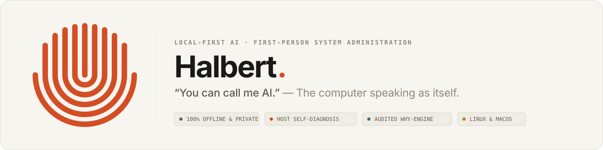

<p align="center">
  <picture>
    <source media="(prefers-color-scheme: dark)" srcset="./assets/brand/halbert-readme-banner-dark.svg">
    <source media="(prefers-color-scheme: light)" srcset="./assets/brand/halbert-readme-banner.svg">
    
  </picture>
</p>

# Halbert

**An AI assistant that actually knows your computer.**

Halbert connects an AI assistant directly to your machine's hardware, logs, and configuration. Instead of a generic cloud chatbot that talks about computers in the abstract, Halbert is aware of the machine it runs on—its disks, services, network, and homelab devices.

By default, Halbert uses a **hybrid AI architecture**: fast, capable cloud models handle everyday conversation and deep troubleshooting, while a private, on-device local model runs your **secure layer**—ensuring private credentials, sensitive configs, and security checks never leave your hardware. If you prefer to work entirely offline, Halbert can also run 100% on local models.

Because Halbert understands its own environment, it speaks in a natural, hybrid voice—acting as a knowledgeable assistant while occasionally speaking for the machine itself when reporting on its state:

> *"Everything looks healthy today, though I noticed my primary SSD is getting close to 85% capacity and a cron backup failed around 3 AM. Want me to pull up the log and help you clean up old snapshots?"*

---

## At a Glance

```
┌────────────────────────────────────────────────────────────────────────────────────────┐
│                                  WHAT HALBERT BRINGS                                   │
├────────────────────────────┬────────────────────────────┬──────────────────────────────┤
│    SYSTEM-AWARE AI         │    NATURAL VOICE & AUDIO   │    EXTERNAL AI TOOLS (MCP)   │
│ • Grounded in live sensors │ • Talk naturally via voice │ • Connect Claude & Cursor    │
│ • Hybrid: Cloud + Local    │ • Room & spatial context   │ • Camera privacy guard       │
│ • Secure on-device layer   │ • Fast local speech & TTS  │ • Code & doc intelligence    │
│ • 16,000+ system doc RAG   │ • Verified speaker safety  │ • 12+ standard system tools  │
├────────────────────────────┼────────────────────────────┼──────────────────────────────┤
│  SMART HOME & HOMELAB      │  MANAGE ALL YOUR MACHINES  │   HEALTHY SETTINGS & SHELL   │
│ • Home Assistant (HACS)    │ • macOS & Linux native     │ • Untangle messy dotfiles    │
│ • Frigate NVR video AI     │ • Switch machine tabs      │ • Fix PATH & version clashes │
│ • Storage pools & Docker   │ • Fleet peer mesh & teams  │ • Safe diffs & 1-click undo  │
├────────────────────────────┴────────────────────────────┴──────────────────────────────┤
│                           ALWAYS SAFE & UNDER YOUR CONTROL                             │
│ • Clear approval prompts before any changes │ • Automatic rollbacks if things go wrong │
│ • Custom safety rules in simple YAML       │ • Private local model for sensitive data  │
└────────────────────────────────────────────────────────────────────────────────────────┘
```

---

## Capabilities

### System-Aware Intelligence
- **Grounded in Reality** — Answers are backed by live data retrieved directly from your system rather than abstract guesswork or canned disclaimers.
- **Hybrid AI by Default** — Pairs the reasoning power of leading cloud models (Claude, OpenAI, Gemini, DeepSeek) for chat with a dedicated, on-device local model for sensitive security operations.
- **100% Offline Capable** — Easily configured to run fully offline using [Ollama](https://ollama.ai/), Apple Silicon MLX, Apple Intelligence on-device models, or `llama.cpp`.
- **Live System Telemetry** — Continuously monitors `journald` system logs and `hwmon` temperature sensors, indexing events into local memory so it can spot trends and diagnose intermittent issues.
- **Hardware & Storage Health** — Live tracking and diagnostics for storage pools (`bcachefs`, `ZFS`, `Btrfs`, `ext4`), SMART disk status, GPU usage (NVIDIA, AMD), system services (`systemd`), and containers (`Docker`, `Podman`).
- **16,000+ Built-In Documentation Guides** — Fast hybrid search (BM25 + dense vector retrieval) across Linux man pages, Arch Wiki, systemd guides, BSD handbooks, and macOS references.
- **Remembers Your System's "Why"** — Keeps track of *why* specific configurations exist, remembering the purpose behind custom scripts, network rules, and storage layouts across reboots.

### Natural Voice & Hearing
- **Wyoming Voice Protocol** — Built-in Wyoming voice streaming (port `10400`) that connects directly with Home Assistant voice satellites, smart speakers, and desk microphones.
- **Fast Local Speech Stack** — Instant local Speech-to-Text (Streaming Zipformer ASR, Silero VAD) and clear neural Text-to-Speech (Piper) with full barge-in support (interrupt whenever you want).
- **Room & Spatial Context** — Understands where you are. Asking *"turn on the light"* from an office satellite knows to illuminate the office without needing room qualifiers.
- **Speaker Safety (`RoleGate`)** — Uses voice biometrics (CAM++ embeddings) so guests or unknown voices cannot trigger privileged system operations.
- **Proactive Spoken Alerts** — Announces urgent hardware warnings or security events out loud, with automatic quiet hours during sleep or guest modes.

### Connect Your AI Tools (Model Context Protocol)
- **Built-In MCP Server** — Lets external AI tools (Claude Desktop, Cursor, Windsurf, Google Antigravity) safely interact with your machine over fast local stdio or token-authenticated network streams.
- **Camera Privacy Gate (`CameraDataGate`)** — When sharing camera or video data with external AI agents, Halbert exposes only structured text descriptions (e.g. *"front door: person detected at 2:15 PM"*), strictly isolating and redacting raw images and video feeds.
- **Dynamic Code & Docs Intelligence** — Connects to SourcePrep tools (`prep`, `prep_search`, `prep_impact`, `prep_audit`, `prep_observe`, `prep_concepts`) to inspect code structure, dependencies, and rationale.

### Smart Home & Homelab Companion
- **Two Modes in One** — Switch effortlessly between **Host Mode** (focusing on system administration and dev tools) and **Home Mode** (focusing on household devices, sensors, and cameras).
- **Home Assistant Integration (HACS)** — Includes a custom integration (`custom_components/halbert`) so Halbert can serve as the primary voice and conversation brain for your smart home with Assist API tools.
- **Frigate NVR Video Intelligence** — Monitors camera events in real time, keeps track of object detection trends, and remembers episodic visual events for up to 7 days.
- **Homelab Overview** — Keeps your network mesh (Tailscale, WireGuard), file shares (NFS, SMB), and container stacks running smoothly in one place.

### Built for macOS and Linux
- **Flagship Linux Support** — Full-featured assistant for Ubuntu, Fedora, Arch, Debian, and server environments.
- **macOS Pro & Free Editions**:
  - **Halbert Pro (macOS)**: Direct-distribution app with Full Disk Access, deep dotfile management (`~/.zshrc`, Homebrew, `launchd`), and native Apple Silicon / Apple Intelligence on-device inference.
  - **Halbert Free / Companion (Mac App Store)**: Lightweight sandboxed companion to monitor and manage remote Linux servers and homelabs.
- **Multi-Session Tabs** — Open tabs for each of your machines (your laptop, your home server, your cloud devbox). Each tab connects directly to that machine's telemetry and environment.
- **Fleet Mesh & Personalities** — Link multiple Halbert instances together to share tasks across your network, or switch between distinct AI personas with zero downtime.

### Keep Your Settings & Shell Healthy
- **Ambient Dotfile Discovery** — Automatically finds and maps your configuration files (`~/.zshrc`, `~/.config`, `~/.gitconfig`, `~/.ssh`, launch daemons, systemd units).
- **Environment & PATH Tracer** — Traces how your shell loads variables (`.zshenv` → `.zprofile` → `/etc/paths.d` → `.zshrc`) to explain why a command or version is being shadowed.
- **Clean Up Tool Clutter** — Detects duplicate aliases, broken symlinks, orphaned configs, and version conflicts across package managers (`mise`, `asdf`, `nvm`, `pyenv`, `brew`).
- **Safe Diffs with Undo** — Shows clear before-and-after diffs with Monaco editor integration and creates automatic backups before applying changes, so you can roll back with a single click.

### Safe, Transparent, and Always in Control
- **Approvals Before Action** — When Halbert proposes a change, it explains what will happen, simulates the outcome, and waits for your confirmation.
- **Custom Policy Rules** — Define what Halbert can and cannot touch using simple rules in `~/.config/halbert/policy.yml` (sensitive credentials are never shown in plain text).
- **Early Anomaly Detection** — Spots runaway CPU spikes, memory leaks, and repeating errors early, with automated recovery playbooks.
- **Smart Model Routing** — Routes tasks to the right model automatically across your configured endpoints.

---

## Architecture

```
┌────────────────────────────────────────────────────────────────────────────────────────┐
│                                 HALBERT FRONTENDS                                      │
│  Tauri v2 Desktop App (macOS & Linux)  │  Web Dashboard (:8000)  │  CLI & Terminal     │
│  Wyoming Voice Satellites (:10400)     │  MCP Server (JSON-RPC Stdio / SSE :8000)      │
├────────────────────────────────────────────────────────────────────────────────────────┤
│                           MULTI-SESSION & FLEET ENGINE                                 │
│   [ Tab 1: Local Host ]    │   [ Tab 2: Linux Devbox ]   │   [ Tab 3: Homelab NAS ]    │
│   macbook-pro (Local)      │   devbox-ubuntu (Remote)    │   storage-homelab (Remote)  │
├────────────────────────────────────────────────────────────────────────────────────────┤
│                                   HALBERT RUNTIME                                      │
│ ┌─────────────────────────┬───────────────────────────┬──────────────────────────────┐ │
│ │  Host Agent & Ontology  │  Config Physiology Engine │  Safety & Policy Engine      │ │
│ │  • Identity & Memory    │  • Dotfile/PATH tracer    │  • Approval workflow         │ │
│ │  • "Why Brain" store    │  • Impact analysis & diff │  • Anomaly & rollback        │ │
│ ├─────────────────────────┼───────────────────────────┼──────────────────────────────┤ │
│ │  Auditory Cortex Engine │  Sentient Home Cognition  │  Multi-Persona Store         │ │
│ │  • Silero VAD / ASR     │  • HA Bridge & Assist     │  • Atomic symlink switching  │ │
│ │  • Piper TTS / Barge-in │  • Frigate NVR Visuals    │  • Per-persona model override│ │
│ └─────────────────────────┴───────────────────────────┴──────────────────────────────┘ │
├────────────────────────────────────────────────────────────────────────────────────────┤
│                              INTEGRATIONS & PROTOCOLS                                  │
│ ┌───────────────────┬────────────────────┬────────────────────┬──────────────────────┐ │
│ │  Model Context    │  Home Assistant    │  Wyoming Voice     │  Frigate NVR Video   │ │
│ │  Protocol (MCP)   │  HACS Integration  │  Spatial Protocol  │  MQTT Event Ingestion│ │
│ └───────────────────┴────────────────────┴────────────────────┴──────────────────────┘ │
├────────────────────────────────────────────────────────────────────────────────────────┤
│                                KNOWLEDGE & TELEMETRY                                   │
│ ┌────────────────────────────────────────┬───────────────────────────────────────────┐ │
│ │ 16,000+ Document RAG (BM25 + Dense)    │ Continuous Telemetry (journald + hwmon)   │ │
│ └────────────────────────────────────────┴───────────────────────────────────────────┘ │
├────────────────────────────────────────────────────────────────────────────────────────┤
│                       HYBRID INFERENCE (RECOMMENDED SETUP)                             │
│  Cloud APIs (Claude, OpenAI, Gemini) ──▶ General Chat & Deep Diagnostics               │
│  Local (Ollama, MLX, Apple Intelligence) ──▶ Private Secure Layer & Secrets            │
└────────────────────────────────────────────────────────────────────────────────────────┘
```

---

## Quick Start

### 1. Prerequisites
- **Linux** (Ubuntu 22.04+, Fedora 38+, Arch, Debian) or **macOS** (macOS 14+ Sonoma/Sequoia, Apple Silicon or Intel)
- **Python 3.11+**
- **Node.js 22 LTS** (for dashboard/Tauri builds)
- A cloud API key (e.g. Anthropic, OpenAI, Gemini) and/or a local runtime ([Ollama](https://ollama.ai/), Apple Silicon MLX)

### 2. Clone & Install

```bash
# Clone the repository
git clone https://github.com/EricBintner/Halbert.git
cd Halbert

# Create and activate Python virtual environment
python3 -m venv .venv
source .venv/bin/activate

# Install core package
pip install -e halbert_core/
```

### 3. Launch Halbert

```bash
# Start the Web Dashboard
make dev-web
# Open http://localhost:8000

# Or launch the native Tauri Desktop Application
make dev
```

### 4. Command Line Usage

```bash
# Ask questions directly about your machine
halbert ask "Why is my disk usage spiking?"

# Inspect system configuration physiology & dotfiles
halbert diff-configs

# Ingest live system logs and thermal telemetry
halbert ingest-journald
halbert ingest-hwmon

# Evaluate autonomous action policies
halbert policy-show
```

---

## Ecosystem Integrations

### Home Assistant (HACS Integration)
Halbert includes a native custom component for Home Assistant located in [`custom_components/halbert`](custom_components/halbert/README.md).

1. Copy `custom_components/halbert` to your Home Assistant `config/custom_components/` directory (or add this repository as a Custom Repository in HACS).
2. Go to **Settings → Devices & Services → Add Integration** and select **Halbert**.
3. Point the integration to your Halbert Wyoming server (`localhost:10400`).
4. In **Settings → Voice Assistants**, assign Halbert as your primary conversation agent.

### Wyoming Voice Pipeline
Enable the Wyoming protocol server in Halbert by starting the agent with `WYOMING_ENABLED=1`:

```bash
export WYOMING_ENABLED=1
export WYOMING_PORT=10400
python halbert_core/halbert_core/integrations/wyoming_agent.py
```

### Model Context Protocol (MCP) Configuration
Connect external AI developer tools (Claude Desktop, Cursor, Windsurf) to Halbert's MCP server:

```json
{
  "mcpServers": {
    "halbert": {
      "command": "python",
      "args": ["-m", "halbert_core.mcp", "--transport", "stdio"]
    }
  }
}
```

*Note: Halbert's `CameraDataGate` automatically protects sensitive video/camera feeds, exposing only structured metadata over MCP.*

---

## AI Model Roles & Hardware Recommendations

Halbert lets you assign different models to specialized roles in **Settings → AI Models**:

| Role | Purpose | Recommended Setup |
|---|---|---|
| **Guide** | Fast conversational triage, status summaries, everyday chat | Fast Cloud model (Claude 3.5 Haiku, GPT-4o-mini) or 3B–8B local |
| **Specialist** | Deep system diagnostics, config generation, complex scripting | High-reasoning Cloud model (Claude 3.7 Sonnet, GPT-4o) or 14B–70B local |
| **Secure Layer** | Private credentials, sensitive telemetry, host security checks | **Local-only on device** (Ollama, Apple Intelligence, MLX) |
| **Vision** | Multimodal analysis of screenshots, error dialogs, cameras | Vision model (Cloud or local Llama 3.2 Vision / Qwen2.5-VL) |
| **Voice** | Low-latency speech-to-speech interaction & orchestration | Stream-optimized voice model or local Piper/Zipformer pipeline |

See the [Model Selection Guide](documentation/guides/model-selection.md) for detailed hardware sizing and provider configuration.

---

## Documentation

| Document | Description |
|---|---|
| [**Visual Walkthrough**](documentation/WALKTHROUGH.md) | Screenshot tour of dashboard, chat, and monitoring |
| [**Features Overview**](documentation/FEATURES.md) | Comprehensive catalog of implemented features |
| [**macOS Strategy & Multi-Session**](documentation/design/macos-strategy.md) | Architecture for macOS Pro, Free, and remote host tabs |
| [**Architecture**](documentation/ARCHITECTURE.md) | Deep dive into system architecture and runtime |
| [**CLI Reference**](documentation/CLI-REFERENCE.md) | Complete CLI command catalog |
| [**API Reference**](documentation/API-REFERENCE.md) | REST and WebSocket API specifications |
| [**Configuration**](documentation/CONFIGURATION.md) | Configuration file formats and options |
| [**Installation Guide**](documentation/INSTALLATION.md) | Full multi-platform setup instructions |
| [**Quick Start Guide**](documentation/guides/quickstart.md) | Step-by-step onboarding walkthrough |

See [documentation/](documentation/) for all guides and architectural specs.

---

## Contributing

We welcome contributions from the community! See [CONTRIBUTING.md](documentation/contributing/CONTRIBUTING.md) for guidelines on code style, testing, and pull requests.

---

## License

Copyright (C) 2024-2026 Eric Bintner and Halbert Contributors.

Halbert is free software licensed under the **GNU General Public License v3.0 or later** (`GPL-3.0-or-later`). See [LICENSE](LICENSE) for the full text.

Builds conveyed through the Apple Mac App Store carry one additional permission under GPLv3 §7 — [LICENSE-EXCEPTION-APPSTORE](LICENSE-EXCEPTION-APPSTORE). It applies to that channel and no other, and it does not extend to third-party code. Every other build, including the direct download and every Linux package, is plain `GPL-3.0-or-later`.

See [documentation/legal/](documentation/legal/README.md) for licensing summaries, [third-party notices](documentation/legal/THIRD-PARTY-LICENSES.md), [privacy policy](documentation/legal/PRIVACY.md), [trademarks](documentation/legal/TRADEMARKS.md), and the [autonomous-action disclaimer](documentation/legal/DISCLAIMER.md).


