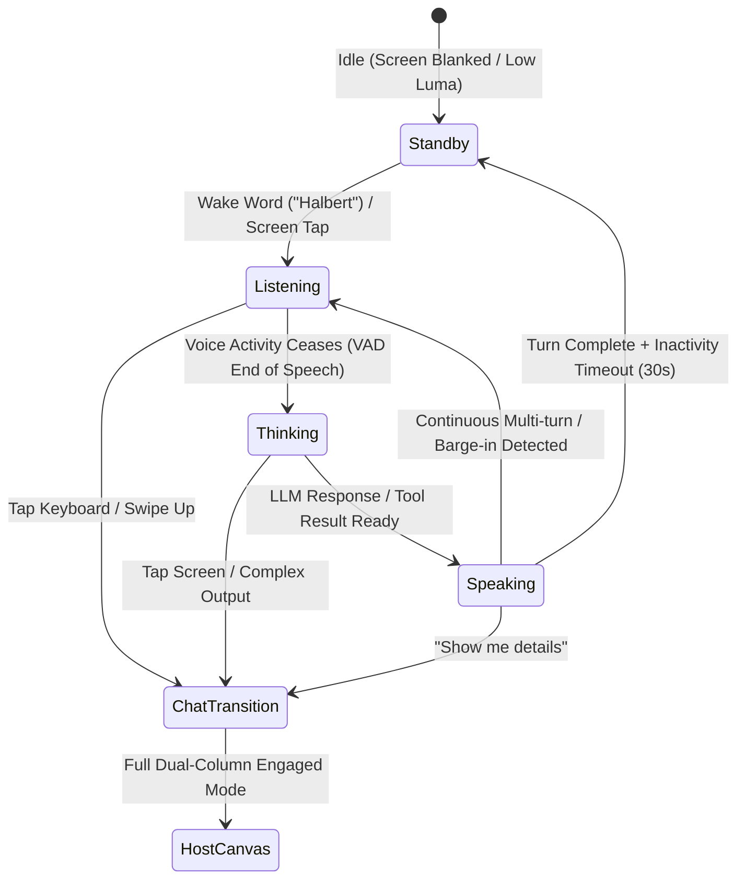

# Voice Mode Visual UI & Touchscreen Architecture Specification

> **Document:** `documentation/design/15-voice-mode-visual-ui-and-touchscreen-spec.md`  
> **Status:** Architecture, Visual UI & SVG Animation Specification  
> **Date:** 2026-08-31  
> **Target Framework:** React 18.2 / 19, SVG Path Deformation / Web Audio API, Tailwind CSS, Tauri v2 / Kiosk Mode, Linux (`halbert_core`)  
> **Reads With:** `documentation/design/11-response-modality-handoff.md`, `documentation/design/the-being.md`, `documentation/design/DESIGN-SYSTEM-SPEC.md`, `audio-research/01-CORRECTED-ARCHITECTURE.md`, `audio-research/03-UX-SURFACES.md`

---

## 1. Executive Vision: The Embodied Voice Presence

Halbert is fundamentally structured as a multi-modal sovereign mind. While the **Engaged Surface** (`HostShell.tsx` — conversation spine + context stage) serves the desktop workstation user and the **Browsing Surface** (`Layout.tsx` nav rail) serves the sysadmin, **Voice Mode** represents Halbert's **embodied physical presence in the room**.

```
┌─────────────────────────────────────────────────────────────────────────────┐
│                            THE THREE HALBERT SURFACES                       │
├──────────────────────────┬──────────────────────────┬───────────────────────┤
│ 1. Engaged Surface       │ 2. Browsing Surface      │ 3. Voice Mode Surface │
│    (Workstation Canvas)  │    (Sysadmin Hub)        │    (Living Presence)  │
├──────────────────────────┼──────────────────────────┼───────────────────────┤
│ • Conversation Spine     │ • Full Navigation Rail   │ • Central Resonator   │
│ • Terminal Dock & Stage  │ • Storage, ZFS, Services │ • Spectral SVG Motion │
│ • Diffs & Telemetry      │ • Network, GPU, Backups  │ • Touchscreen Kiosk   │
│ • Keyboard / Mouse-first │ • Configuration Forms    │ • Ambient Ear & Voice │
└──────────────────────────┴──────────────────────────┴───────────────────────┘
```

In a dedicated appliance setup — such as an **Intel N150 Home Assistant server** with an attached 7"–15" capacitive touchscreen or wall-mounted iPad/kiosk — Voice Mode is the primary **"Listening & Resonating" interface**. It transforms the abstract AI into a physical, acoustic being with clear visual feedback, tactile touch controls, and power-conscious ambient display management.

---

## 2. Core Visual Aesthetic: The Audio-Reactive Halbert Mark

### 2.1 The Geometry of the Mark
The official Halbert brand mark (`/Volumes/4TB-BAD/Halbert/assets/brand/halbert-mark-medium.svg` and `packages/design-system/src/primitives/HalbertMark.tsx`) is inherently acoustic. It is constructed from concentric, nested U-shaped resonator paths radiating outward from a central vertical stem:

```
                          X = 512 (Center Line)
                               │
               Outer Tines     │     Outer Tines
              Ring 5  Ring 3   │   Ring 3  Ring 5
                │       │      │     │       │
                ▼       ▼      ▼     ▼       ▼
             ╭─────────────────┬─────────────────╮   Y = 80px (Apex)
             │  ╭──────────────┼──────────────╮  │
             │  │  ╭───────────┼───────────╮  │  │
             │  │  │  ╭────────┼────────╮  │  │  │
             │  │  │  │  ╭─────┼─────╮  │  │  │  │
             │  │  │  │  │  │  │  │  │  │  │  │  │
             │  │  │  │  │  │  │  │  │  │  │  │  │
             │  │  │  │  │  │  │  │  │  │  │  │  │   Y = 512px (Equator)
             │  │  │  │  │  ╰──┴──╯  │  │  │  │  │   (Concentric U-Arcs)
             │  │  │  │  ╰───────────╯  │  │  │  │
             │  │  │  ╰─────────────────╯  │  │  │
             │  │  ╰───────────────────────╯  │  │
             │  ╰─────────────────────────────╯  │
             ╰───────────────────────────────────╯   Y = 944px (Base)
```

### 2.2 Harmonic Frequency-to-Geometry Mapping
Rather than applying generic uniform scaling or CSS pulses, the mark acts as a **physical harmonic resonator**, where each concentric tine corresponds to a specific acoustic register of the human voice and synthesized speech:

| Tine Identifier | Geometric Coordinates / Radius | Acoustic Frequency Register | Vocal Characteristic Mapped |
|---|---|---|---|
| **Center Stem (Ring 0)** | `M 512 80 V 512` (Vertical line) | **High Treble / Sibilance** (2,500 Hz – 8,000 Hz) | Consonant attacks, sibilance (`s`, `t`, `sh`), upper overtones |
| **Inner Tine (Ring 1)** | Radius $R = 86.4\text{px}$ (`X: 425.6` to `598.4`) | **Upper Mids** (1,200 Hz – 2,500 Hz) | Nasal clarity, vowel formant $F_2$, articulation |
| **Mid-Inner Tine (Ring 2)** | Radius $R = 172.8\text{px}$ (`X: 339.2` to `684.8`) | **Vocal Core / Formant** (600 Hz – 1,200 Hz) | Core vowel formant $F_1$, melodic speech cadence |
| **Mid-Outer Tine (Ring 3)** | Radius $R = 259.2\text{px}$ (`X: 252.8` to `771.2`) | **Warmth / Chest Formant** (250 Hz – 600 Hz) | Body of the voice, tonal warmth |
| **Outer Tine (Ring 4)** | Radius $R = 345.6\text{px}$ (`X: 166.4` to `857.6`) | **Vocal Fundamental** (120 Hz – 250 Hz) | Speaker pitch fundamental ($F_0$ for male/female voices) |
| **Outermost Arc (Ring 5)** | Radius $R = 432.0\text{px}$ (`X: 80.0` to `944.0`) | **Sub-Bass / Room Acoustic** (40 Hz – 120 Hz) | Chest rumble, low room acoustics, ambient energy |

---

## 3. Mathematical Animation & Path Deformation Engine

To achieve an organic, physical vibration without tearing SVG geometry, each path is modulated in real time using parametric Bézier deformation and Fourier energy weighting.

```
┌───────────────────────┐       ┌───────────────────────┐       ┌────────────────────────┐
│  Audio Ingress / TTS  │ ----> │ Web Audio Analyser    │ ----> │ 2nd-Order Spring       │
│  (16kHz PCM Stream)   │       │ (FFT 64 Frequency Bins)│       │ Physics Smoothing      │
└───────────────────────┘       └───────────────────────┘       └───────────┬────────────┘
                                                                            │
                                                                            ▼
┌───────────────────────┐       ┌───────────────────────┐       ┌────────────────────────┐
│ Rendered Screen       │ <---- │ Dynamic SVG Path      │ <---- │ Standing Wave &        │
│ (60/120 FPS Canvas)   │       │ String Interpolation  │       │ Radial Flex Equations  │
└───────────────────────┘       └───────────────────────┘       └────────────────────────┘
```

### 3.1 Standing Wave Equation on Vertical Legs
For the vertical segments of each tine $k \in \{0 \dots 4\}$, the lateral displacement $\Delta x_k(y, t)$ at vertical position $y$ and timestamp $t$ is calculated by:

$$\Delta x_k(y, t) = A_k \cdot E_k(t) \cdot \sin\left(\frac{n_k \pi (y - y_{\text{top}})}{y_{\text{bottom}} - y_{\text{top}}} + \phi_k(t)\right) \cdot W(y)$$

Where:
- $E_k(t) \in [0, 1]$ is the normalized spectral energy in frequency bin $k$.
- $A_k$ is the maximum lateral excursion amplitude (typically $6\text{px}$ to $18\text{px}$).
- $n_k$ is the spatial harmonic mode (1 for fundamental flex, 2 or 3 for higher ripples on inner stems).
- $\phi_k(t)$ is continuous phase drift: $\phi_k(t) = \int \omega_k \, dt$.
- $W(y)$ is a Tukey/Hann window envelope ensuring boundary pinning ($\Delta x = 0$ at apex endpoints and base junctions) to prevent path disconnection:
  $$W(y) = \sin^2\left(\frac{\pi (y - y_{\text{top}})}{y_{\text{bottom}} - y_{\text{top}}}\right)$$

### 3.2 Radial Flexure on Base U-Arcs
For the curved bottom arc of tine $k$, displacement is applied along the normal radial vector:

$$\Delta r_k(\theta, t) = B_k \cdot E_k(t) \cdot \cos\left(m_k \theta + \psi_k(t)\right)$$

Where $\theta \in [0, \pi]$ sweeps the semi-circular base from left leg to right leg.

### 3.3 Physics-Based Damping & Smoothing
To prevent harsh strobe-like jitter when processing noisy mic inputs, raw FFT bin amplitudes pass through a 2nd-order damped spring oscillator:

$$m \frac{d^2 x}{dt^2} + c \frac{dx}{dt} + k_s (x - x_{\text{target}}) = 0$$

- **Stiffness ($k_s$):** `140.0` (rapid attack on transient phonemes)
- **Damping ($c$):** `18.5` (smooth, organic decay without robotic square-wave transitions)
- **Mass ($m$):** `1.0`

---

## 4. Voice Mode State Machine & Interaction Lifecycle

Voice Mode transitions through five distinct operational states:



### 4.1 State Breakdown

| State | Visual Behavior of Halbert Mark | Audio & Acoustic Subsystem | Display Power / Screen State |
|---|---|---|---|
| **1. Standby / Dormant** | Ultra-dim (10% opacity) slow sinusoidal breathing (3.5s cycle) or pure `#000000` blackout. | Low-power wake word listener active (Sherpa-onnx / openWakeWord). | Screen backlight at 0%–10% or software blanked. |
| **2. Listening** | Mark elevates to full luminosity (`#D34E24` Olivetti Vermilion). Reactive wave vibration tracks user's voice in real time. | Mic ingress active (16kHz PCM stream). VAD segmenting speech frames. | Full brightness (100%), 60fps path deformation. |
| **3. Thinking** | Concentric tines rhythmically contract inward, emitting a soft radial chromatic aura. | LLM inference, CRAG graph evaluation, or tool execution. | Full brightness, subtle pulsing glow. |
| **4. Speaking** | Full harmonic path resonance synchronized to Piper neural TTS output. Subtitle stream renders live words. | Neural TTS audio output playing through speakers. Barge-in VAD active. | Full brightness, frequency-mapped tine vibration. |
| **5. Interrupted (Barge-in)** | Sharp radial ripple / instant dampening back to Listening posture. | Immediate playback audio cutoff. New user utterance captured. | Instant zero-latency visual reset. |

---

## 5. Touchscreen Appliance Logistics: N150 Server & Display Management

### 5.1 The Hardware Architecture
In a homelab/smart home deployment, the user often runs Halbert on an **Intel N150 / N100 mini PC** connected to a dedicated HDMI/USB capacitive touchscreen (7" to 15.6" IPS or OLED panel).

```
┌────────────────────────────────────────────────────────────────────────┐
│                        INTEL N150 APPLIANCE                            │
│                                                                        │
│  ┌───────────────────────┐             ┌────────────────────────────┐  │
│  │ halbert_core (Python) │             │ Tauri v2 / Kiosk Chromium  │  │
│  │ • Local Mic Ingress   │ <─WebSocket─│ • VoiceMode.tsx View       │  │
│  │ • Sherpa STT / VAD    │  & SSE Loop │ • Audio-Reactive SVG Mark  │  │
│  │ • Piper Neural TTS    │             │ • Virtual Touch Keyboard   │  │
│  │ • Power / DPMS Daemon │             │ • Modality Switcher        │  │
│  └───────────────────────┘             └────────────────────────────┘  │
└───────────────────┬───────────────────────────────────┬────────────────┘
                    │ HDMI Video Output                 │ USB HID Touch
                    ▼                                   ▼
┌────────────────────────────────────────────────────────────────────────┐
│                  TOUCHSCREEN MONITOR (7" - 15.6")                      │
│                                                                        │
│   [ Speaker Badge ]                             [ Settings / Mute ]    │
│                                                                        │
│                               ( ( ( ) ) )                              │
│                           HALBERT RESONATOR MARK                       │
│                               ( ( ( ) ) )                              │
│                                                                        │
│   "Turned off 3 lights in the kitchen and set thermostat to 71°F"     │
│                                                                        │
│   [ 🎙️ Tap to Speak ]      [ ⌨️ Type / Expand ]      [ 🛑 Cancel ]     │
└────────────────────────────────────────────────────────────────────────┘
```

### 5.2 Screen Power Saving vs. Instant Wake Latency
A major design challenge for dedicated voice displays is power management:

| Method | Power Saved | Wake Latency | Suitability for Voice Mode |
|---|---|---|---|
| **Hardware DPMS (`xset dpms force off`)** | 100% display backlight powered off (~5–15W). | **1.5s – 3.5s** (HDMI signal re-sync & handshake). | **Unacceptable for wake word.** A 2-second blank delay feels broken when speaking to an assistant. |
| **DDC/CI or PWM Backlight Dimming (`/sys/class/backlight`)** | 80%–90% power saved (LED backlight dialed to 0%). | **50ms – 100ms** (Instant PWM ramp). | **Ideal for LCD panels.** Immediate visual feedback on "Hey Halbert". |
| **Software Pure Black (`#000000` Canvas + `cursor: none`)** | 95%+ power saved on OLED screens; GPU idle. | **0ms** (Instant frame render). | **Ideal for OLED / Modern Kiosk displays.** Zero wake latency. |

#### Recommended Multi-Tier Standby Policy:
1. **Tier 1 (0 – 30 seconds idle):** Ambient resting mark (subtle 10% breathing aura + current room temperature/clock).
2. **Tier 2 (30 seconds – 10 minutes idle):** Software blackout / ultra-dim ambient clock. Instant wake on wake-word or screen touch.
3. **Tier 3 (Quiet Hours / Night 22:00 – 07:00 or >15m idle):** Backlight dimmed to 0% via DDC/CI or hardware DPMS sleep. Wake-word daemon signals hardware wake before TTS completes.

---

## 6. Touchscreen UI Layout & Transition Mechanics

### 6.1 Voice Mode Screen Anatomy
When active, the Voice Mode layout maximizes physical visibility and touch accessibility:

```
┌────────────────────────────────────────────────────────────────────────┐
│ [● Eric (Admin) 98%]     Living Room Satellite      [⚙️] [🔇 Mute]     │
├────────────────────────────────────────────────────────────────────────┤
│                                                                        │
│                                                                        │
│                                   M                                    │
│                               ╭───┼───╮                                │
│                              ╭┤ ╭─┼─╮ ├╮                               │
│                             ╭┤│╭┤ ╵ ├╮│├╮                              │
│                             │││││   │││││                              │
│                             ╰┴┴┴┴───┴┴┴┴╯                              │
│                         (Audio-Reactive Mark)                          │
│                                                                        │
│                                                                        │
│  "I've verified the nightly ZFS snapshot completed with zero errors."  │
│  [ whisper prosody: calm ]                                             │
│                                                                        │
├────────────────────────────────────────────────────────────────────────┤
│  [ 🎙️ Tap to Speak ]     [ ⌨️ Open Keyboard ]     [ ↗️ Host Canvas ]   │
└────────────────────────────────────────────────────────────────────────┘
```

### 6.2 The Touch Controls
1. **Direct Mark Tap:** Tapping the center mark acts as a universal action:
   - If Speaking $\rightarrow$ **Interrupts / Silences TTS**.
   - If Idle $\rightarrow$ **Initiates Push-to-Talk**.
   - If Listening $\rightarrow$ **Forces immediate turn submission (manual VAD end-of-speech)**.
2. **On-Screen Touch Keyboard Overlay:**
   - Tapping `[ ⌨️ Open Keyboard ]` or swiping up smoothly glides a touch-friendly virtual keyboard into view from the bottom edge.
   - The Halbert Mark scales down to a 48px header emblem.
   - Includes quick-intent suggestion chips: `"System Vitals"`, `"Check Storage"`, `"Lock Doors"`, `"Run Health Scan"`.
3. **Seamless Transition to Host Canvas (`HostShell.tsx`):**
   - Tapping `[ ↗️ Host Canvas ]` or swiping right seamlessly transitions the screen from Voice Mode to the full two-column Host Canvas.
   - The voice conversation history is preserved intact in the `AgentChat.tsx` conversation spine.

---

## 7. Comparison: Voice Mode vs. Existing Audio Tooling

Halbert's audio capabilities have evolved rapidly across recent engineering batches. Voice Mode serves as the unifying presentation canvas:

| Feature / Subsystem | Existing Component | Role in Voice Mode Screen |
|---|---|---|
| **Header Status Aura** | `AcousticAuraIndicator.tsx` | Provides minimal 16px pulse in desktop mode; in Voice Mode, expanded to full 512px central resonator. |
| **Speech Delivery Pill** | `VoiceCompanionPill.tsx` | Compact pill below chat bubbles; in Voice Mode, transformed into the live floating subtitle ribbon. |
| **Biometric Recognition** | `SpeakerProfilesCard.tsx` (CAM++ 256-dim) | Identifies speaker identity in background $\rightarrow$ displays top-left biometric badge with confidence score. |
| **Acoustic Anomalies** | `AcousticAnomalyModule.tsx` (CED-tiny) | Proactive event card $\rightarrow$ triggers Voice Mode screen wake with urgent amber pulse when glass break / smoke alarm is heard. |
| **Audio Configuration** | `AudioSettings.tsx` | Manages Wyoming satellites, Piper voices, and quiet hours $\rightarrow$ directly governs Voice Mode audio engines. |

---

## 8. Implementation Roadmap

### Phase 1: SVG Path Deformation Prototype
- Build `AudioReactiveHalbertMark.tsx` component in `@halbert/design-system`.
- Implement Web Audio API `AnalyserNode` frequency extraction (64 FFT bins).
- Create parametric Bézier curve generator with Hann window boundary pinning.
- Add Storybook stories with synthetic audio oscillators for visual testing.

### Phase 2: Voice Mode Screen (`VoiceMode.tsx`)
- Implement full-screen view in `halbert_core/dashboard/frontend/src/pages/VoiceMode.tsx`.
- Connect to SSE audio events (`/api/being/events` and `/api/audio/status`).
- Integrate live streaming STT transcription subtitle ribbon.
- Add touch gestures (tap to interrupt, swipe up for virtual keyboard).

### Phase 3: Shell & Appliance Integration
- Add Voice Mode route (`/voice`) and integrate with `ShellModeContext.tsx`.
- Implement software blanking / auto-sleep timer with instant touch/wake-word wakeup.
- Wire seamless bidirectional transition between Voice Mode and `HostShell` canvas.
- Validate on touch hardware (N150 mini PC + 10" HDMI capacitive touchscreen).

---

> **Design Law:**  
> *The mark does not merely display sound; it embodies the voice.*
