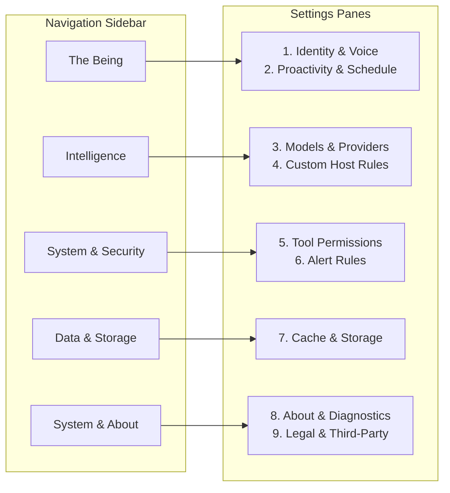

# Halbert Settings Redesign, De-bloating & Information Architecture Specification

**Document:** `documentation/design/SETTINGS-REDESIGN-2026-08-27.md`  
**Date:** August 27, 2026  
**Status:** Approved Design Specification & Implementation Handoff  
**Author:** AI Systems Architecture & UX Pair  
**Reads With:**
- [`BRAND-GUIDELINES-AND-AESTHETIC.md`](file:///Volumes/4TB-BAD/Halbert/documentation/design/BRAND-GUIDELINES-AND-AESTHETIC.md) — Colour law, surface licence, and the Vermilion budget
- [`the-being.md`](file:///Volumes/4TB-BAD/Halbert/documentation/design/the-being.md) — The philosophical and physical foundation of Halbert as the computer itself
- [`HALBERT-CLEANUP-AND-WIRING-PLAN-2026-08-27.md`](file:///Volumes/4TB-BAD/Halbert/documentation/design/HALBERT-CLEANUP-AND-WIRING-PLAN-2026-08-27.md) — Defect analysis, unreachable code audit, and routing fixes
- [`UI-SPEC-REUSABLE-MODEL-PICKER-2026-08-26.md`](file:///Volumes/4TB-BAD/Halbert/documentation/design/UI-SPEC-REUSABLE-MODEL-PICKER-2026-08-26.md) — Unified Model Picker and Drawer specification
- [`CHROMADB-RETIREMENT-REFACTOR-2026-08-26.md`](file:///Volumes/4TB-BAD/Halbert/.handoff/CHROMADB-RETIREMENT-REFACTOR-2026-08-26.md) — Retirement plan for legacy ChromaDB storage

---

## 1. Executive Summary & Diagnosis

### 1.1 The Problem: Settings as a Feature Dumping Ground

In Halbert's current frontend implementation, [`Settings.tsx`](file:///Volumes/4TB-BAD/Halbert/halbert_core/halbert_core/dashboard/frontend/src/pages/Settings.tsx) has swollen to **2,681 lines of TypeScript**, supported by a sprawling **3,266-line backend route file** ([`routes/settings.py`](file:///Volumes/4TB-BAD/Halbert/halbert_core/halbert_core/dashboard/routes/settings.py)). 

Whenever an engineer implemented a new subsystem—a vector database manager, a context compression experiment, a Hugging Face dataset crawler, a documentation URL scraper, a deep hardware scanner, or an autonomy simulation—it was dumped into a card or tab in Settings.

This architectural sprawl violates the foundational principle of settings design established by the Nielsen Norman Group (NN/g):
> *"Settings are not a dumping ground for features that lack a home in the primary information architecture. Users arrive with a 'get in, change, get out' mental model. When an administrative page confuses operational actions with user preferences, usability collapses and trust is degraded."*

### 1.2 The Production Hazard: Exposing Internal Engine Knobs

Exposing internal pipeline parameters to user configuration is not merely bad UX; it creates catastrophic failure modes:

* **The Headline Routing Outage**: In [`CompressionSettings.tsx`](file:///Volumes/4TB-BAD/Halbert/halbert_core/halbert_core/dashboard/frontend/src/components/CompressionSettings.tsx), users were given an interactive playground to configure neural token pruning (`lingua` vs `semantic`) and compression thresholds. Clicking this component invoked a non-atomic file writer that mutated `models.yml`, injecting `complexity_threshold: 0.5` without 0600 file modes or backups. From then on, **every prompt—including "hi"—routed to the specialist model**, permanently disabling intent classification ([`HALBERT-CLEANUP-AND-WIRING-PLAN-2026-08-27.md`](file:///Volumes/4TB-BAD/Halbert/documentation/design/HALBERT-CLEANUP-AND-WIRING-PLAN-2026-08-27.md) §1).
* **LocalStorage State Drift**: GPU performance tweaks (connection timeouts ranging from 60s to 900s, max tokens, temperature) were stored in browser `localStorage` under `halbert_gpu_tweaks` rather than the server configuration store. Different browser tabs or client machines received wildly different timeout behaviors with zero backend validation.
* **Fake/Decorative Mockups**: The Autonomy Guardrails card (`Settings.tsx:2468-2550`) rendered static HTML text ("80% Auto-Execute", "Max CPU 50%", "Max RAM 2GB") with no interactive inputs or backend persistence, misleading users into believing limits were enforced.

### 1.3 The Strategic Pivot

Halbert's identity is defined in [`the-being.md`](file:///Volumes/4TB-BAD/Halbert/documentation/design/the-being.md):
> *"An LLM that identifies as the computer itself is fundamentally more useful than an LLM that merely answers questions about computers."*

Settings is **not** an operational console for monitoring disk caches or re-indexing documentation. Settings is the **calibration surface for the Being**:
1. How does your computer speak to you? (Name, Voice, Communication Style)
2. How proactive is it allowed to be? (Proactivity Dial, Quiet Hours, Morning Report)
3. What intelligence powers it? (Model slot assignments via the unified Model Picker)
4. What are the rules of engagement? (Tool execution permissions and custom host guardrails)
5. Housekeeping & About (Cache maintenance, version info, legal notices)

Everything else belongs in dedicated operational tools, conversational memory, or automated background daemons.

---

## 2. Contemporary Research & Benchmark Analysis

To establish a world-class settings architecture for an AI-native host custodian, we analyzed leading desktop operating systems, AI developer tools, and productivity applications.

```
┌──────────────────────────────────────────────────────────────────────────────────────────────────┐
│                                   BENCHMARK APPLICATION MATRIX                                   │
├───────────────────┬──────────────────────┬────────────────────────────┬──────────────────────────┤
│ Application       │ Layout Architecture  │ Navigation & Search        │ Approach to Complexity   │
├───────────────────┼──────────────────────┼────────────────────────────┼──────────────────────────┤
│ **macOS System    │ Two-column sidebar + │ Persistent search bar      │ Strict separation of     │
│ Settings**        │ detail pane          │ with keyboard focus (`⌘F`) │ "About" diagnostics from │
│                   │                      │                            │ user toggles.            │
├───────────────────┼──────────────────────┼────────────────────────────┼──────────────────────────┤
│ **Raycast**       │ Master-detail        │ Filterable list;           │ **Zero low-level dials.** │
│                   │ modal window         │ instant section jumping    │ High-level intent dials  │
│                   │                      │                            │ only; hardware auto-fit. │
├───────────────────┼──────────────────────┼────────────────────────────┼──────────────────────────┤
│ **Cursor**        │ Left-tabbed dialog   │ Model search + verify      │ Clear separation: Model  │
│                   │                      │ inline feedback            │ BYOK keys vs AI Rules.   │
├───────────────────┼──────────────────────┼────────────────────────────┼──────────────────────────┤
│ **Claude Code /   │ Clean dialog /       │ Flat, transparent flags    │ Single source of truth   │
│ Claude Desktop**  │ CLI command palette  │ (`/model`, `/permissions`) │ config; zero speculative │
│                   │                      │                            │ complexity scales.       │
├───────────────────┼──────────────────────┼────────────────────────────┼──────────────────────────┤
│ **Linear**        │ Deep-linked sidebar  │ Full-text preference       │ Auto-saving inputs with  │
│                   │ with grouped sections│ filter                     │ optimistic UI state.     │
└───────────────────┴──────────────────────┴────────────────────────────┴──────────────────────────┘
```

### 2.1 Core Architectural Principles Extracted

#### 1. Master-Detail Sidebar Replaces Horizontal Tabs
Horizontal tab bars fail when category counts exceed 5. Halbert's 7 tabs (`grid grid-cols-7` across `Settings.tsx:1249`) clip labels on laptop screens, prevent clean nested hierarchies, and cannot display secondary metadata (such as status badges). A vertical sidebar supports search, logical grouping, badge indicators, and unlimited future expansion without layout collapse.

#### 2. The "Smart Defaults Over Manual Knobs" Law
Raycast and Claude Code never ask the user: *"What context compression ratio do you want?"* or *"What connection timeout in seconds should we wait for your GPU?"* 
The runtime detects hardware capabilities (Apple Silicon Metal vs CUDA vs CPU) and sets conservative timeouts and context window budgets automatically. The user is asked only for their **intent** (e.g., preferred model, communication style).

#### 3. Separation of State Diagnostics from Actionable Settings
In macOS System Settings, hardware specifications (CPU, RAM, Serial Number) live in "General → About". They are not mixed into the primary controls. Displaying static hardware specs at the very top of Halbert's first settings tab creates cognitive clutter. Diagnostics belong in a dedicated "About & Diagnostics" view.

#### 4. Instant Persistence with Clear Feedback
Every setting change must persist immediately to disk via an atomic write. Modals and drawers must avoid dirty-state tracking confusion. Success feedback is communicated via transient toasts or inline status badges, never full-page blocking spinners.

---

## 3. The Granular Elimination Master List

This audit identifies every setting, component, and backend route in Halbert that must be **eliminated entirely**, **relocated**, or **consolidated**.

```
┌────────────────────────────────────────────────────────────────────────────────────────────────────────┐
│                                     GRANULAR ELIMINATION MASTER LIST                                    │
├────────────────────────────────┬───────────────────────────────┬────────────┬──────────────────────────┤
│ Setting / Feature Name         │ Source Location               │ Action     │ Detailed Rationale       │
├────────────────────────────────┼───────────────────────────────┼────────────┼──────────────────────────┤
│ Context Compression Tuning     │ `CompressionSettings.tsx`     │ **DELETE** │ Corrupted `models.yml`.  │
│ (Threshold, Neural backend,    │ (377 lines),                  │            │ Token pruning is an      │
│ interactive sandbox tester)    │ `Settings.tsx:1400`           │            │ internal engine detail.  │
├────────────────────────────────┼───────────────────────────────┼────────────┼──────────────────────────┤
│ Autonomy Guardrails Mockup     │ `Settings.tsx:2468-2550`      │ **DELETE** │ Fake UI. Hardcoded HTML  │
│ (80% confidence, 50% CPU, etc.)│ (`config/autonomy.yml` display│            │ cards with zero inputs.  │
├────────────────────────────────┼───────────────────────────────┼────────────┼──────────────────────────┤
│ Legacy Personas Tab            │ `Settings.tsx:2033-2188`,     │ **DELETE** │ Commented out in tabs;   │
│ ("IT Admin" vs "Casual",       │ `routes/settings.py:384,647`  │            │ conflicts with canonical │
│ `persona-names` endpoints)     │                               │            │ "The Being" schema.      │
├────────────────────────────────┼───────────────────────────────┼────────────┼──────────────────────────┤
│ Being Duplicate Model Select   │ `Settings.tsx:254-288`        │ **DELETE** │ Redundant. Bypasses the  │
│                                │ (`saveConfig({ model })`)     │            │ unified Model Drawer.    │
├────────────────────────────────┼───────────────────────────────┼────────────┼──────────────────────────┤
│ LocalStorage GPU Tweaks        │ `Settings.tsx:1403-1485`,     │ **DELETE** │ Un-synced browser hack.  │
│ (`halbert_gpu_tweaks`)         │ `useAgentStream.ts:691,731`   │            │ Engine handles timeouts. │
├────────────────────────────────┼───────────────────────────────┼────────────┼──────────────────────────┤
│ Split Complexity Scales        │ `config/models.yml:53`        │ **DELETE** │ Dual 1-5 vs 0.0-1.0 scale│
│ (`routing.complexity_threshold`│                               │            │ collapsed into classifier│
├────────────────────────────────┼───────────────────────────────┼────────────┼──────────────────────────┤
│ ChromaDB Vector Admin          │ `ChromaDBSettings.tsx`        │ **RELOCATE**│ Legacy DB being retired.│
│ (Orphan cleanup, collections)  │ (726 lines), `Settings:1495`  │ to CLI/Dev │ Move to dev script.      │
├────────────────────────────────┼───────────────────────────────┼────────────┼──────────────────────────┤
│ Hugging Face Dataset Manager   │ `DatasetManager.tsx`          │ **RELOCATE**│ Asset downloading is an  │
│ (RAG corpus downloader)        │ (413 lines), `Settings:1498`  │ to Setup   │ onboarding/CLI task.     │
├────────────────────────────────┼───────────────────────────────┼────────────┼──────────────────────────┤
│ Manual "Teach Halbert" CRUD    │ `Settings.tsx:1501-1609`      │ **RELOCATE**│ Memory teaching belongs  │
│ (Subject, Content, Why form)   │                               │ to Chat/Mem│ in chat or Memory view.  │
├────────────────────────────────┼───────────────────────────────┼────────────┼──────────────────────────┤
│ Documentation URL Scraper      │ `Settings.tsx:1612-2030`      │ **RELOCATE**│ Web crawling belongs in  │
│ (Re-index, URL ingestion)      │                               │ to Tool    │ Knowledge inspector.     │
├────────────────────────────────┼───────────────────────────────┼────────────┼──────────────────────────┤
│ "Run Deep Scan" Action         │ `Settings.tsx:1350-1392`      │ **RELOCATE**│ Operational action       │
│                                │                               │ to Status  │ belongs in main Header.  │
└────────────────────────────────┴───────────────────────────────┴────────────┴──────────────────────────┘
```

### 3.1 Detailed Deletion Rationales

#### 1. Context Compression Tuning (`CompressionSettings.tsx`)
* **What it does today:** Exposes a 377-line card with dropdowns for `backend` (`auto`, `lingua`, `semantic`, `noop`), numeric token threshold, compression level (`light`, `standard`, `aggressive`), LOD floor, and an interactive test textarea that simulates string compression.
* **Why delete:** In production, clicking this card caused the single worst routing regression in the codebase. Furthermore, no user knows whether LLMLingua-2 neural pruning or regex pruning is appropriate for their context. The agent core should automatically apply semantic compression when token limits approach context watermarks.
* **Replacement:** Delete the UI card entirely. The backend compression engine runs transparently with standard defaults.

#### 2. Fake Autonomy Guardrails Mockup (`Settings.tsx:2468-2550`)
* **What it does today:** Renders four static cards: "80% Auto-Execute", "50-80% Approval Required", "Max CPU 50%", "Max Memory 2GB", "Max Time 30 min", and "Max Jobs/Hour 10".
* **Why delete:** It is decorative mock UI. None of these elements are form inputs. They read nothing from `config/autonomy.yml` and write nothing back. It violates Brand Pillar 5 ("Honesty of State").
* **Replacement:** Delete the mockup. When real autonomy budgets are introduced, they will be surfaced as editable threshold controls backed by `config/autonomy.yml`.

#### 3. Legacy Personas System (`Settings.tsx:2033-2188`)
* **What it does today:** 155 lines of dead JSX that allow toggling between "IT Administrator" and "Casual Companion", complete with separate name editors (`personaNames['it_admin'] = 'Halbert'`, `personaNames['friend'] = 'Cera'`). The tab trigger is commented out.
* **Why delete:** Halbert has officially moved to the unified "Being" model (`the-being.md`). The being is the computer itself. Having parallel "personas" that re-skin the computer into arbitrary fictional identities creates code divergence and confuses system prompts.
* **Replacement:** Fully delete the commented-out personas tab and its corresponding backend routes (`/persona-names`, `/persona-name`). Identity is configured solely in *The Being → Identity & Voice*.

#### 4. Redundant Being Model Selector (`Settings.tsx:254-288`)
* **What it does today:** `BeingSettings` renders its own `<Select>` for `model` and `model_endpoint_id`, executing a custom query to `/api/llm/proxy/models`.
* **Why delete:** It duplicates the unified Model Picker Drawer (`@halbert/design-system`), does not support capability filters, does not validate provider keys, and writes to an un-layered field.
* **Replacement:** Delete the select element. All model configurations are managed in *Intelligence → Models & Providers*.

#### 5. LocalStorage GPU Tweaks (`Settings.tsx:1403-1485`)
* **What it does today:** Stores `connectionTimeout` (60s to 900s), `maxTokens`, and `temperature` in browser `localStorage`.
* **Why delete:** LocalStorage is client-specific. If an operator accesses Halbert from a laptop browser, their desktop settings do not apply. Timeout values like "15 minutes" mask underlying endpoint crashes.
* **Replacement:** Temperature and max tokens are managed as standard engine defaults or configured per model slot in `models.yml`. Connection timeouts are handled natively by `httpx` with sensible retry policies.

---

## 4. Target Information Architecture & Layout

### 4.1 Master-Detail Navigation Model

The redesigned settings page replaces the 7-tab grid with a structured two-column layout. The left column is a fixed-width navigation sidebar (256px); the right column is a scrollable detail pane.

```
┌──────────────────────────────────────────────────────────────────────────────────────────────────────────┐
│                                                 SETTINGS                                                 │
├──────────────────────────────┬───────────────────────────────────────────────────────────────────────────┤
│  🔍 Filter settings... (⌘F)  │  BEING & IDENTITY                                                         │
│                              │  ───────────────────────────────────────────────────────────────────────  │
│  THE BEING                   │  Machine Name                                                             │
│  • Identity & Voice      [●] │  ┌─────────────────────────────────────────────────────────────────────┐  │
│  • Proactivity & Schedule    │  │ Halbert                                                             │  │
│                              │  └─────────────────────────────────────────────────────────────────────┘  │
│  INTELLIGENCE                │  What your computer calls itself in notifications and session banners.     │
│  • Models & Providers        │                                                                           │
│  • Custom Host Rules         │  Communication Style                                                      │
│                              │  ┌───────────┬──────────────┬────────────┬────────────┬────────────┐      │
│  SYSTEM & SECURITY           │  │  Concise  │ [ Balanced ] │  Detailed  │ Analytical │   Casual   │      │
│  • Tool Permissions          │  └───────────┴──────────────┴────────────┴────────────┴────────────┘      │
│  • Alerts & Notifications    │  Clear, calm, factual, and helpful. Explains why before acting.           │
│                              │                                                                           │
│  DATA & STORAGE              │  Voice Self-Reference                                                     │
│  • Cache & Storage           │  ┌────────────────────────┬─────────────────────┬──────────────────┐      │
│                              │  │ [ First Person ("I") ] │ The Computer ("It") │      Hybrid      │      │
│  SYSTEM & ABOUT              │  └────────────────────────┴─────────────────────┴──────────────────┘      │
│  • About & Legal             │  "I" is the natural ethos. Select "The Computer" to avoid first person.   │
│                              │                                                                           │
│                              │  Custom System Instructions                                               │
│                              │  ┌─────────────────────────────────────────────────────────────────────┐  │
│                              │  │ Always display the exact shell command before asking for approval. │  │
│                              │  └─────────────────────────────────────────────────────────────────────┘  │
└──────────────────────────────┴───────────────────────────────────────────────────────────────────────────┘
```

### 4.2 Grouping & Section Hierarchy

The settings interface is organized into five functional categories:



#### Category 1: The Being (Identity & Presence)
* **Identity & Voice**:
  * **Machine Name**: Plain text input. Backed by `config/being.yml` (`name`).
  * **Communication Style**: 5-way segmented control (`concise`, `balanced`, `detailed`, `analytical`, `casual`). Backed by `config/being.yml` (`archetype_id`).
  * **Voice Self-Reference**: 3-way toggle (`first_person`, `the_computer`, `hybrid`). Controls pronoun usage across system prompts. Backed by `config/being.yml` (`voice`).
  * **Machine Purpose**: High-level statement of what this computer is for (e.g. "Primary development workstation and local container host").
  * **Custom Instructions**: Freeform system prompt guidance injected into every turn.
* **Proactivity & Schedule**:
  * **Proactivity Dial**: 4-step selector (`off`, `quiet`, `balanced`, `assertive`). Directly regulates autonomous notifications and prompt interrupts.
  * **Quiet Hours**: Time range inputs (Start / End) with single-click toggle.
  * **Morning Report**: Daily system digest toggle, delivery time picker, and timezone specifier.

#### Category 2: Intelligence (Models & Guardrails)
* **Models & Providers**:
  * Directly embeds the canonical [`ModelSettingsDrawer`](file:///Volumes/4TB-BAD/Halbert/documentation/design/UI-SPEC-REUSABLE-MODEL-PICKER-2026-08-26.md) component from `@halbert/design-system`.
  * Configures the three primary slots: **Chat Model**, **Specialist Model**, and **Vision Model**.
  * Provider management: Endpoint creation, local Ollama auto-detection, and BYOK cloud keys (Anthropic, OpenAI, OpenRouter) with **inline API key verification**.
* **Custom Host Rules**:
  * User-defined operational guardrails (e.g., "Never suggest unmounting `/mnt/storage`", "NAS shares sleep on idle—do not alert on disconnected mounts").
  * Add/Edit/Delete interface with priority tagging (`high`, `medium`, `low`) and category classification. Backed by `config/models.yml` or SQLite rules store.

#### Category 3: System & Security (Execution & Policy)
* **Tool Permissions**:
  * **Default Policy**: Master toggle between `Default Allow` (permissive, suitable for local devboxes) and `Default Deny` (strict zero-trust, requires explicit whitelist).
  * **Granular Overrides**: Interactive table of all registered tools (`write_config`, `schedule_cron`, `execute_command`, `read_telemetry`) with per-tool `Allow` / `Require Approval` / `Deny` controls. Backed by `config/policy.yml`.
* **Alerts & Notifications**:
  * Configured alert rules (CPU threshold, disk exhaustion, systemd unit failures).
  * Enable/disable toggles and severity level assignment (`info`, `warning`, `critical`).

#### Category 4: Data & Storage (Housekeeping)
* **Cache & Storage Maintenance**:
  * **Discovery Cache**: Clean status display showing count of cached hardware/network discoveries with a single, safe **Clear Cache** button.
  * **SourcePrep Index Health**: Read-only status pill showing the live knowledge index status (`71,092 chunks indexed · Healthy`), replacing the retired ChromaDB card.
  * **Conversation Retention**: Selector for conversation history retention policy (30 days, 90 days, Forever).

#### Category 5: System & About
* **About Halbert**:
  * Version, build hash, platform target (macOS Pro / Linux Flagship).
  * System telemetry summary (Hostname, OS kernel, CPU cores, unified memory).
  * Developer Tools button: Opens the [`ComponentLibraryViewer`](file:///Volumes/4TB-BAD/Halbert/halbert_core/halbert_core/dashboard/frontend/src/components/ComponentLibraryViewer.tsx).
  * Legal & Third-Party Notices: Opens the [`LegalNoticesModal`](file:///Volumes/4TB-BAD/Halbert/halbert_core/halbert_core/dashboard/frontend/src/components/legal/LegalNoticesModal.tsx).

---

## 5. UI Layout Specifications & Brand Law Compliance

Every component in the redesigned settings view must strictly obey the brand rules defined in [`BRAND-GUIDELINES-AND-AESTHETIC.md`](file:///Volumes/4TB-BAD/Halbert/documentation/design/BRAND-GUIDELINES-AND-AESTHETIC.md).

### 5.1 Colour Law & The Surface Licence
* **Canvas Ground**: All settings views rest on `--color-canvas` (warm unbleached paper field in light mode, deep carbon in dark mode).
* **Card Elevation**: Grouped cards use `--color-surface` with crisp `1px solid var(--color-border)` hairlines and recessed data trays (`--color-surface-subtle`).
* **The Vermilion Budget**:
  * `--color-accent` (the letterpress stroke) is strictly rationed. Exactly **one** vermilion element per view may hold primary status (e.g. the primary "Save" or "Verify" action).
  * Destructive buttons (e.g., "Clear Cache") use `--color-status-danger` / `--color-status-danger-strong`, **never vermilion**.

### 5.2 Typography Triad
* **Section Titles**: Humanist serif (`font-serif`, e.g. Lyon / Merriweather / Georgia), `--type-heading-md` (`1.5rem`), conveying calm editorial gravitas.
* **Labels & Body**: Modernist sans (`font-sans`, e.g. Inter / Helvetica Neue), `--type-body-sm` (`0.875rem`), crisp and neutral.
* **Values, Ports, Model IDs, & Versions**: Tabular monospace (`font-mono`, e.g. SF Mono / JetBrains Mono), `--type-mono-sm` (`0.8125rem`), perfectly aligned.

### 5.3 Interactive Specifications: Filter & Search (`⌘F`)

```
┌──────────────────────────────────────────────────────────────────────────┐
│ [ 🔍 Filter settings... (⌘F)                                      [Esc] ]│
└──────────────────────────────────────────────────────────────────────────┘
```

* Typing in the filter box immediately filters the left sidebar navigation and dims non-matching cards in the detail view.
* Search matches against: section titles, setting labels, descriptions, and keywords (e.g., typing "Ollama" highlights *Intelligence → Models & Providers*; typing "Quiet" highlights *The Being → Proactivity & Schedule*).
* Pressing `Esc` clears the search query and restores full navigation.

---

## 6. Backend Persistence Contracts & Seam Alignment

Settings must never write raw unstructured YAML files or bypass store atomicity. All settings modifications are bound to strict backend stores:

```
┌────────────────────────────────────────────────────────────────────────────────────────┐
│                              BACKEND PERSISTENCE MATRIX                                │
├──────────────────────────┬──────────────────────────┬──────────────────────────────────┤
│ Settings Section         │ Target Backend Storage   │ Atomic Store Writer              │
├──────────────────────────┼──────────────────────────┼──────────────────────────────────┤
│ Machine Name, Archetype, │ `config/being.yml`       │ `routes/settings.py` via         │
│ Voice, Proactivity,      │                          │ `BeingStore.save_config()`       │
│ Quiet Hours, Purpose     │                          │ (atomic rename, 0600 mode)       │
├──────────────────────────┼──────────────────────────┼──────────────────────────────────┤
│ Model Slots (Chat,       │ `config/models.yml`      │ `llm_config.py:llm_store` via    │
│ Specialist, Vision),     │                          │ `set_top_level("llm_config", …)` │
│ Saved BYOK Endpoints     │                          │ (preserves siblings, 0600 mode)  │
├──────────────────────────┼──────────────────────────┼──────────────────────────────────┤
│ Tool Execution Policy    │ `config/policy.yml`      │ `routes/settings.py` via         │
│ (Default allow, tool map)│                          │ `PolicyStore.save_policy()`      │
├──────────────────────────┼──────────────────────────┼──────────────────────────────────┤
│ Custom Host AI Rules     │ SQLite `rules` table or  │ `routes/settings.py` via         │
│                          │ `config/ai_rules.json`   │ dedicated store CRUD             │
├──────────────────────────┼──────────────────────────┼──────────────────────────────────┤
│ Alert Rules              │ `config/alerts.yml`      │ `AlertManager.save_rules()`      │
└──────────────────────────┴──────────────────────────┴──────────────────────────────────┘
```

### 6.1 Enforcing Invariants
1. **Single Writer Invariant**: All writes to `models.yml` must execute through `llm_store`. Direct `open(path, 'w')` calls (such as the legacy bug in `routes/compression.py`) are strictly prohibited.
2. **0600 Permissions**: Because `models.yml` contains sensitive API keys (`llm_config.saved_endpoints[].api_key`), files must be created with `0o600` permissions on POSIX systems.
3. **No Cross-File Smuggling**: Modifying Being settings must never touch `models.yml`; modifying Model settings must never alter `policy.yml`.

---

## 7. Phased Implementation & Migration Plan

The redesign will be executed in four disciplined phases to maintain zero downtime and keep tests passing throughout.

### Phase 1: Frontend Elimination & Dead Code Removal
* [ ] Delete dead legacy personas JSX (`Settings.tsx:2033-2188`).
* [ ] Delete fake Autonomy Guardrails JSX (`Settings.tsx:2468-2550`).
* [ ] Remove `CompressionSettings.tsx` import and component from `Settings.tsx`.
* [ ] Remove `ChromaDBSettings.tsx` and `DatasetManager.tsx` from `Settings.tsx`.
* [ ] Remove `halbert_gpu_tweaks` reads and writes from `Settings.tsx` and `useAgentStream.ts`.

### Phase 2: Navigation & Information Architecture Overhaul
* [ ] Replace the 7-column Radix tab strip with the two-column sidebar layout (`SettingsSidebar.tsx` + detail region).
* [ ] Implement client-side fuzzy filter search bar with keyboard shortcut (`⌘F`).
* [ ] Deep-link section navigation via URL query parameters (`?section=identity`, `?section=models`, `?section=policy`, `?section=about`).

### Phase 3: Model Picker & Being Integration
* [ ] Embed the canonical `ModelSettingsDrawer` inside *Intelligence → Models & Providers*.
* [ ] Remove the duplicate `<Select>` dropdown in `BeingSettings`.
* [ ] Clean up `BeingSettings` to focus strictly on Character, Voice, Proactivity, Quiet Hours, and Purpose.

### Phase 4: Backend Endpoint Pruning
* [ ] Delete dead routes in `routes/settings.py`:
  * `GET /persona-names`, `POST /persona-name`
  * ChromaDB legacy management endpoints (handled by background migration)
* [ ] Ensure all settings endpoints write via atomic file stores with 0600 file modes.

### Phase 5: Navigation Grouping (Supplemental)
* [ ] Refactor `navigation` array in `Layout.tsx` from flat 14-item list to grouped structure with 5 sections: Overview, System, Network, Development, Utility.
* [ ] Render section headers as muted uppercase text.
* [ ] Always expanded — no collapse state.
* [ ] Active item highlight unchanged (NavLink).

### Phase 6: About Relocation (Supplemental)
* [ ] Remove About from the Settings sidebar.
* [ ] Add About entry to the avatar/user dropdown menu in `Layout.tsx`.
* [ ] On macOS, add About Halbert to the native app-name menu bar (Tauri menu configuration).
* [ ] About view shows: version, build hash, platform, system telemetry, legal notices link, developer tools button.

---

## 8. Verification & Acceptance Criteria

### 8.1 Automated Verification Commands
```bash
# 1. Verify backend route integrity and tests pass
cd /Volumes/4TB-BAD/Halbert/halbert_core && arch -arm64 ../.venv/bin/python -m pytest tests/ -q

# 2. Verify frontend TypeScript compiles cleanly with zero errors
cd /Volumes/4TB-BAD/Halbert/halbert_core/halbert_core/dashboard/frontend && npx tsc --noEmit

# 3. Verify Model Picker boundary and tests
cd /Volumes/4TB-BAD/Halbert/packages/model-picker && ./node_modules/.bin/tsc --noEmit && node scripts/check-boundary.mjs && ./node_modules/.bin/vitest run
```

### 8.2 Acceptance Criteria
1. **Clean Visual Hierarchy**: Settings renders in a two-column master-detail layout. All 7 legacy horizontal tabs are gone.
2. **Instant Search**: Typing `⌘F` focuses search; typing "Ollama" or "Quiet" immediately reveals the corresponding section.
3. **Zero Dead UI**: No un-wired mockups (autonomy cards) or commented-out tabs exist in the codebase.
4. **No Route Outages**: Saving any setting preserves `models.yml` integrity without overwriting routing complexity thresholds or file permissions.
5. **Brand Compliance**: All surfaces pass contrast tests (`check_contrast.py`) and adhere to the Vermilion budget.
